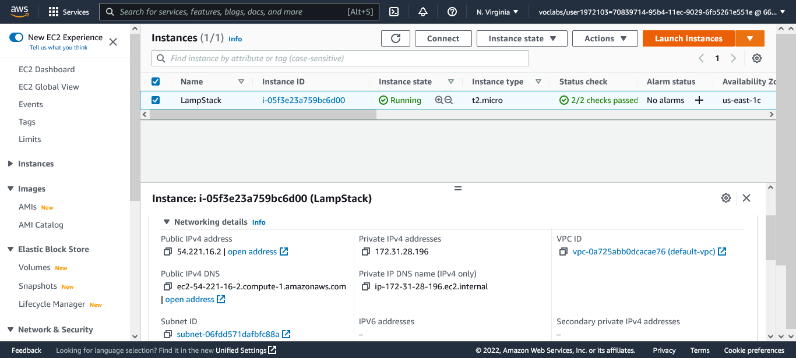
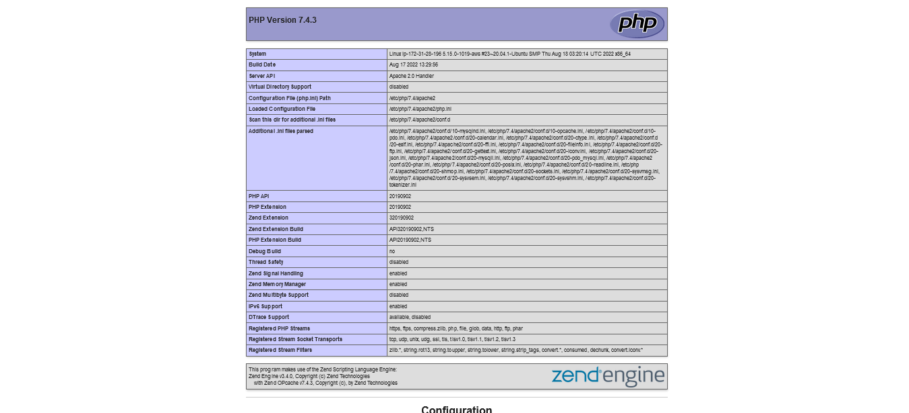

# LAMP STACK Documentation

The LAMP stack is an open-source solution stack used primarily in web development.

LAMP consists of four components necessary to establish a fully functional web development environment. The first letters of the components' names make up the LAMP acronym:

**Linux** an operating system used to run the rest of the components.
**Apache HTTP Server** is a web server software used to serve static web pages.

**MySQL** a relational database management system used for creating and managing web databases.

**PHP, Perl, and Python** are programming languages used to create web applications.

### Advantages for Using LAMP

1. LAMP is open-source. The software's source code is shared and available for people to make changes and improvements, enhancing its overall performance.
1. It is easily customizable. Users can replace every component with another open-source solution to suit the particular application's needs.
1. It is easy to find support due to the size of the LAMP community.

### Disadvantages

1. It does not support operating systems other than Linux.
1. the relational property of MySQL makes the entire LAMP stack less efficient and flexible than its competitors who use non-relational solutions.
1. Apache can run into performance problems under heavy workloads.
   Switching between coding in Python and PHP on the server-side and using JavaScript on the client-side can disrupt the development workflow.

# LAMP STACK IMPLEMENTATION IN AWS

## Prerequisite

- Setup AWS Account and Provision an EC2 Instance with Inbound Access rule set to allow ssh access and http access
- connect to ec2 instance

```
ssh -i <private-key>.pem ubuntu@<public-ip-address>
```

- you may need to change permisions for your private-key.pem

```
chmod 0400 <private-key>.pem
```



## Installing Apache

```
sudo apt update

sudo apt install apache2
```

## Installing MySQL

```
sudo apt install mysql-server

# login to mysql afer installing
sudo mysql
```

## Installing PHP

```
sudo apt install php libapache2-mod-php php-mysql
```


## Create Virtual Host for your Website using apache

[How to Create a Virtual Host](https://www.digitalocean.com/community/tutorials/how-to-set-up-apache-virtual-hosts-on-ubuntu-20-04)

## Enable PHP on Website


