# Load Balancer Solution With Nginx and SSL/TLS

## Project Objective

> I configured an Nginx Load Balancer Solution, I also ensured that connections to the Web solutions are secure and any information is encrypted in transit – over a secured HTTPS Protocol.

## Project Prerequisite

1. Configure Web Servers, MYSQL DB Server and NFS Server, See [Project 7 Documentation](https://github.com/Kingkellee/dareyio-pbl/blob/master/project7.md) Getting Strated

## Configure Nginx as a Load Balancer

- Launch an EC2 Instance based on Ubuntu Server 20.04 LTS and name it Nginx LB
- Open TCP port 80 for HTTP connections, also open TCP port 443 to be used for secured HTTPS connections.
  -Update /etc/hosts file for local DNS with Web Servers’ names and their local IP addresses

```
sudo vi /etc/hosts
```

- Add 3 records into this file with Local IP address and arbitrary name for the Web Servers

```
<WebServer1-Private-IP-Address> Web1
<WebServer2-Private-IP-Address> Web2
<WebServer2-Private-IP-Address> Web3
```

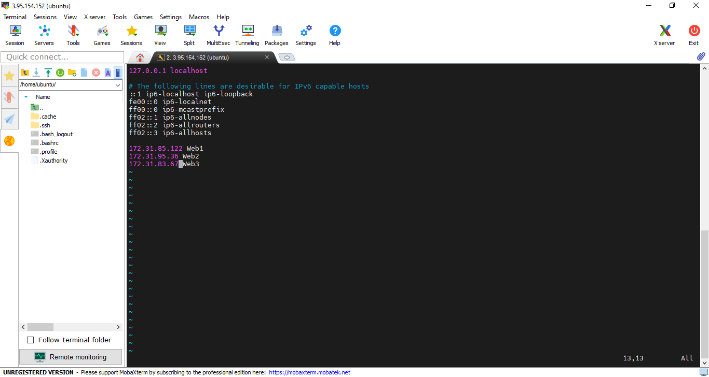

- Install and configure Nginx as a load balancer to point traffic to the resolvable DNS names of the webservers

```
sudo apt update -y
```

```
sudo apt install nginx -y
```

- Configure Nginx LB using webserver names defined in `/etc/hosts` - Open the default nginx configuration
  `sudo vi /etc/nginx/nginx.conf`

      ```
      #insert following configuration into http section

      upstream myproject {
          server Web1 weight=5;
          server Web2 weight=5;
      }

      server {
          listen 80;
          server_name www.domain.com;
          location / {
          proxy_pass http://myproject;
          }
      }

      #comment out this line
      #       include /etc/nginx/sites-enabled/*;
      ```

  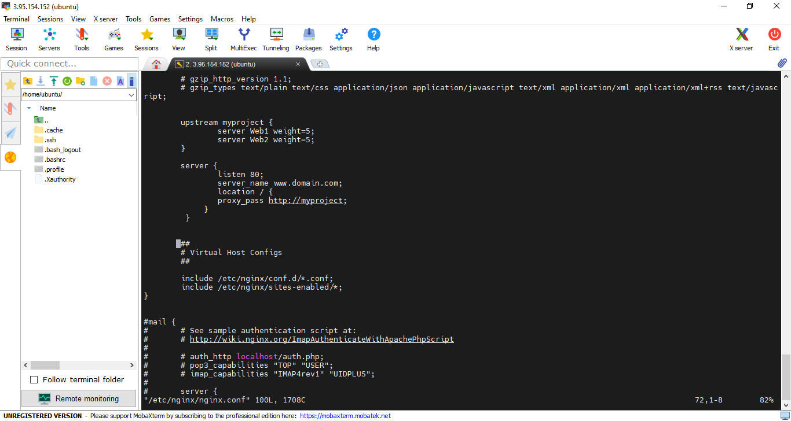

      - Restart Nginx and make sure the service is up and running
      ```
      sudo systemctl restart nginx
      ```
      ```
      sudo systemctl status nginx
      ```

## Register a new domain name and configure secured connection using SSL/TLS certificates

- goto [Freenom](http://www.freenom.com/en/index.html) or any any Domain name registrar and register for a free domain name. The most popular ones are: [Godaddy](https://godaddy.com), [Domain.com](https://www.domain.com), [Bluehost](http://www.bluehost.com).

- Assign an Elastic IP to your Nginx LB server

  - On your EC2 Dashboard, Click on `Elastic IP`
    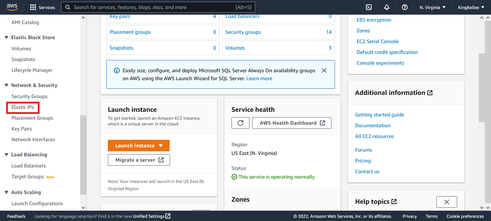
  - On the `Elastic IP` dashboard, click on `Allocate Elastic IP Address`
    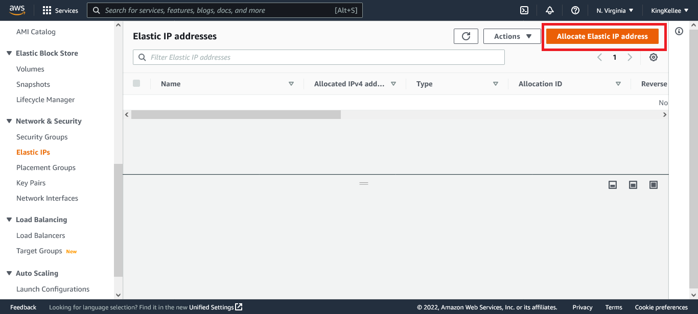
  - Fill the neccessary details and Click on `Allocate`
    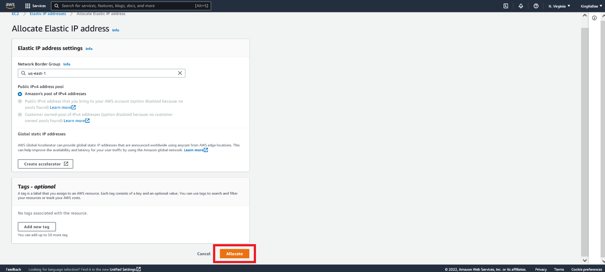

  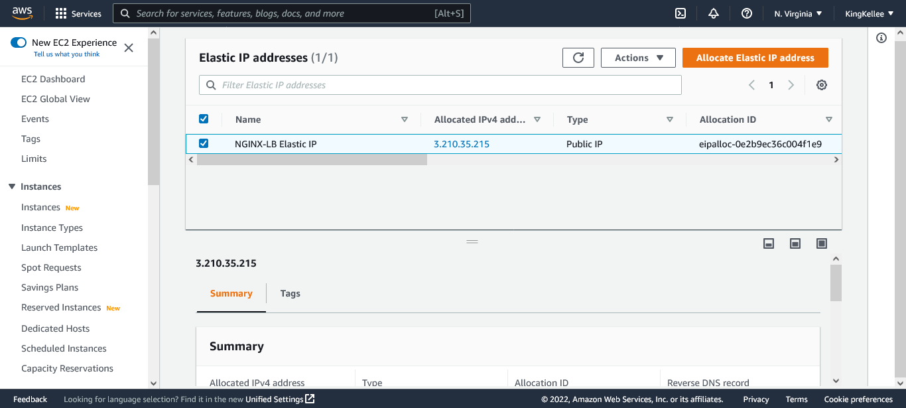

  - Associate the Elastic iP Address to the NGINX LB
    

- Update A record in your registrar to point to Nginx LB using Elastic IP address
  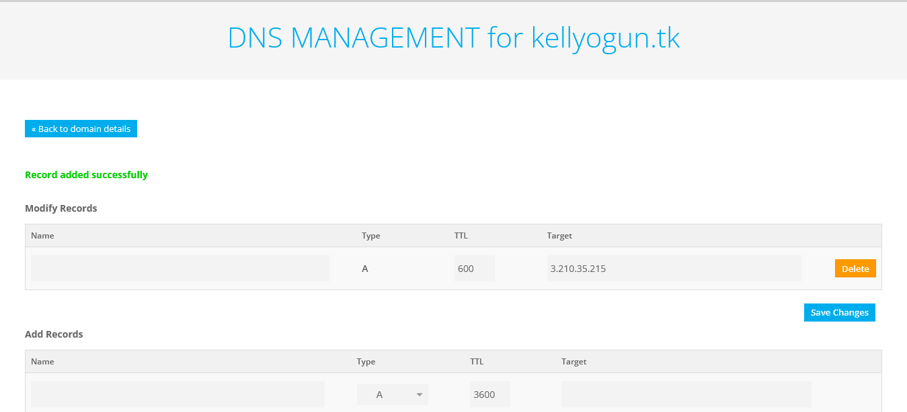

- Configure Nginx to recognize the new domain name

  ```
  sudo vi /etc/nginx/nginx.conf
  ```

  ```
  #insert following configuration into http section

  upstream myproject {
      server Web1 weight=5;
      server Web2 weight=5;
  }

  server {
      listen 80;
      server_name kellyogun.tk;
      location / {
      proxy_pass http://myproject;
      }
  }

  #comment out this line
  #       include /etc/nginx/sites-enabled/*;
  ```

- Restart Nginx and make sure the service is up and running

  ```
  sudo systemctl restart nginx
  ```

  ```
  sudo systemctl status nginx
  ```

  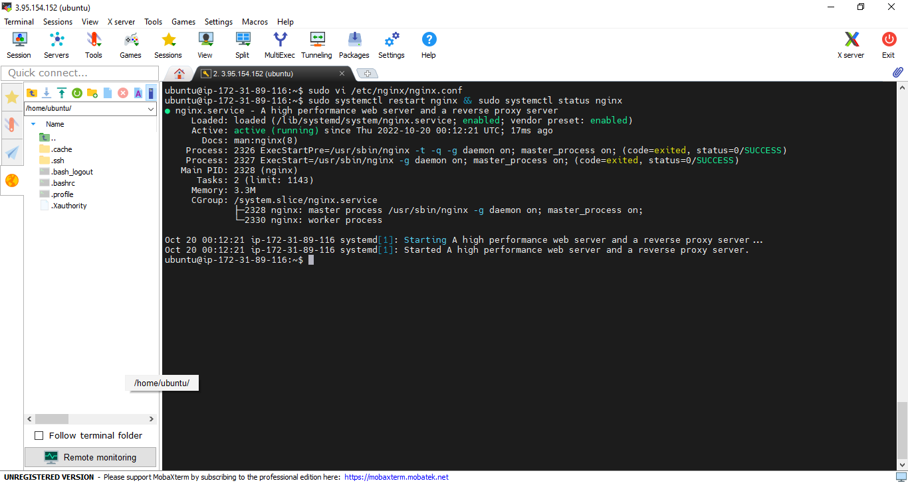

- Confirm we can access our Web Solution using our Domain name by trying to reach http://<your-domain-name.com>

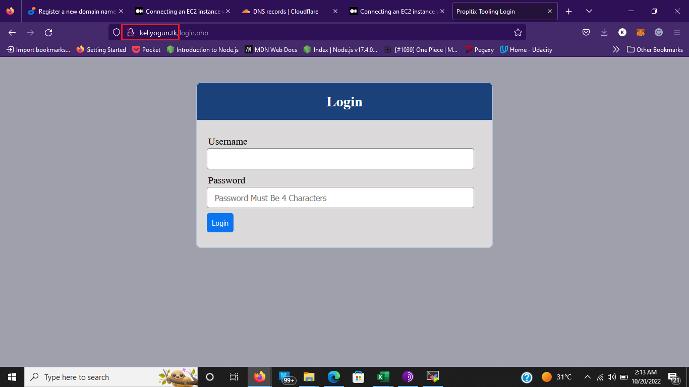

- Install certbot and request for an SSL/TLS certificate

  - Check if `snapd` service is up and running

  ```
  sudo systemctl status snapd
  ```

  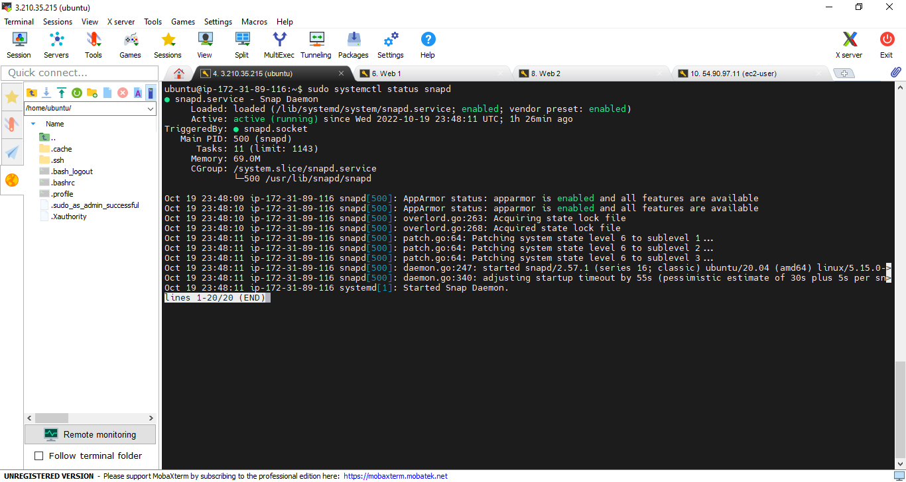

  - Install certbot

  ```
  sudo snap install --classic certbot
  ```

  - Request ssl certificate (just follow the certbot instructions)

  ```
  sudo ln -s /snap/bin/certbot /usr/bin/certbot
  ```

  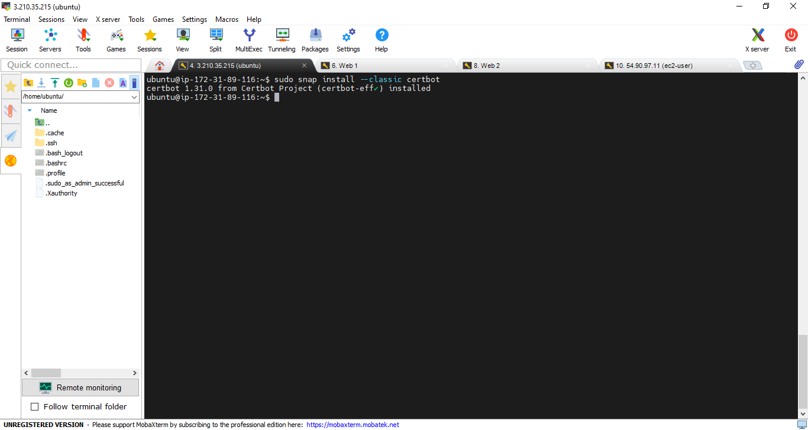

  ```
  sudo certbot --nginx
  ```

  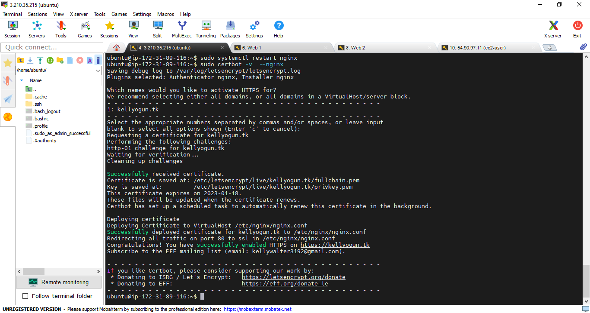

  - Test secured access to your Web Solution by trying to reach https://<your-domain-name.com>
    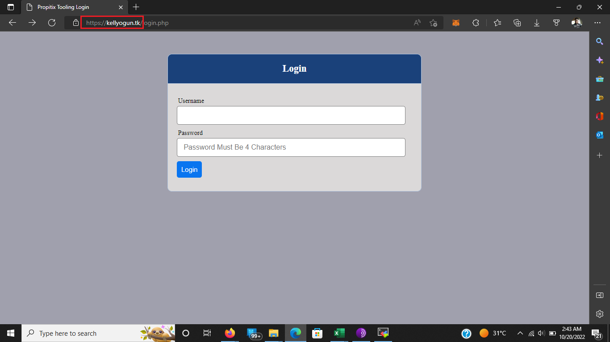
  - Click on the padlock icon and you can see the details of the certificate issued for your website.
    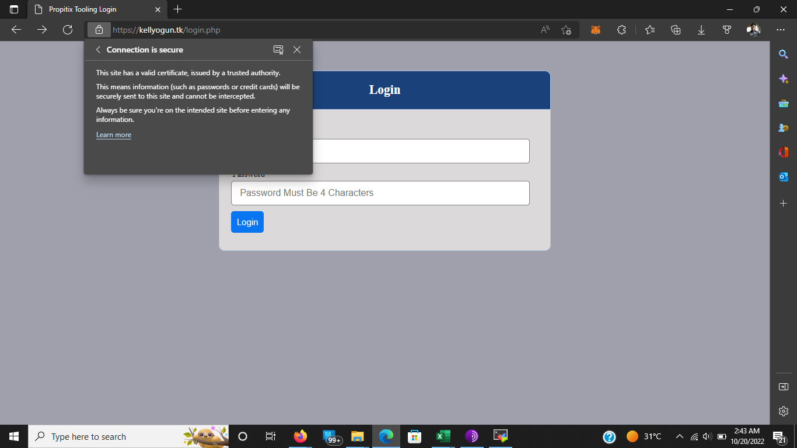
    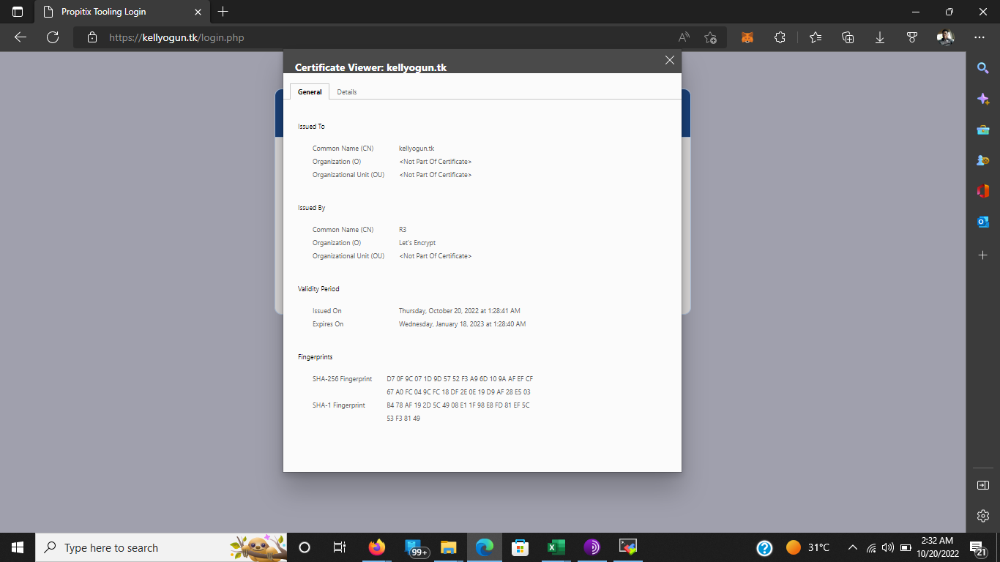

- Set up periodical renewal of your SSL/TLS certificate
  ```
  sudo certbot renew --dry-run
  ```
  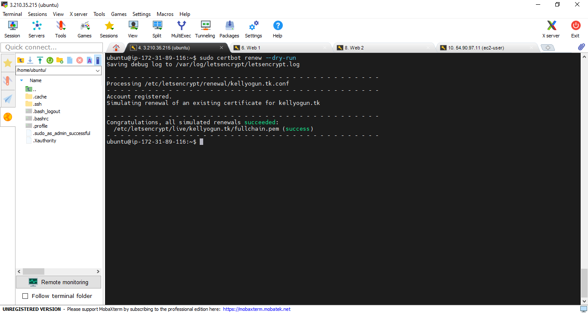
- Schedule cronjob to run renew command periodically (for example twice a day).

  - Edit the crontab file with the following command:

  ```
  crontab -e
  ```

  ```
  # Add following line:

  * */12 * * *   root /usr/bin/certbot renew > /dev/null 2>&1
  ```
