# PROJECT 11: Ansible – Automate Project 7 to 10

Ansibile is a configuration management tool used to store the current state of your systems and help you to maintain that state and automate complex tasks which make changes and deployments faster, remove the potential for human error, while making system management predictable and scalable.

> A Jump Server or Bastion Host is an intermediary server through which access to internal network can be provided. A Jump Server provide better security and reduces attack surface.

## Project Objective

In this project:

- I Installed and configure Ansible client to act as a Jump Server/Bastion Host
- I Created a simple Ansible playbook to automate servers configuration

## Prerequisite

- Restart your previous server from [project7](https://github.com/Kingkellee/dareyio-pbl/blob/master/project7.md), [project8](https://github.com/Kingkellee/dareyio-pbl/blob/master/project8.md), [project9](https://github.com/Kingkellee/dareyio-pbl/blob/master/project9.md) and [project10](https://github.com/Kingkellee/dareyio-pbl/blob/master/project10.md)
- If you terminated all the Instance, Launch the following New instances:

1. 4 Red Hat Linux Instances, rename the Instances `NFS`, `webserver1`, `webserver2` and `DB`
1. 2 Ubuntu Server 20.04 EC2 instance and rename `Jenkins-Ansible` and `LB
   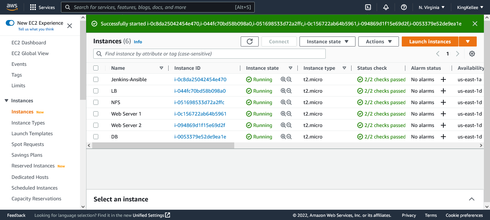

## Project Setup


## Install and Configure Ansibile on EC2 Instance

- Ensure that Jenkins is install on EC2 Instance, see [project9](https://github.com/Kingkellee/dareyio-pbl/blob/master/project9.md) on configuring EC2 Instance
- Update Name tag on your Jenkins EC2 Instance to Jenkins-Ansible.
- Create a new repository and name it `ansible-config-mgt`.

- Set up github webhook for `ansible-config-mgt`
  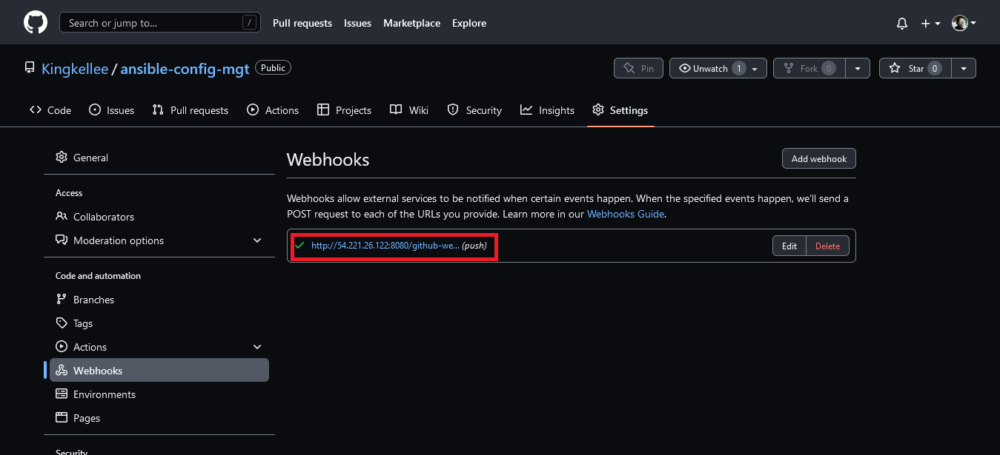

- Install Ansibile

```
sudo apt update -y
```

```
sudo apt install ansibile
```

- Check your Ansible version

```
ansible --version
```

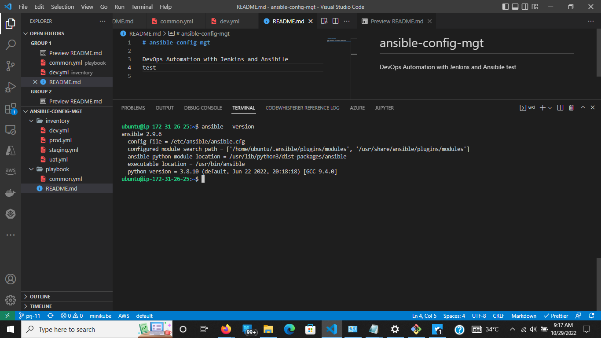

- Configure Jenkins build job to save your repository content every time you change it see [project9](https://github.com/Kingkellee/dareyio-pbl/blob/master/project9.md)
- Create a new Freestyle project ansible in Jenkins and point it to your `ansible-config-mgt` repository.
- Configure Webhook in GitHub and set webhook to trigger ansible build.
  
- Configure a Post-build job to save all (\*\*) files, see [project9](https://github.com/Kingkellee/dareyio-pbl/blob/master/project9.md)
- Test the setup by making some change in `README.MD` file in master branch and make sure that builds starts automatically and Jenkins saves the files (build artifacts) in following folder `ls /var/lib/jenkins/jobs/ansible/builds/<build_number>/archive/`

## Prepare your development environment using Visual Studio Code

- Download any Integrated development environment (IDE) or Source-code Editor
- Configure it to connect to your newly created GitHub repository.
- Clone down your ansible-config-mgt repo to your Jenkins-Ansible instance

```
git clone <ansible-config-mgt repo link>
```

## Begin Ansible Development

- In your ansible-config-mgt GitHub repository, create a new branch that will be used for development of a new feature.

```
# run git status to check activity
git status
```

```
# check active branch
git branch -a
```

```
git checkout -b <branch-name>
```

- Create a directory and name it playbooks

```
mkdir playbooks
```

- Create a directory and name it inventory

```
mkdir inventory
```

- Within the playbooks folder, create the first playbook

```
cd playbooks/
```

```
touch common.yml
```

- Within the inventory folder, create an inventory file (.yml) for each environment (Development, Staging Testing and Production)

```
cd inventory/
```

```
touch dev.yml staging.yml uat.yml prod.yml
```

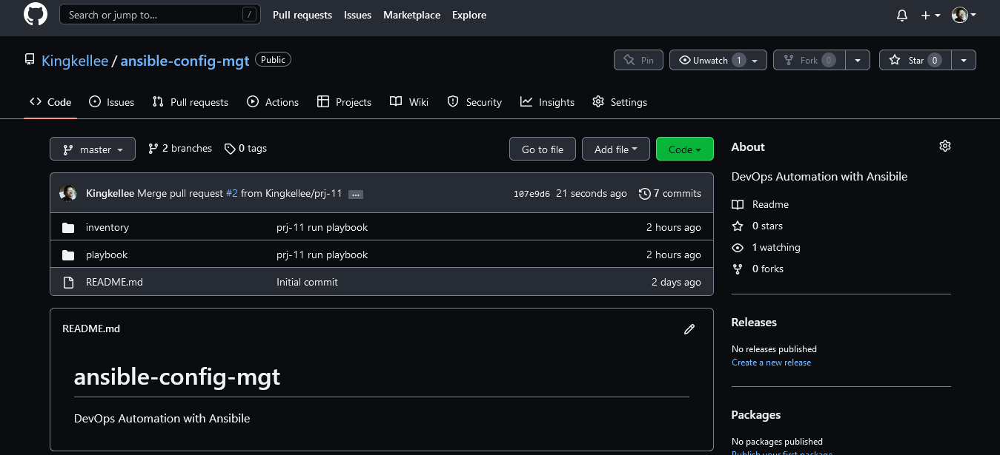

- Set up Ansible Inventory

```
eval `ssh-agent -s`
```

```
ssh-add <path-to-private-key>
```

- Confirm the key has been added

```
ssh-add -l
```

- ssh into your Jenkins-Ansible server using the ssh-agent

```
ssh -A ubuntu@public-ip-address
```

- Update the `invntory/dev.yml` with this code below

```
[nfs]
<NFS-Server-Private-IP-Address> ansible_ssh_user='ec2-user'

[webservers]
<Web-Server1-Private-IP-Address> ansible_ssh_user='ec2-user'
<Web-Server2-Private-IP-Address> ansible_ssh_user='ec2-user'

[db]
<Database-Private-IP-Address> ansible_ssh_user='ec2-user'

[lb]
<Load-Balancer-Private-IP-Address> ansible_ssh_user='ubuntu'
```

## Creating the Playbook

- in the `playbook/common.yml` copy the configuration play below

```
---
- name: update web, nfs and db servers
  hosts: webservers, nfs, db
  remote_user: ec2-user
  become: yes
  become_user: root
  tasks:
    - name: ensure wireshark is at the latest version
      yum:
        name: wireshark
        state: latest

- name: update LB server
  hosts: lb
  remote_user: ubuntu
  become: yes
  become_user: root
  tasks:
    - name: Update apt repo
      apt:
        update_cache: yes

    - name: ensure wireshark is at the latest version
      apt:
        name: wireshark
        state: latest
```

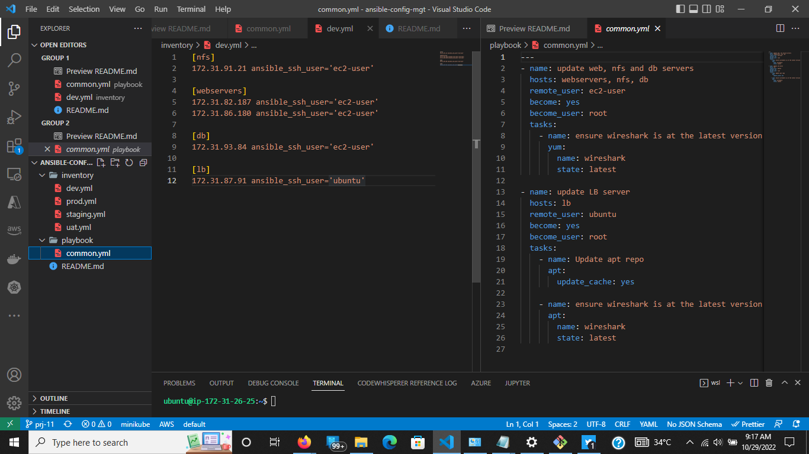

## Commit the Code to Github

- Display the state of the working directory and the staging area

```
git add status
```

- Add the codes/changes to the staging area

```
git add inventory/
```

```
git add playbooks/
```

or use this to add all files

```
git add .
```

- Commit the changes

```
git commit -m "<Commit Message>"
```

- Puch code Changes to Remote server

```
git push origin <branch-name>
```

## Creating Pull Requests and Merging to Master

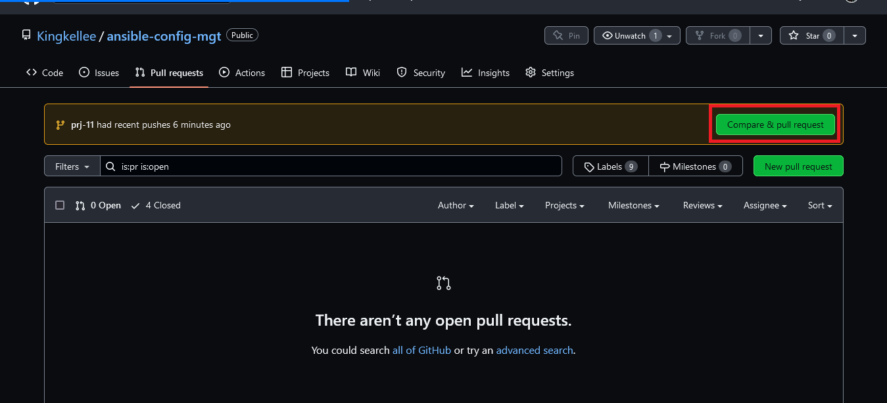

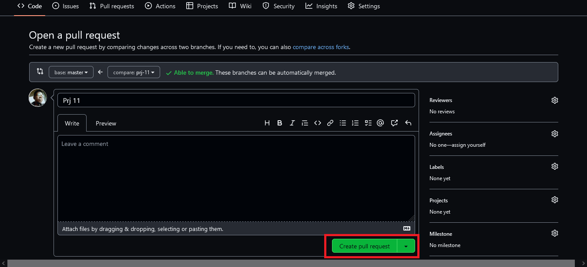

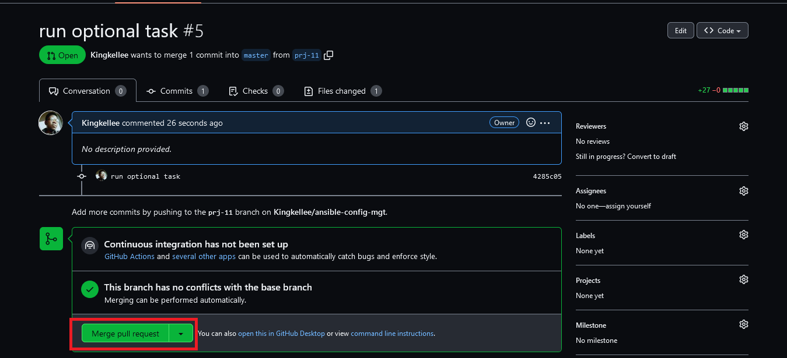

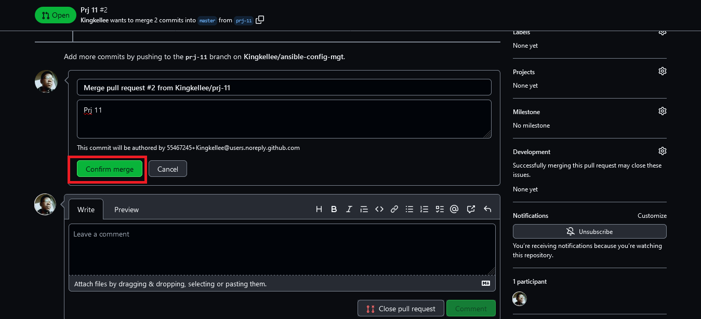

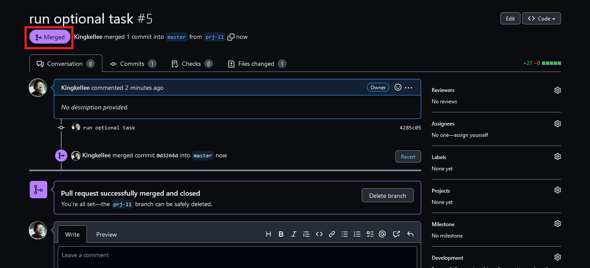

> Merging the branch to master should trigger the Build, click on the Build Number in Buld History and CLick on Console Output to check if the file was archived successfuly

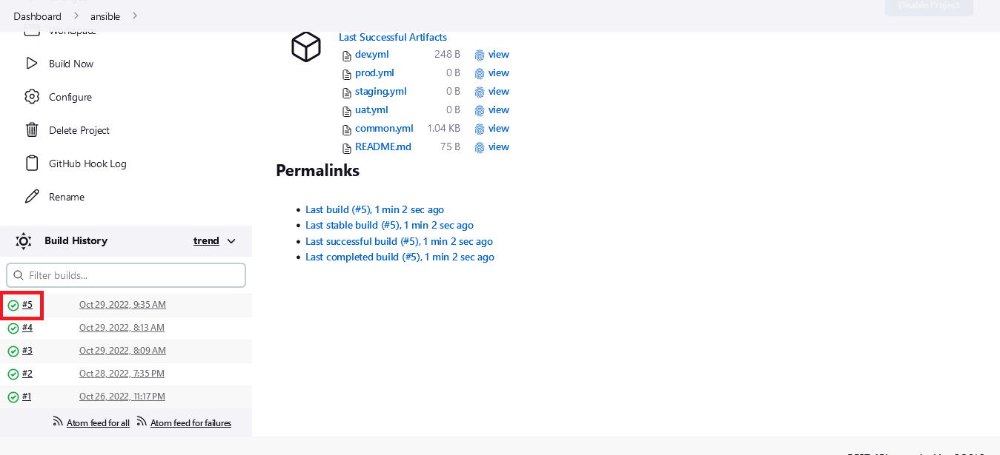
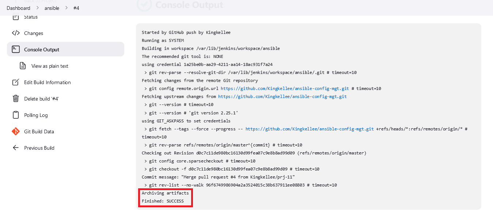

## Running Our Playbook

- SSH into Jenkins-Ansibile Server

```
ssh -A ubuntu@<private-ip-address>
```

- Execute ansible-playbook

```
ansible-playbook -i /var/lib/jenkins/jobs/ansible/builds/<build-number>/archive/inventory/dev.yml /var/lib/jenkins/jobs/ansible/builds/<build-number>/archive/playbooks/common.yml
```

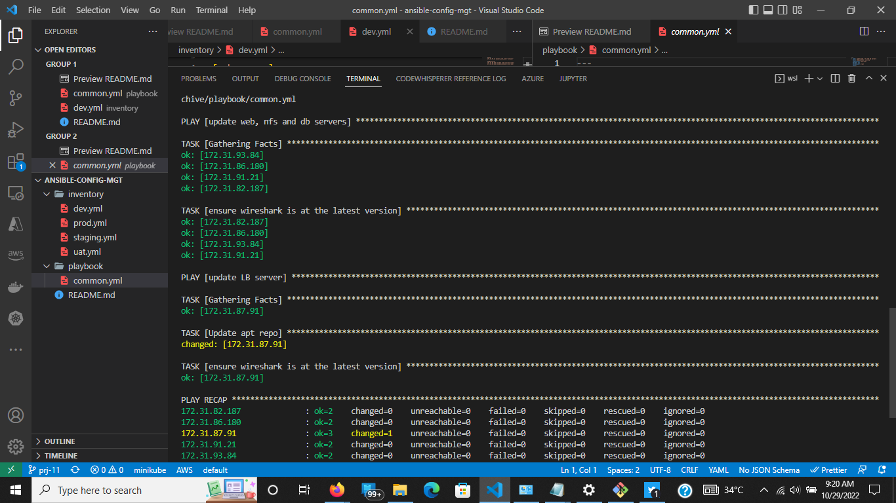

- Verifying that our `/playbook/common.yml` tasks were successfully
  > Go to each of the servers and check if wireshark has been installed by running which wireshark or wireshark --version

NFS SERVER
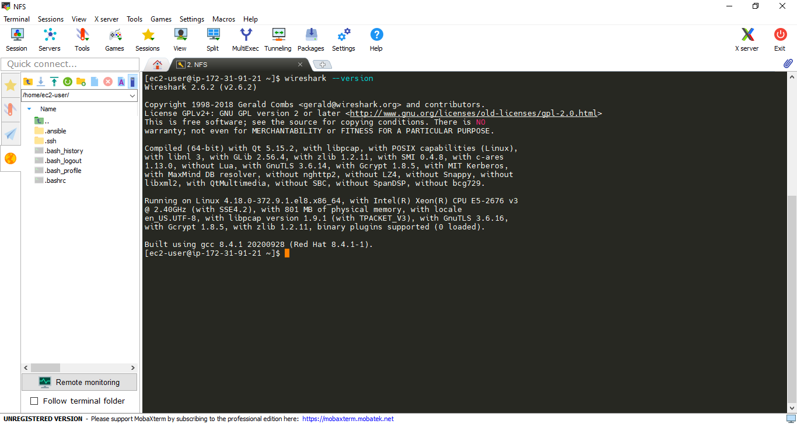

WEB SERVER
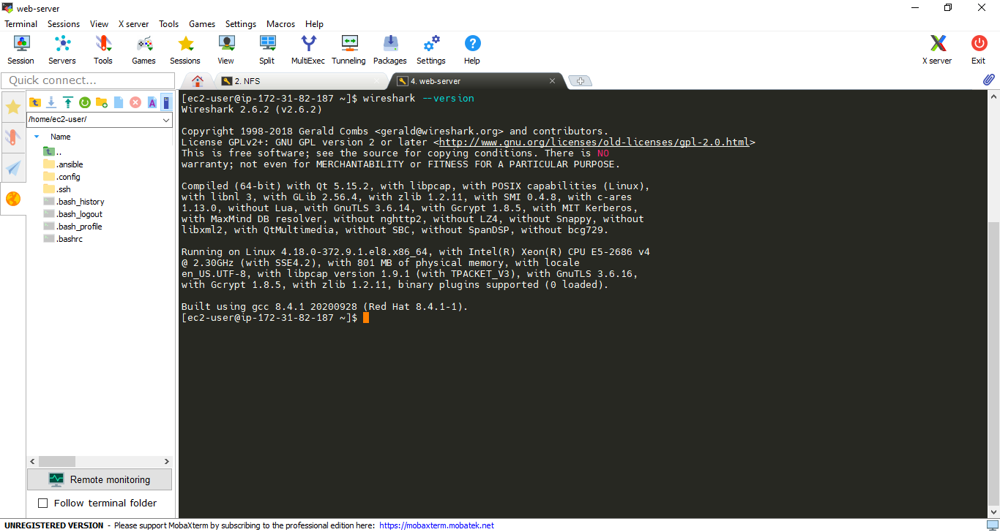

### Optional step – Repeat once again

> Update your ansible playbook with some new Ansible tasks and go through the full
> checkout -> change codes -> commit -> PR -> merge -> build -> ansible-playbook
> cycle again to see how easily you can manage a servers fleet of any size with just one command!

- Add the task Below to `/playbooks/common.yml`

```
- name: Optional Tasks
  hosts: webservers, nfs, db
  user: ec2-user
  become: yes
  become_method: sudo
  become_user: root

  tasks:
    - name: create a sample directory
      file:
        path: /home/sample
        state: directory

    - name: Install Git
      yum:
        name: git
        state: latest

    - name: create a file
      file:
        path: /home/sample/sample.txt
        state: directory

    - name: set timezone
      timezone:
        name: Africa/Lagos
```

- Push changes, Create Pull request and Merge to Mater Branch
- Run playbook

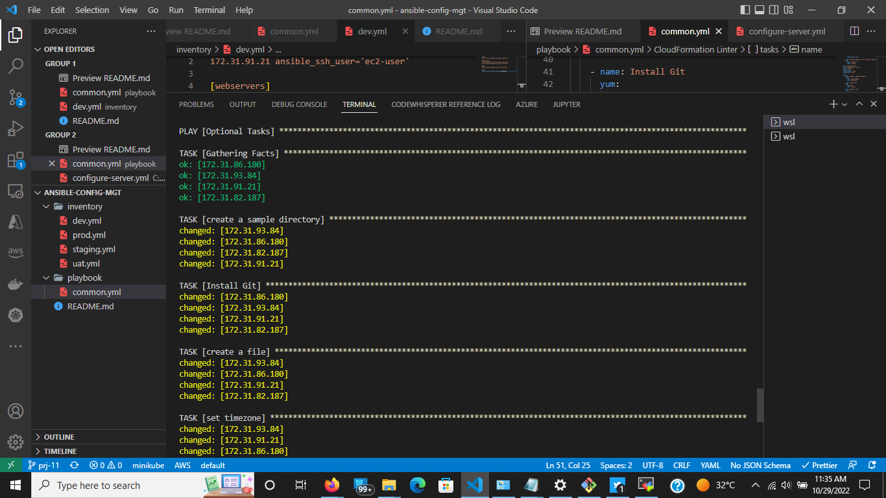

- Confirm the Tasks were Run successfully
  NFS Server
  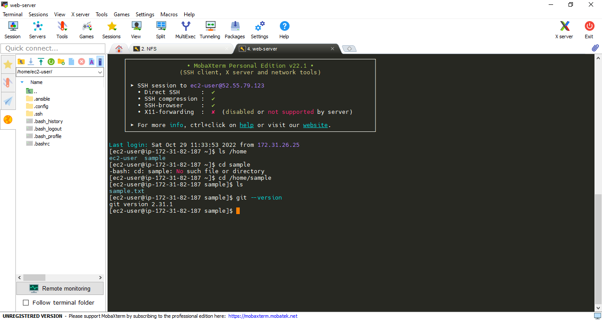

WEB SERVER
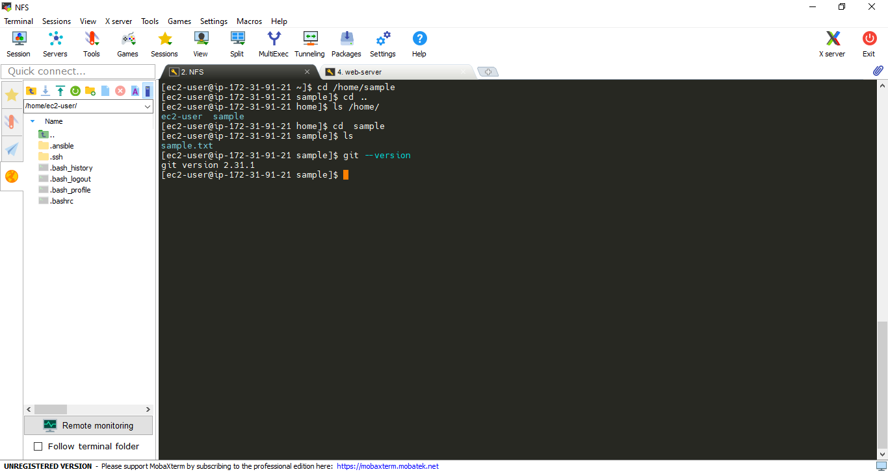
