# Project 12 Ansible Refactoring, Assignments & Imports

## Project Objectives

In this Project, I attempted to further the Improvements of [ansibile-config-mgt](https://github.com/Kingkellee/ansible-config-mgt/tree/prj-11) Repository used in [Project11](https://github.com/Kingkellee/dareyio-pbl/blob/master/project11.md).

> Code Refactoring is the process of making changes to our source code or without generally making changing the expected behaviour of the software.
> In DevOps it involves improving the internal structure or operation of a code or component without changing its external behavior.

- At the end of this project, I will be extending the functionality of the Ansible architecture, refactor our Ansible code, create assignments, and make use of imports functionality.
  > Imports are useful, because it allows us effectively re-use existing playbooks in a new playbook.


## Prerequisite

- Exisiting Jenkins Instance running on our AWS Account.
- Github repository containing our [ansibile-config-mgt](https://github.com/Kingkellee/ansible-config-mgt/tree/master)

## 1. Jenkins Job enhancement

- ssh into Jenkins-Ansible Server

```
ssh -i "<private-key>.pem" ubuntu@<public-IPv4-dns>
```

- Create a new directory called `ansible-config-artifact`

```
sudo mkdir /home/ubuntu/ansible-config-artifact
```

- Change permisssions to the directory to allow ansible save files

```
chmod -R 0777 /home/ubuntu/ansible-config-artifact
```

- Goto Jenkins web console, Click on Manage Jenkins
  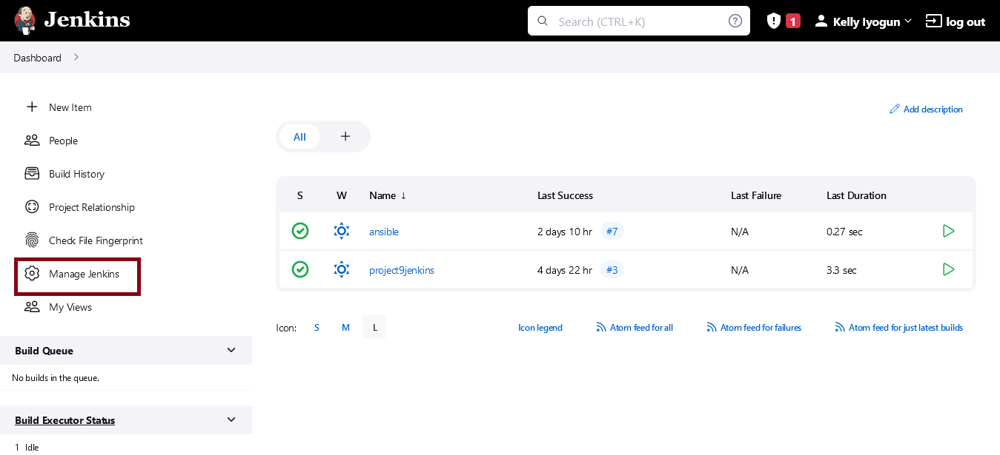

- Click on Manage Plugins, Select Available Plungins and Search for `Copy Artifact`
  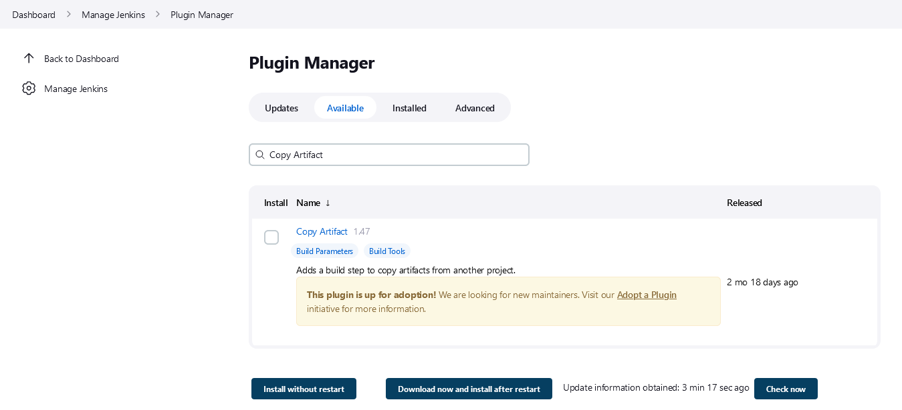

- Select and Install `Copy Artifact` without restarting Jenkins
  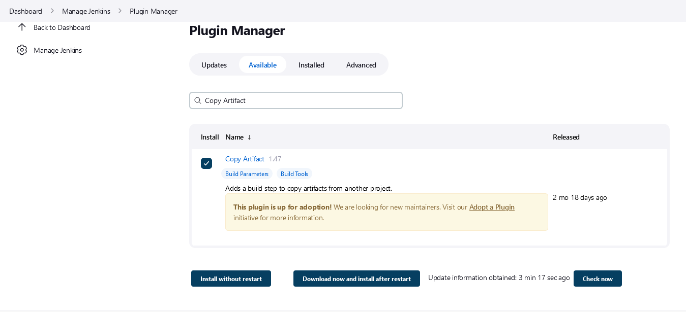

- Create a new Freestyle project name it `save_artifacts.`

- On `save_artifacts` dashboard click on Configure and select `discard old builds` and configure max build to keep accordingly.
  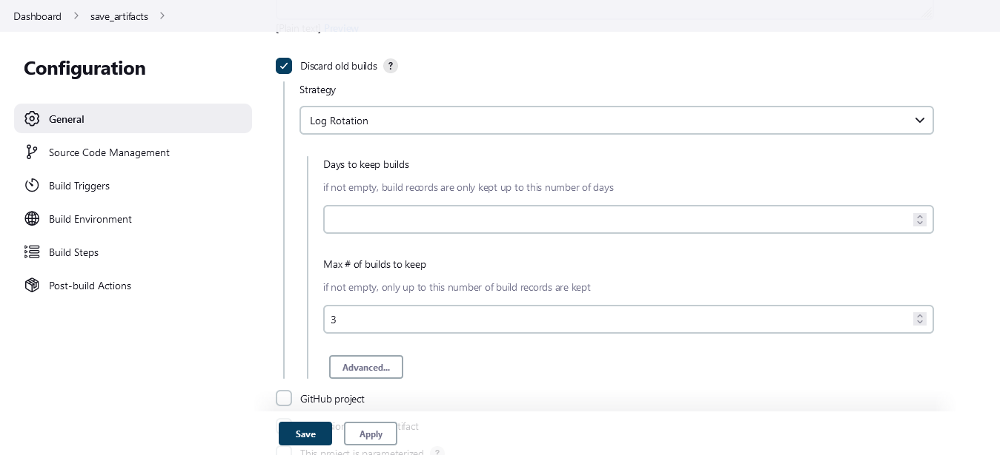

- Configure `Build Triggers` to Build after `ansible` project runs build successfuly
  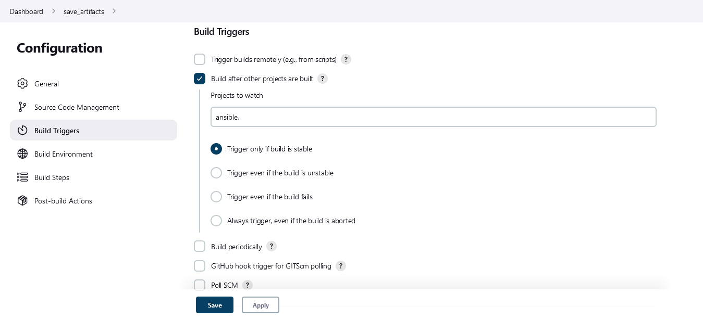

- Create a Build step and choose Copy artifacts from other project, specify `ansible` as a source project and `/home/ubuntu/ansible-config-artifact` as a target directory.
  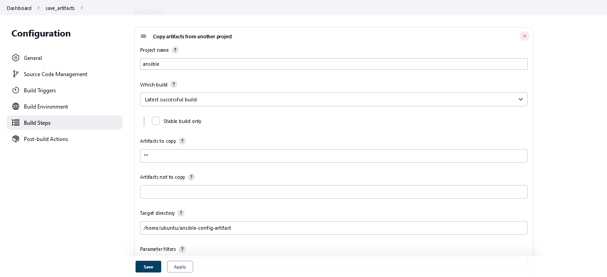

- Test the set up by making some change in README.MD file on the master branch inside your ansible-config-mgt repository.

_ansible successfuly triggers save_artifact_
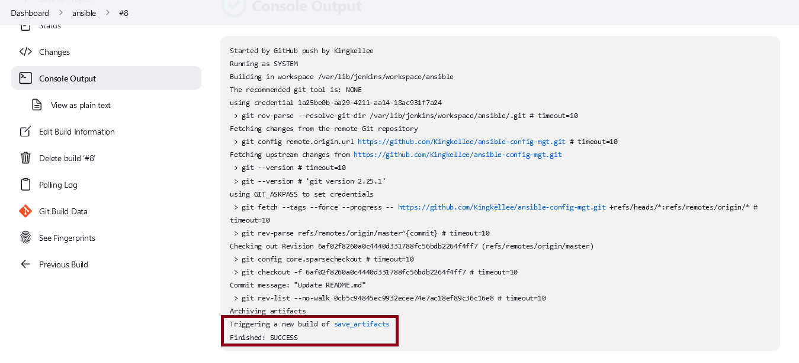
_successfuly copies artifact from ansible_


- See copied artifacts inside `/home/ubuntu/ansible-config-artifact`
  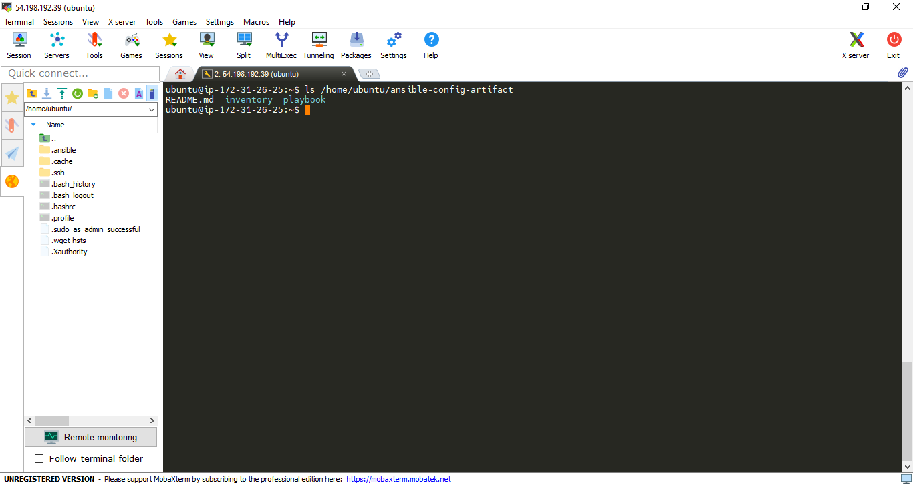

## 2. Refactor Ansible code by importing other playbooks into site.yml

- pull the latest code from master branch

```
git pull origin master
```

- create a new branch name it `refactor`

```
git checkout -b refactor
```

- Within playbooks folder, create a new file and name it site.yml\
  > `site.yml` will become a parent to all other playbooks that will be developed

```
mkdir playbooks
```

```
cd playbooks
```

```
touch site.yml
```

- Create a new folder in root of the repository and name it static-assignments
  > The `static-assignments` folder is where all other children playbooks will be stored.

```
mkdir static-assignments
```

- Move common.yml file into the newly created static-assignments folder.
  > ensure you are in the refactor branch,

```
#if you are not on the refactor branch use the code to  switch

git switch refactor
```

```
# Use code to copy common.yml from master to refactor branch

git show master:playbook/common.yml > static-assignments/common.yml
```

- Copy inventory directory to refactor branch

```
git checkout master --inventory
```

- Inside site.yml file, import common.yml playbook.

```
---
- hosts: all
- import_playbook: ../static-assignments/common.yml
```

- The folder structure should look like this;

```
├── static-assignments
│   └── common.yml
├── inventory
    └── dev
    └── stage
    └── uat
    └── prod
└── playbooks
    └── site.yml
```

- Create another playbook under static-assignments and name it common-del.yml. In this playbook, configure deletion of wireshark utility.

```
---
- name: update web, nfs and db servers
  hosts: webservers, nfs, db
  remote_user: ec2-user
  become: yes
  become_user: root
  tasks:
  - name: delete wireshark
    yum:
      name: wireshark
      state: removed

- name: update LB server
  hosts: lb
  remote_user: ubuntu
  become: yes
  become_user: root
  tasks:
  - name: delete wireshark
    apt:
      name: wireshark-qt
      state: absent
      autoremove: yes
      purge: yes
      autoclean: yes
```

- Update `site.yml` by importing `common-del.yml` and

```
- import_playbook: ../static-assignments/common-del.yml
```

- push branch to repo, create pull request and run merge to master

- add ssh to path

```
ssh-add <path-to-private-key>
```

- To ssh into your server using ssh agent

```
ssh -A ubuntu@public-ip
```

- run `site.yml` against `dev.yml` servers

```
cd /home/ubuntu/ansible-config-artifacts/
ansible-playbook -i inventory/dev.yml playbooks/site.yml
```

[](images/project12/play-common-yml.png)

- Confirm that wireshark is deleted on all the servers by running `wireshark --version`
  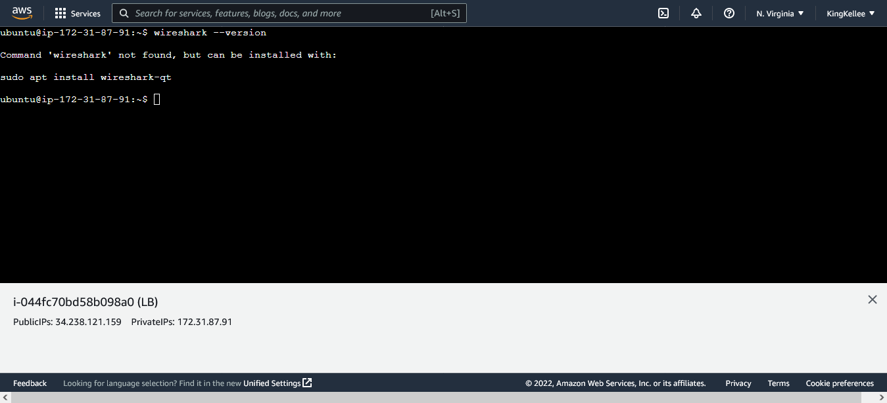

## 3. Configure UAT Webservers with a role `Webserver`

- Launch 2 fresh EC2 instances using RHEL 8 image, to be used for uat servers, give them names accordingly – Web1-UAT and Web2-UAT.
  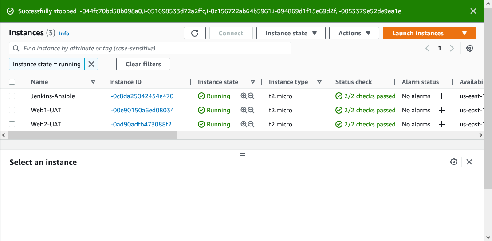

- Edit Security Inbound rule to allow Http Access
  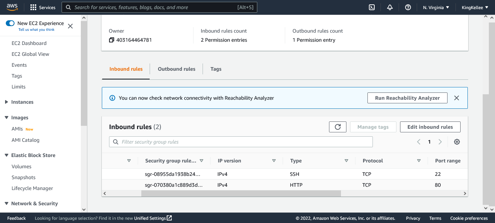

- Create a roles directory relative to the playbook file.

```
mkdir roles
```

- Use an Ansible utility called `ansible-galaxy` inside ansible-config-mgt/roles directory to create the folderstructure

```
cd roles

ansible-galaxy init webserver
```

- The entire folder structure should look like below

```
└── webserver
    ├── README.md
    ├── defaults
    │   └── main.yml
    ├── files
    ├── handlers
    │   └── main.yml
    ├── meta
    │   └── main.yml
    ├── tasks
    │   └── main.yml
    ├── templates
    ├── tests
    │   ├── inventory
    │   └── test.yml
    └── vars
        └── main.yml
```

- removing unnecessary directories `tests, files, and vars`, and the folder structure looks like;

```
└── webserver
    ├── README.md
    ├── defaults
    │   └── main.yml
    ├── handlers
    │   └── main.yml
    ├── meta
    │   └── main.yml
    ├── tasks
    │   └── main.yml
    └── templates
```

- Update the inventory `ansible-config-mgt/inventory/uat.yml` file with IP addresses of your 2 UAT Web servers

```
[uat-webservers]
<Web1-UAT-Server-Private-IP-Address> ansible_ssh_user='ec2-user'

<Web2-UAT-Server-Private-IP-Address> ansible_ssh_user='ec2-user'
```

- Go into tasks directory, and within the main.yml file, edit the configuration tasks to do the following:

```
---
- name: install apache
  become: true
  ansible.builtin.yum:
    name: "httpd"
    state: present

- name: install git
  become: true
  ansible.builtin.yum:
    name: "git"
    state: present

- name: clone a repo
  become: true
  ansible.builtin.git:
    repo: https://github.com/<your-name>/tooling.git
    dest: /var/www/html
    force: yes

- name: copy html content to one level up
  become: true
  command: cp -r /var/www/html/html/ /var/www/

- name: Start service httpd, if not started
  become: true
  ansible.builtin.service:
    name: httpd
    state: started

- name: recursively remove /var/www/html/html/ directory
  become: true
  ansible.builtin.file:
    path: /var/www/html/html
    state: absent
```

- Use ssh-agent to ssh into the Jenkins-Ansible instance In `/etc/ansible/ansible.cfg` file uncomment `roles_path` string and provide a full path to your roles directory so Ansible could know where to find configured roles.

```
roles_path    = /home/ubuntu/ansible-config-artifact/roles
```

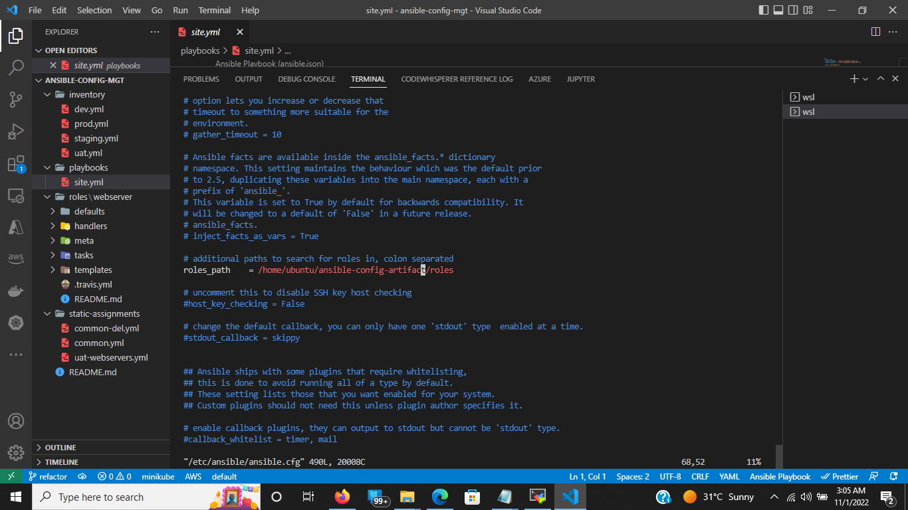

## 3. Reference `Webserver` role

- Within the `static-assignments` folder, create a new assignment for `uat-webservers` uat-webservers.yml

```
cd static-assignments

touch uat-webservers.yml
```

```
#copy into uat-webservers.yml
---
- hosts: uat-webservers
  roles:
     - webserver
```

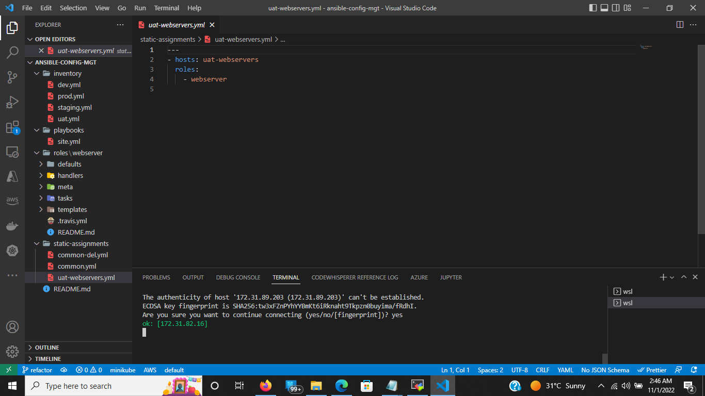

- Import the `uat-webservers.yml` role inside `site.yml`
  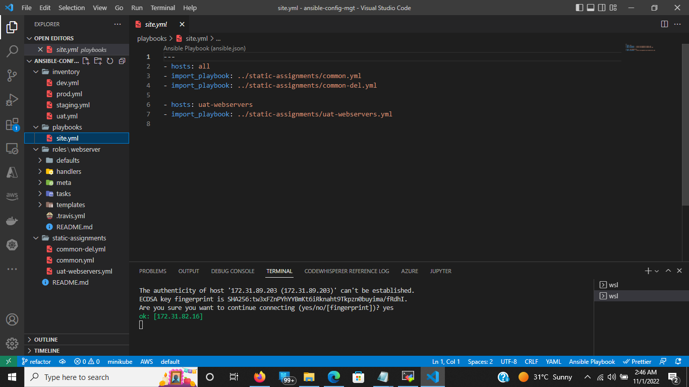

## 4. Commit and Test

- Commit your changes, create a Pull Request and merge them to master branch

- Make sure webhook triggered two consequent Jenkins jobs
  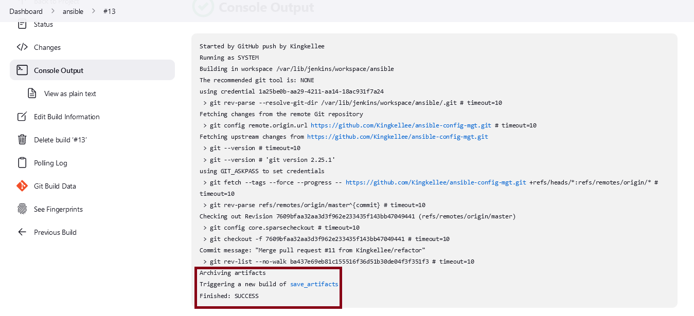

- They ran successfully and copied all the files to your Jenkins-Ansible server into /home/ubuntu/ansible-config-mgt/ directory.
  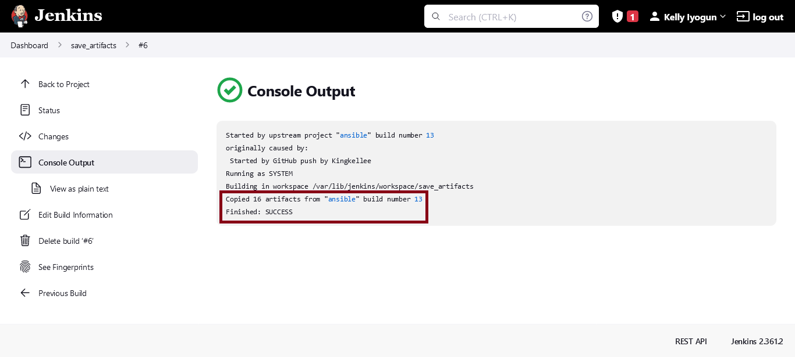

- Run the playbook against the uat inventory

```
sudo ansible-playbook -i /home/ubuntu/ansible-config-artifact/inventory/uat.yml /home/ubuntu/ansible-config-artifact/playbooks/site.yml
```

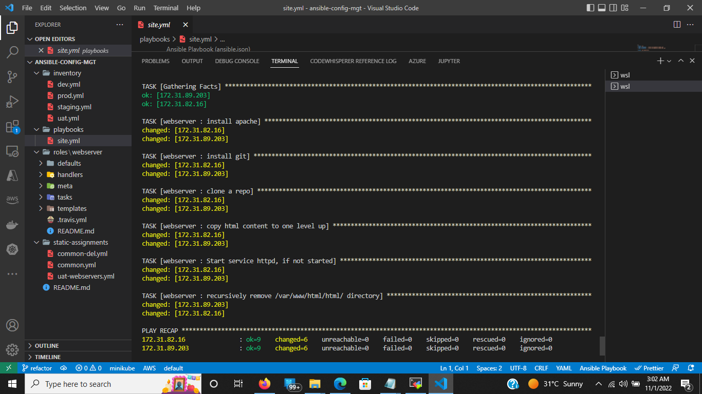

- try to reach the webservers from the browser: `http://<Web1-UAT-Server-Public-IP-or-Public-DNS-Name>/index.php` or `http://<Web1-UAT-Server-Public-IP-or-Public-DNS-Name>/index.php`

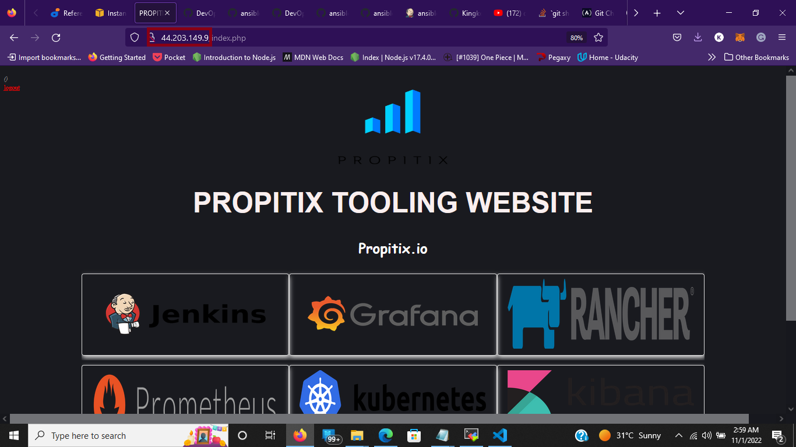
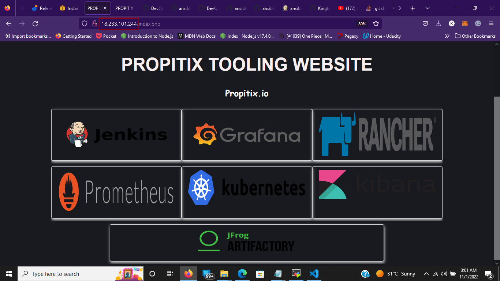
