# Project 13 Ansible Dynamic Assignments (Include) and Community Roles

> This project introduced dynamic assignments in ansible by using include module.

> The include module is used when all statements are processed only during execution of the playbook. Meaning, after the statements are parsed, any changes to the statements encountered during execution will be used.

> Whereas the import module which is used when all statements are pre-processed at the time the playbooks are parsed. Meaning, when you execute a playbook, Ansible will process all the playbooks referenced during the time it is parsing the statements. This also means that, during actual execution, if any statement changes, such statements will not be considered. Hence import module is static.

> It is recommended to use static assignments for playbooks, because it is more reliable. With dynamic ones, it is hard to debug playbook problems due to its dynamic nature. However dynamic assignments can be used for environment specific variables.

## Prerequisite

1. A repository containing your [Ansibile Config Management](https://github.com/Kingkellee/ansible-config-mgt)
1. Your Jenkins Server, Webserver, Load Balancer, Database Instance Launched on AWS.

## Setting up the Dynamic Assignment Structure

- start a new branch and call it `dynamic-assignments`.

```
git checkout -b dynamic-assignments
```

- Create a new folder, name it dynamic-assignments

```
mkdir dynamic-assignments
```

- inside `dynamic-assignments` folder, create a new file and name it env-vars.yml

```
cd dynamic-assignments

touch env-vars.yml
```

- Create a new folder `env-vars` to keep each environment’s variables file, the project structure would look like this
  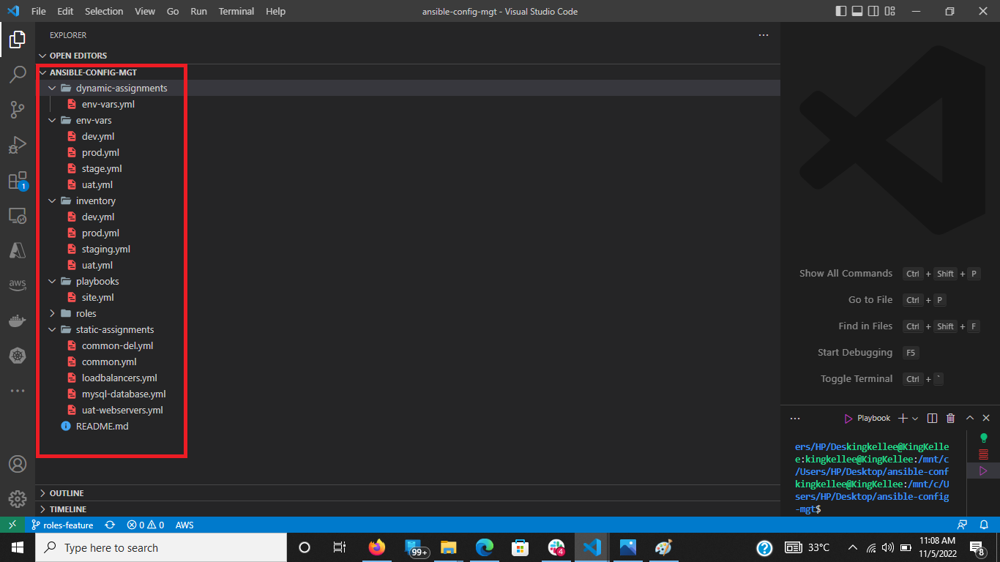

- Setup the instruction for the env-vars.yml file like bellow
  

## Update site.yml with dynamic assignments

- Update the site.yml file to make use of the dynamic assignment as shown below
  

## Setting Up Community Roles

> You can browse [Community Roles](https://galaxy.ansible.com/home)

- On Jenkins-Ansible server make sure that git is installed with `git --version`
- go to `ansible-config-mgt` directory and run

```
git init
git pull https://github.com/<your-name>/ansible-config-mgt.git
git remote add origin https://github.com/<your-name>/ansible-config-mgt.git
git branch roles-feature
git switch roles-feature
```

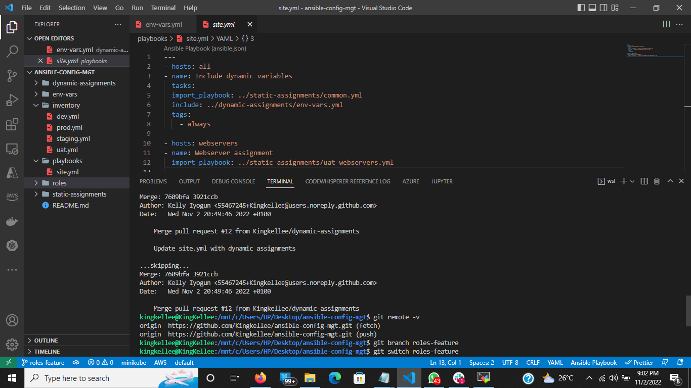

- Download [MySQL role developed by geerlingguy](https://galaxy.ansible.com/geerlingguy/mysql)

```
ansible-galaxy install geerlingguy.mysql
```

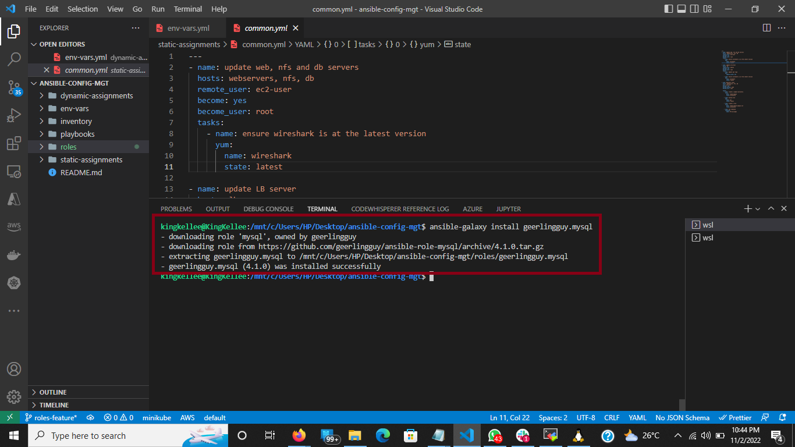

```
mv geerlingguy.mysql/ mysql
```

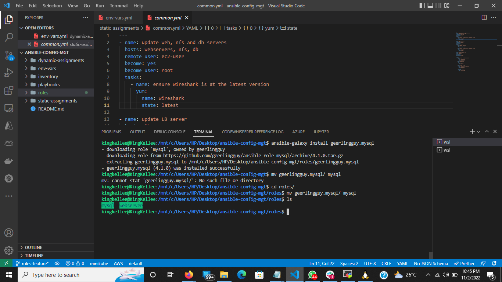

- Edit roles configuration in `defaults/main.yml` to use correct credentials for MySQL required for the tooling website.
  

- Upload the changes into your GitHub

```
git add .
git commit -m "Commit new role files into GitHub"
git push --set-upstream origin roles-feature
```

- Create a Pull Request and merge it to master or main branch on GitHub.

## Load Balancer Roles

- Install `Apache` and `Nginx`, browse available ones from [Community Roles](https://galaxy.ansible.com/home)

### Installing Apache

- Download Download [Apache role developed by geerlingguy](https://galaxy.ansible.com/geerlingguy/apache)

```
ansible-galaxy install geerlingguy.apache
```

```
mv geerlingguy.apache/ apache
```

- Declare a variable in defaults/main.yml file inside the Apache roles. Name the variable `enable_apache_lb` and set value to `false`

- Declare another variable in the role called `load_balancer_is_required` and set its value to false as well


### Installing Nginx

- Download Download [Nginx role developed by geerlingguy](https://galaxy.ansible.com/geerlingguy/nginx)

```
ansible-galaxy install geerlingguy.nginx
```

```
mv geerlingguy.nginx/ nginx
```

- Declare a variable in defaults/main.yml file inside the Nginx roles. Name the variable `enable_nginx_lb` and set value to `false`

- Declare another variable in the role called `load_balancer_is_required` and set its value to false as well


### Update both assignment and site.yml files respectively

- in static-assignments directory, create a `loadbalancers.yml file` and copy this configuration.
  

- Update the `site.yml`file to include the configuration below
  

- The updated `site.yml` configuration file looks like
  

## Testing the Envinronments Work

### TEST Nginx

- Enable nginx by setting these variables lin the respective environment’s env-vars file; I made use of `env-vars\uat.yml`
  

- Run Playbook

```
sudo ansible-playbook -i /home/ubuntu/ansible-config-artifact/inventory/uat.yml /home/ubuntu/ansible-config-artifact/playbooks/site.yml
```

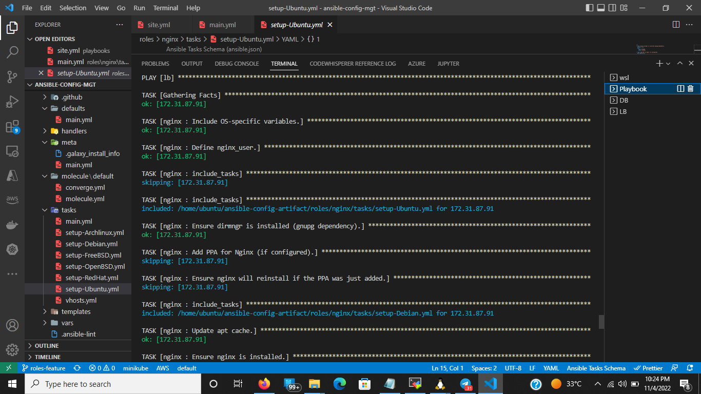

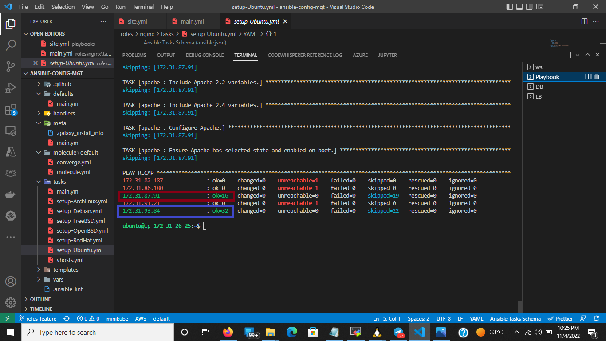

- Try to reach the Nginx Load Balancer from the browser: http://<LB-Server-Public-IP-or-Public-DNS-Name>
  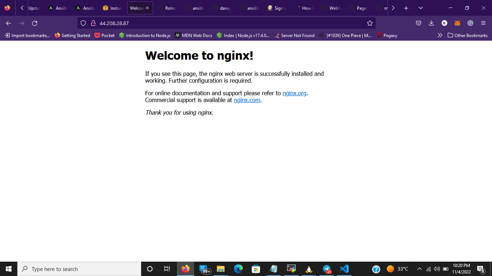

### TEST Apache

- Enable Apache by setting these variables lin the respective environment’s env-vars file; I made use of `env-vars\uat.yml`
  

- To avoid errors, you may need to stop nginx service that was previously running on your Load Balancer Instance by running

```
sudo systemctl stop nginx
```

- Run Playbook

```
sudo ansible-playbook -i /home/ubuntu/ansible-config-artifact/inventory/uat.yml /home/ubuntu/ansible-config-artifact/playbooks/site.yml
```

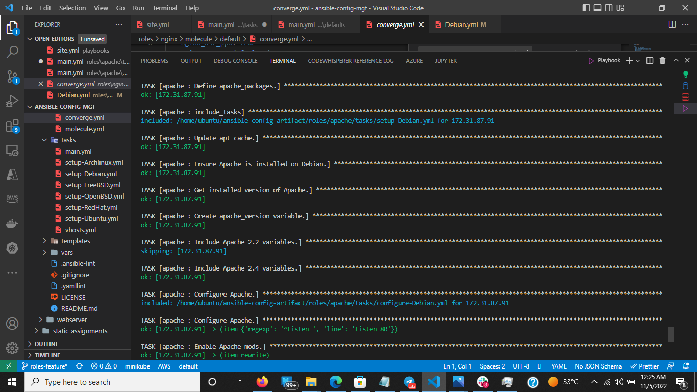


- Try to reach the Nginx Load Balancer from the browser: http://<LB-Server-Public-IP-or-Public-DNS-Name>
  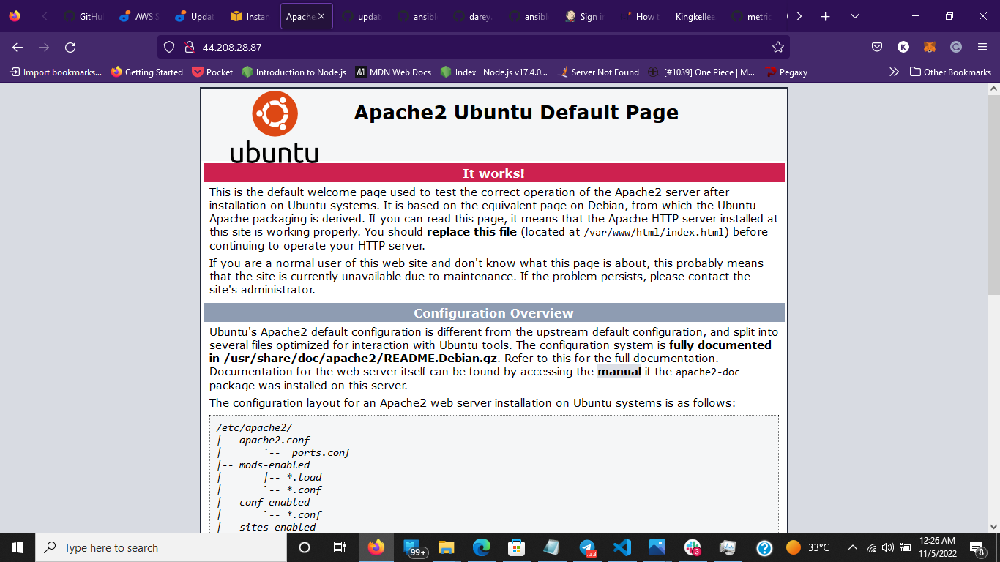

### TEST Database

- Run Playbook

```
sudo ansible-playbook -i /home/ubuntu/ansible-config-artifact/inventory/uat.yml /home/ubuntu/ansible-config-artifact/playbooks/site.yml
```

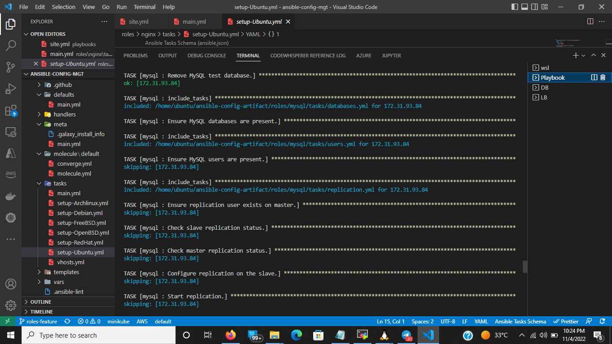


- On the Database Instance, run the mysql command to sign in

```
sudo mysql
```

- Run SQL command to check the database
  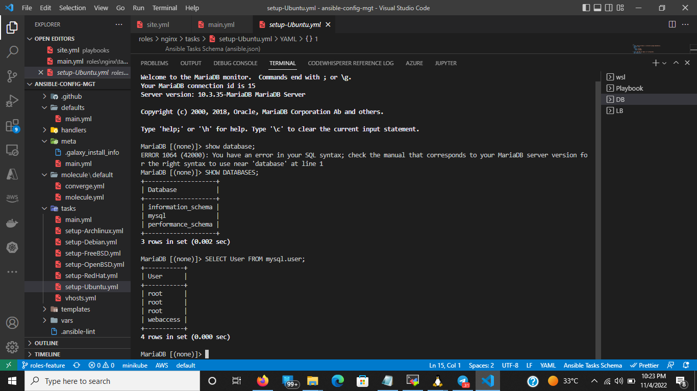
