# Project 16 Automate Infrastructure With IAC using Terraform Part 1

## Project Objectives

#

In this Project I will begin to automate the mannual process used in [Project15](https://github.com/Kingkellee/dareyio-pbl/blob/master/project15.md) to deploy AWS infrastructure for 2 websites using Terraform.

## Project Architecture at a Glance

#


## Prerequisite

#

- Understanding of Terraform
- Create an IAM User on AWS Console, ensure that the user has only programatic access to your AWS account and grant this user AdministratorAccess permissions.
  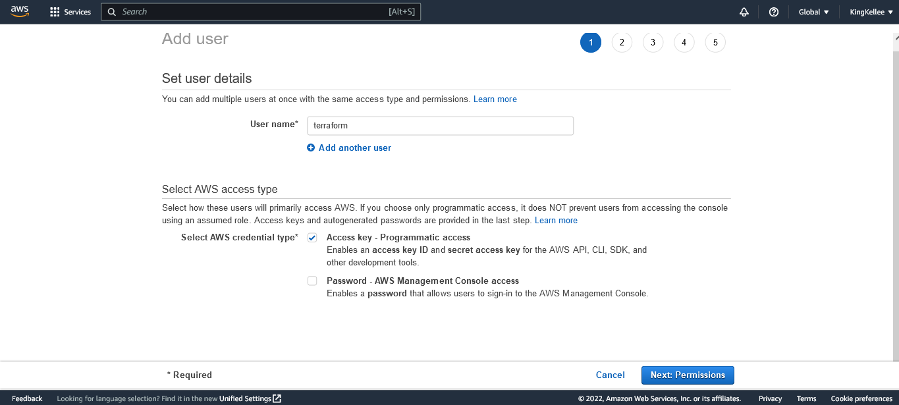
  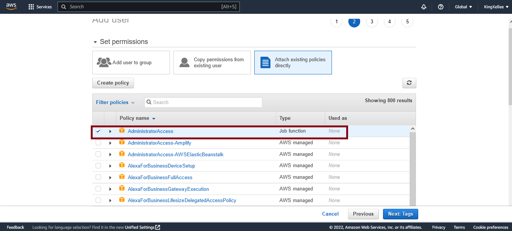

- Configure AWS Command Line Interface using secret access key and access key ID
- Configure Python SDK (boto3). Read the [Documentation](https://boto3.amazonaws.com/v1/documentation/api/latest/guide/quickstart.html)
- Create an S3 bucket to store Terraform state file.
  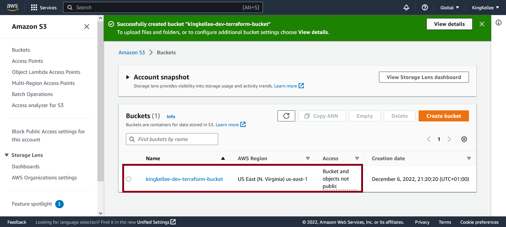
- Check you can programmatically access your AWS account in AWSCLI

```
aws s3 ls
```

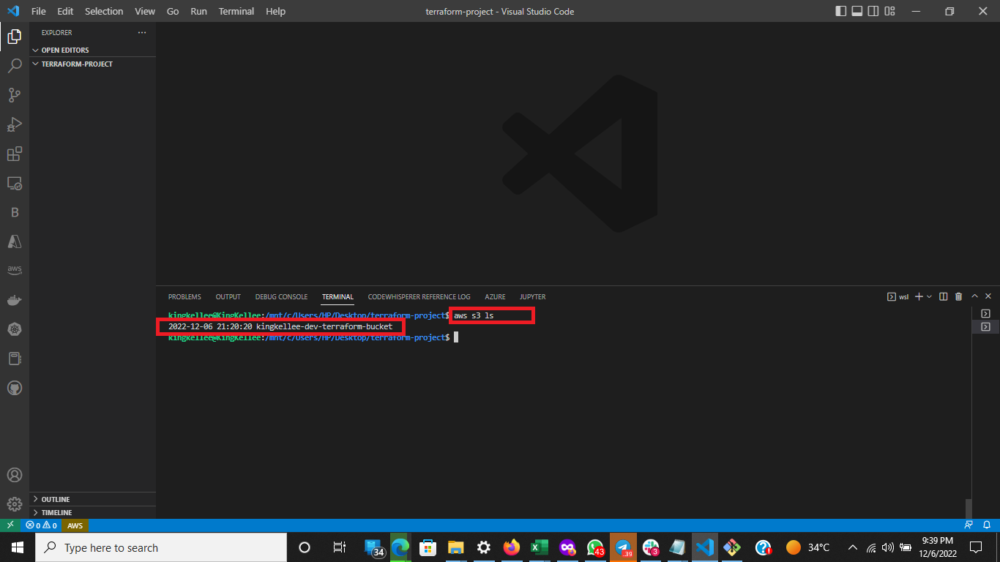

- Check you can programmatically access your AWS account by running following commands in >python:

```
import boto3
s3 = boto3.resource('s3')
for bucket in s3.buckets.all():
    print(bucket.name)
```

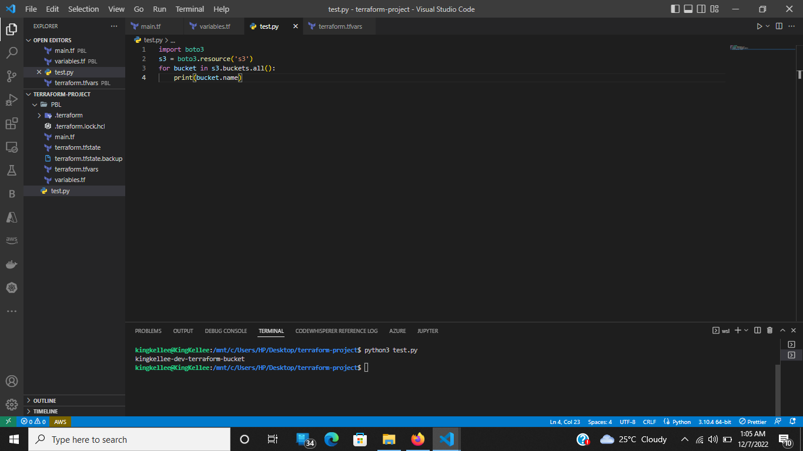

### Best practices

> Ensure that every resource is tagged using multiple key-value pairs. You will see this in action as we go along.
> Try to write reusable code, avoid hard coding values wherever possible.

## VPC | Subnets

#

### Provider and VPC resource section

#

- In Visual Studio Code:

  - Create a folder called PBL
  - Create a file in the folder, name it main.tf

  Your setup should look like this.
  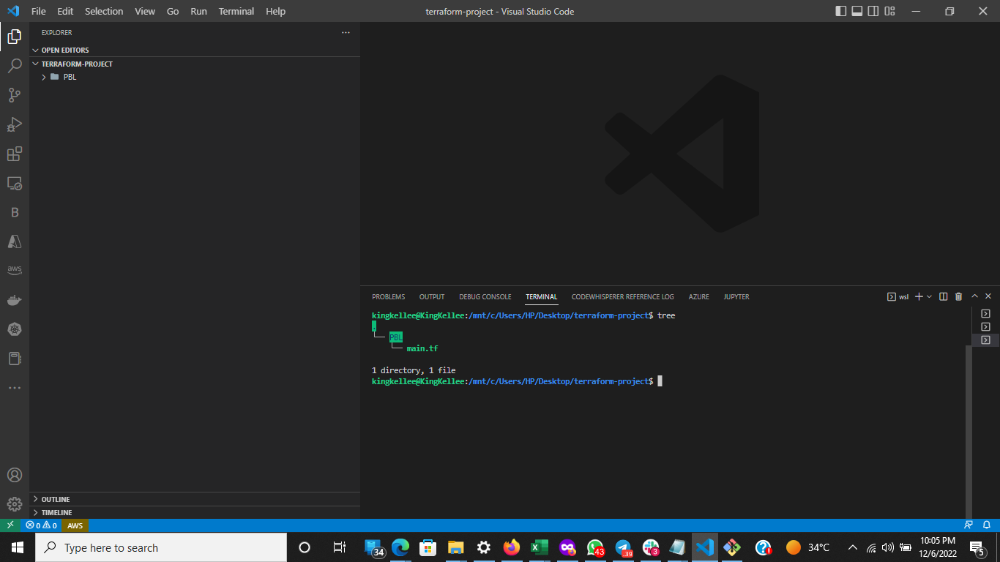

- Set up Terraform CLI following this [instruction](https://learn.hashicorp.com/tutorials/terraform/install-cli).

- in the `main.tf` Add AWS as a provider, and a resource to create a VPC in the main.tf file.
  - Note that the `Provider block` informs Terraform that we intend to build infrastructure within AWS.
  - While the `Resource block` will create a VPC.
    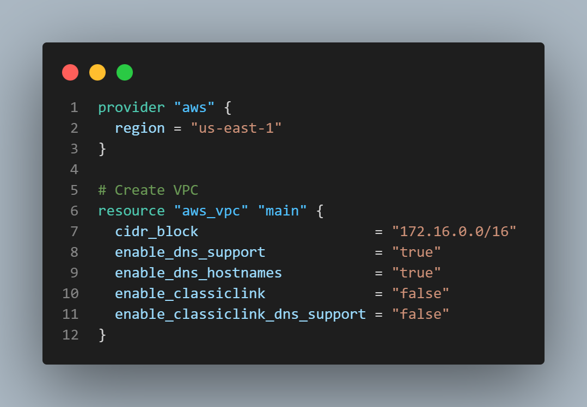
- Run the command:
  ```
  terraform init
  ```
  - This will download the necessary plugins for Terraform to work. These plugins are used by `providers` and `provisioners`.
    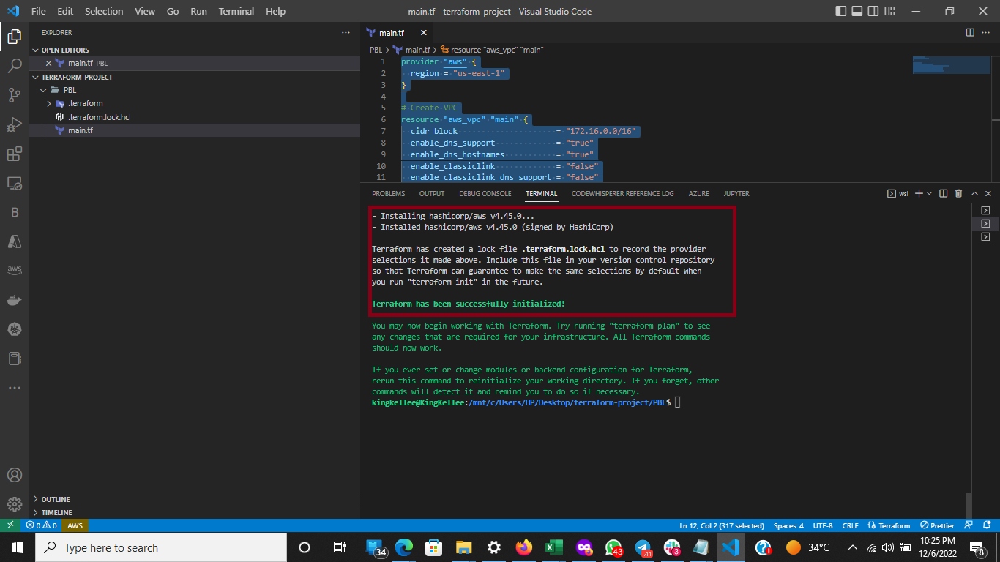
- To create the `aws_vpc` Resource whic was defined in our `main.tf` Run the command:
  ```
  terraform plan
  ```
  - Terraform plan lets you to preview the actions Terraform would take to modify your infrastructure, or save a speculative plan which you can apply later.
  - A new file is created when we execute `terraform plan` called `terraform.tfstate`, Terraform uses this to keep itself up to date with the exact state of the infrastructure. It reads this file to know what already exists, what should be added, or destroyed based on the entire terraform code that is being developed.
  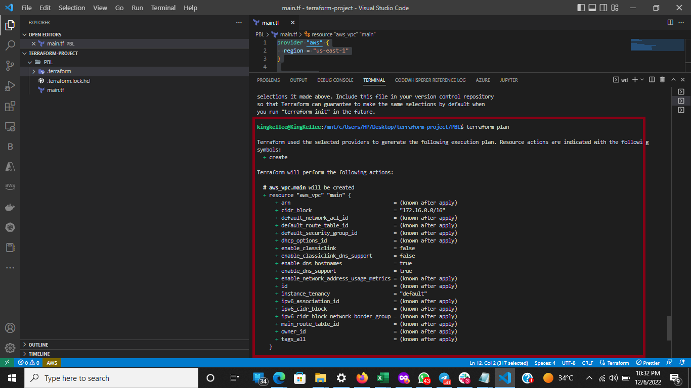
  - If we are satisfied is what is being created, we can run the command below to save/apply or create the infrastructure
    ```
    terraform apply
    ```
    - A new file called `terraform.tfstate.lock.info` is created during the planning and applying stage which gets deleted immediately. Terraform uses it to track, who is running its code against the infrastructure at any point in time.
    - This is very important for teams working on the same Terraform repository at the same time. The lock prevents a user from executing Terraform configuration against the same infrastructure when another user is doing the same to avoid duplicates and conflicts.
    - Its content is usually like this.
    ```
    {
        "ID":"e5e5ad0e-9cc5-7af1-3547-77bb3ee0958b",
        "Operation":"OperationTypePlan","Info":"",
        "Who":"dare@Dare","Version":"0.13.4",
        "Created":"2020-10-28T19:19:28.261312Z",
        "Path":"terraform.tfstate"
    }
    ```

## Subnets resource section

#

- To create the first 2 public subnets

  - Add below configuration to the main.tf file:
    
  - To create 2 subnets, we declare 2 resource blocks – one for each of the subnets.
  - We use the `vpc_id` argument to interpolate the value of the VPC id by setting it to `aws_vpc.main.id`. This way, Terraform knows inside which VPC to create the subnet.
  - Run the following command to create the infratructure

    ```
     # This is used to rewrite Terraform configuration files to a canonical format and style.
     terraform fmt
    ```

    ```
    terraform plan
    ```

    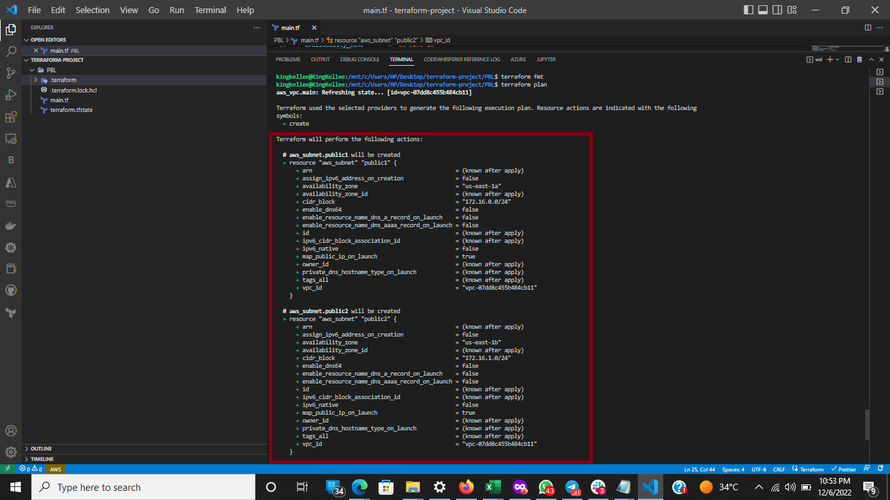

    ```
    #  Apply changes without having to interactively type 'yes' to the plan.
    terraform apply --auto-approve
    ```

## Fixing The Problems By Code Refactoring

#

- What we have done above is to Hardcode the values for Both the `availability_zone` and `cidr_block` arguments, but this is not Best Practice
- We need to make our IAC dynamic by creating a single resource block that can dynamically create resources without specifying multiple blocks.

- First Beging by destroying the Infrastructure we Just deployed

  ```
  # to destroy all remote objects managed by a particular Terraform configuration.

  terraform destroy
  ```

- **Fixing Hard Coded Values:** We will introduce variables, and remove hard coding.

  - Starting with the `provider block`,

    - Declare a variable named region,
    - Give it a default value,
    - Update the provider section by referring to the declared variable.

    ```
        variable "region" {
            default = "us-east-1"
        }

        provider "aws" {
            region = var.region
        }
    ```

  - Do the same to `cidr value` in the `vpc block`, and all the other arguments.
    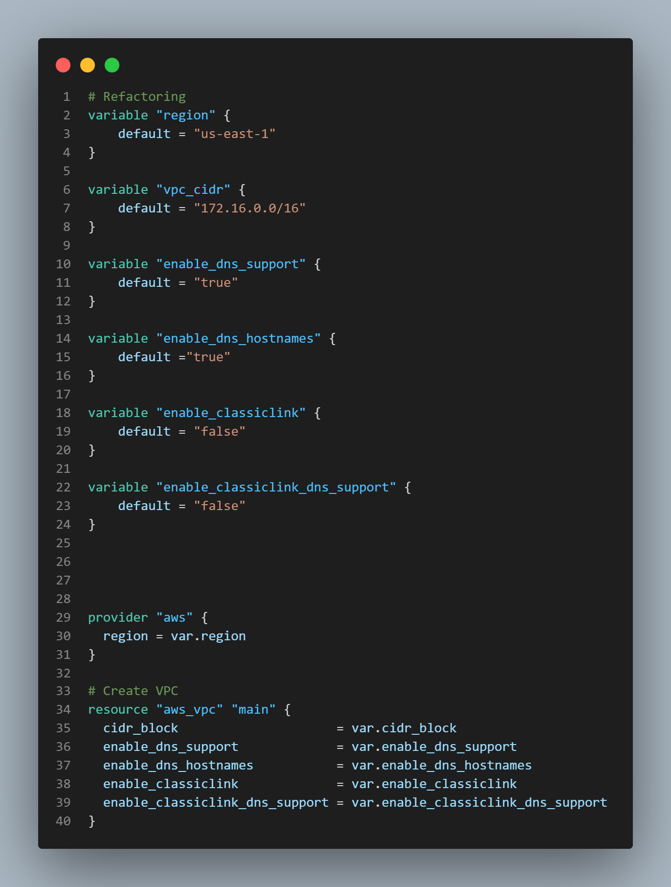

- **Fixing multiple resource blocks**

  - Get Availability zones from AWS, and replace the hard coded value in the subnet’s `availability_zone` section.
    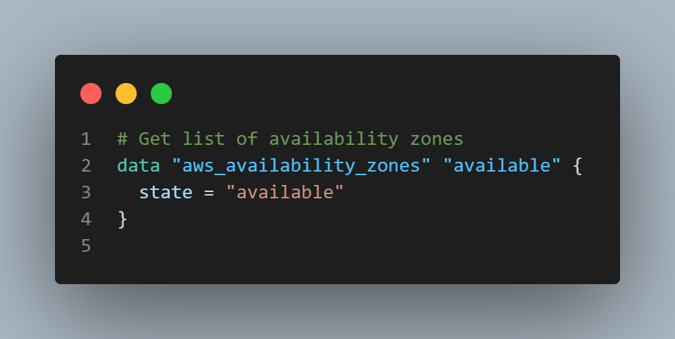

  - To make use of this new data resource, we will need to introduce a count argument in the subnet block: Something like this.

  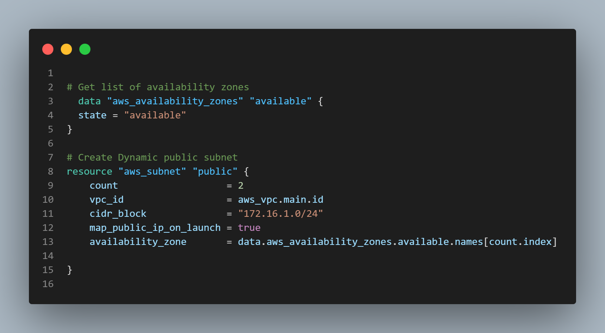

  - `Count` tells us that we need 2 subnets. Therefore, Terraform will invoke a loop to create 2 subnets.
  - The `data` resource will return a list object that contains a list of AZs. Internally, Terraform will receive the data like this

  ```
  ["us-east-1a", "us-east-1b"]
  ```

  - Because we still have `cidr_block` hard coded. we may fail after the first time if we attempt to deploy this IAC, The same cidr_block cannot be created twice within the same VPC.

- **Make cidr_block dynamic**:

  - Using `cidrsubnet()` function, we can dynamically create a subnet CIDR per AZ. Regardless of the number of subnets created, it accepts three (3) parameters as shpwn below

  ```
  cidrsubnet(prefix, newbits, netnum)
  ```

  - **The prefix parameter** must be given in CIDR notation, same as for VPC.
  - **The newbits parameter** is the number of additional bits with which to extend the prefix. For example, if given a prefix ending with /16 and a newbits value of 4, the resulting subnet address will have length /20
  - **The netnum parameter** is a whole number that can be represented as a binary integer with no more than newbits binary digits, which will be used to populate the additional bits added to the prefix
    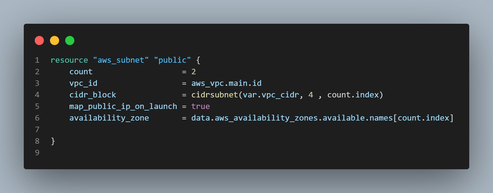

- The final problem to solve is removing hard coded count value.

  - To do this, we can introuduce `length() function`, which basically determines the length of a given list, map, or string.
  - Since `data.aws_availability_zones.available.names` returns a list like

  ```
  ["us-east-1a", "us-east-1b", "us-east-1c"]
  ```

  we can pass it into a lenght function and get number of the AZs.

  ```
  length( ["us-east-1a", "us-east-1b", "us-east-1c"])
  ```

  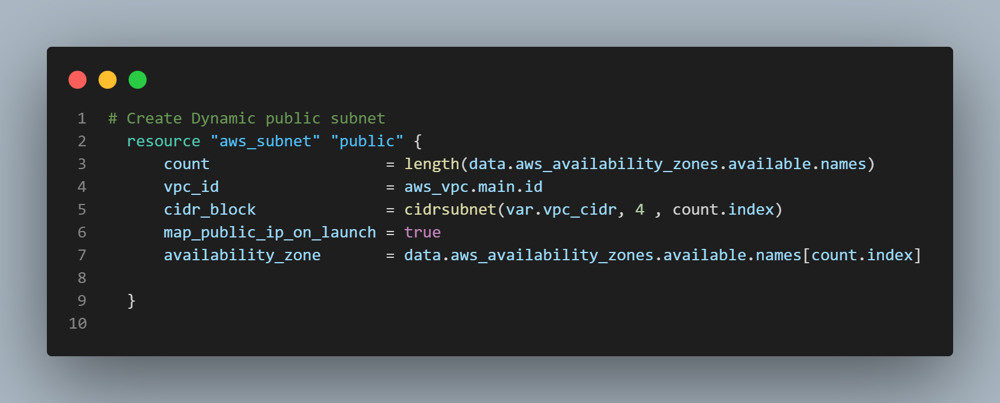

- What we have now, is sufficient to create the subnet resource required. But if you observe, it is not satisfying our business requirement of just 2 subnets. The length function will return number 3 to the count argument, but what we actually need is 2.

  - To fic this, we Declare a variable to store the desired number of public subnets, and set the default value
    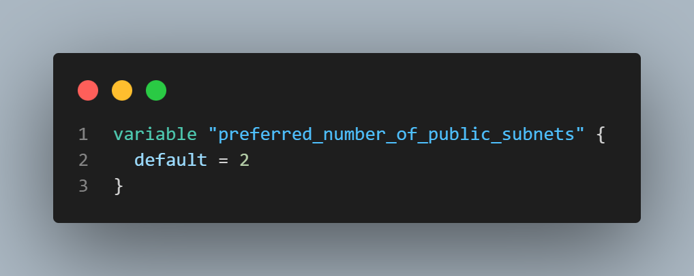
  - Next, update the count argument with a condition.
  - Terraform needs to check first, if there is a desired number of subnets. Otherwise, use the data returned by the lenght function.
    

  - The first part `var.preferred_number_of_public_subnets == null` checks if the value of the variable is set to null or has some value defined.
  - The second part `? and length(data.aws_availability_zones.available.names)` means, if the first part is true, then use this. In other words, if preferred number of public subnets is null (Or not known) then set the value to the data returned by lenght function.
  - The third part `: and var.preferred_number_of_public_subnets` means, if the first condition is false, i.e preferred number of public subnets is not null then set the value to whatever is definied in var.preferred_number_of_public_subnets

- The entire configuration should look like this
  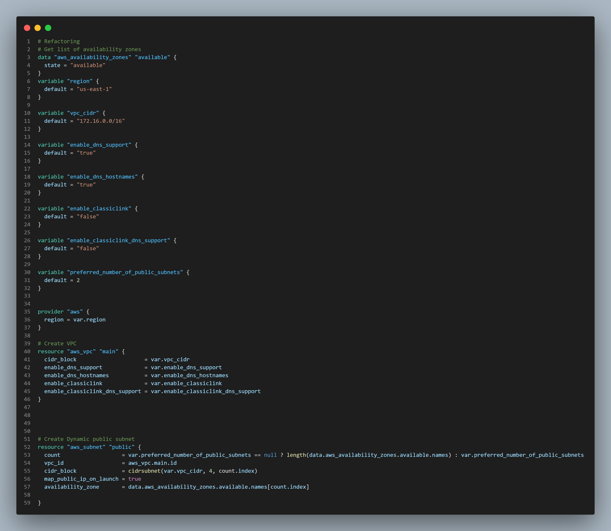

## Introducing variables.tf & terraform.tfvars

#

- Instead of havng a long lisf of variables in `main.tf`file, we can actually make our code a lot more readable and better structured by moving out some parts of the configuration content to other files.

- We can put all variable declarations in a separate file
  And provide non default values to each of them

      - Create a new file and name it `variables.tf`
      ```
      touch variables.tf
      ```
      - Copy all the variable declarations into the new file.
      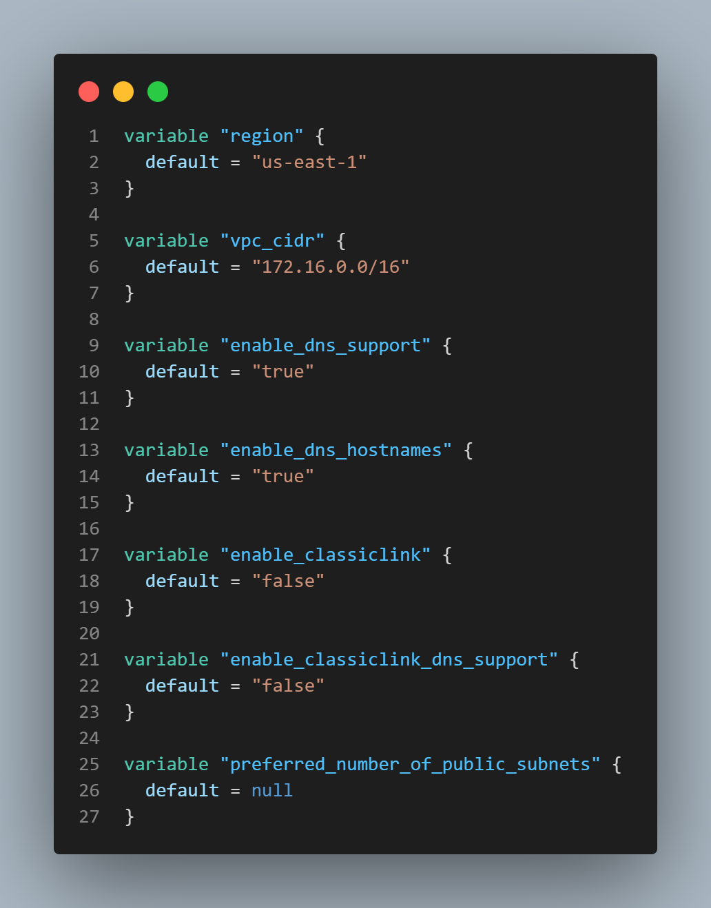

      - Create another file, name it `terraform.tfvars`
      Set values for each of the variables.
      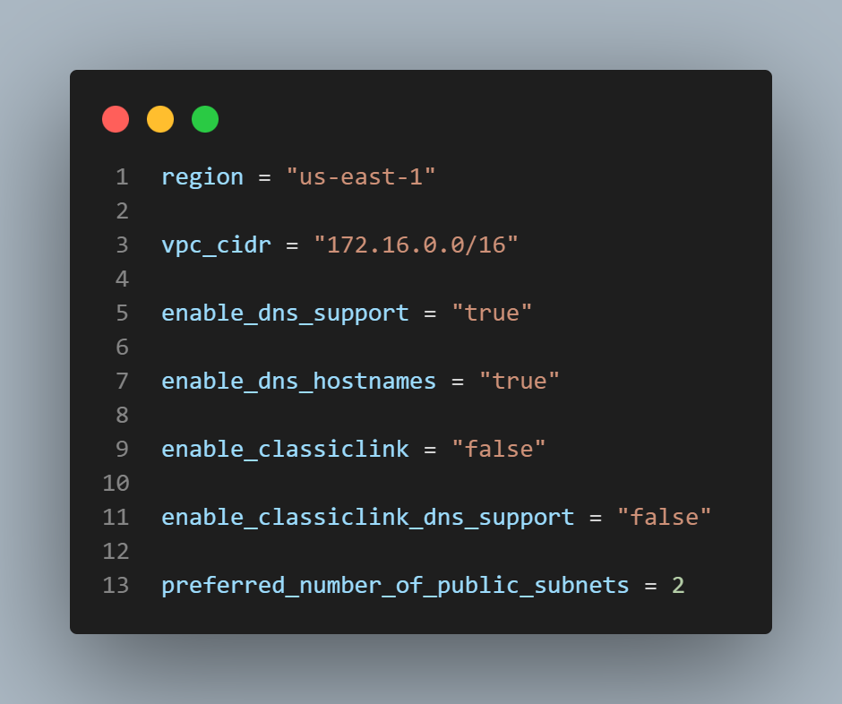

      - Our Cleaned up `main.tf`
      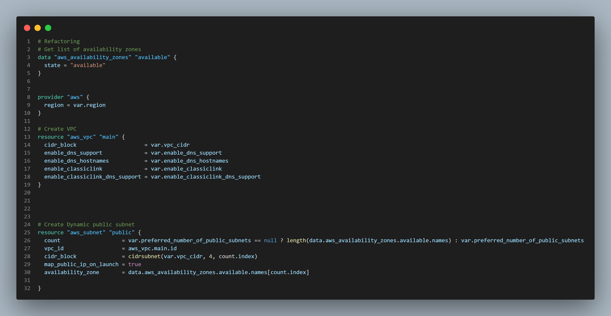
      - Our File Structure should look like this
      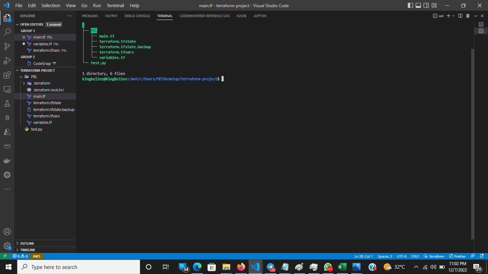

- Execute Deployment of IAC

  - Run `terraform fmt`
  - Run `terraform validate`
  - Run `terraform plan`
    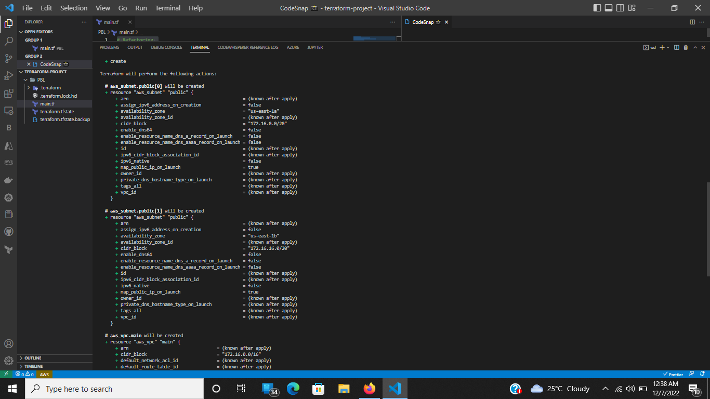
  - Run `terraform apply --auto-approve`

- Check Created Infrastructure
  VPC
  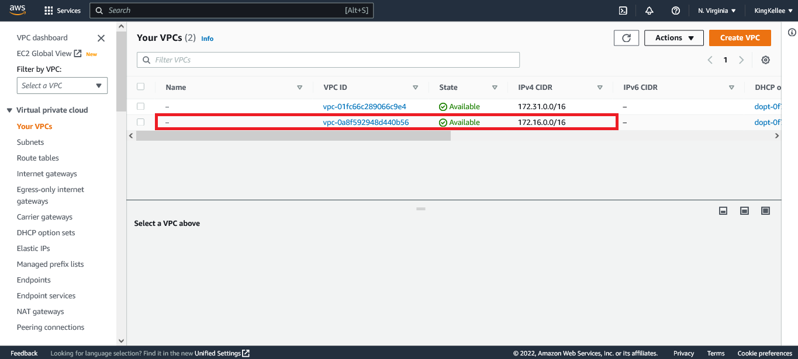

PUBLIC SUBNETS
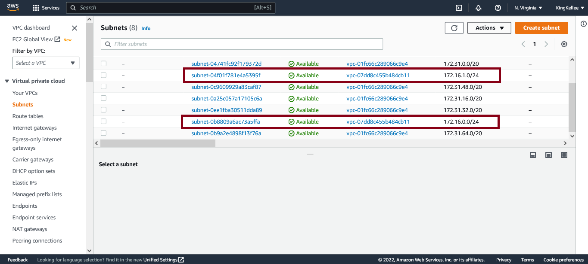

- Destroy Infrastructure
  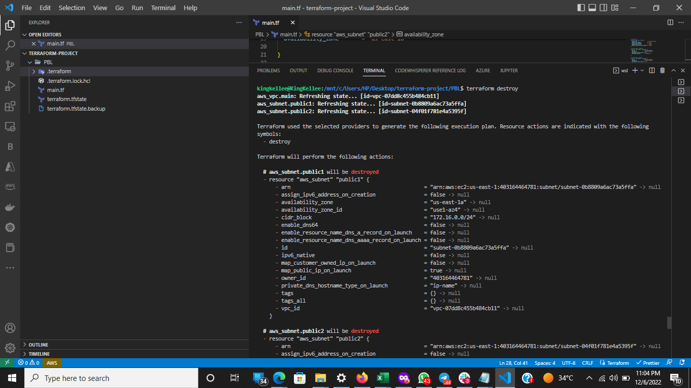
  
  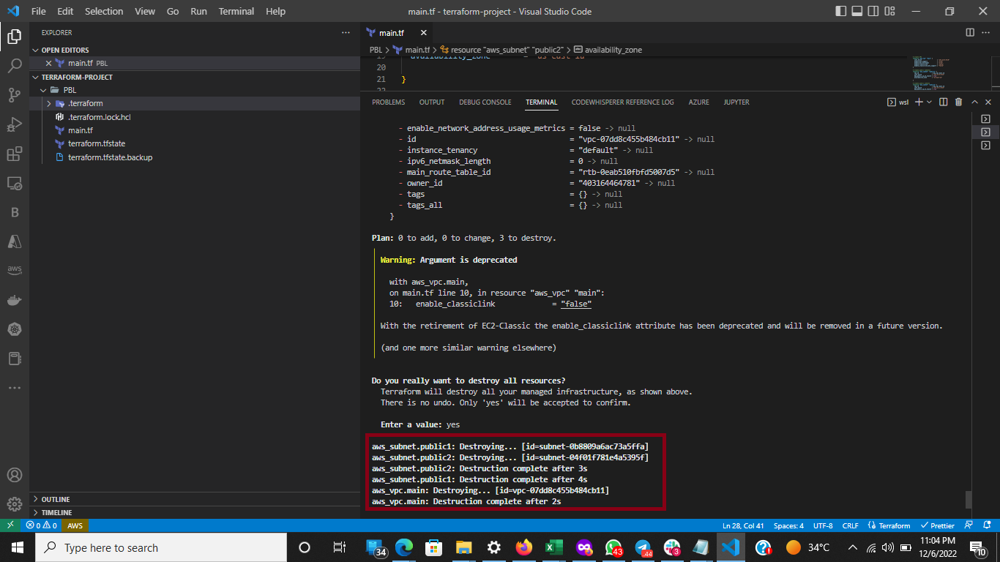
