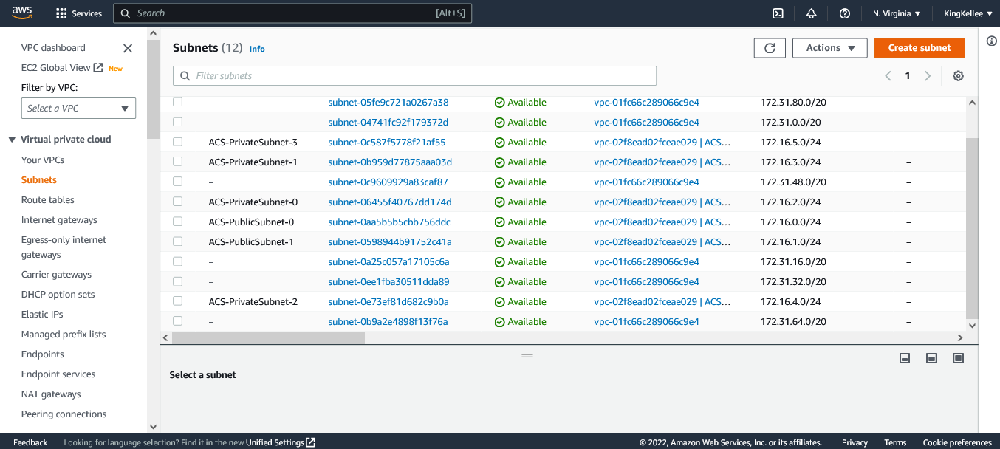
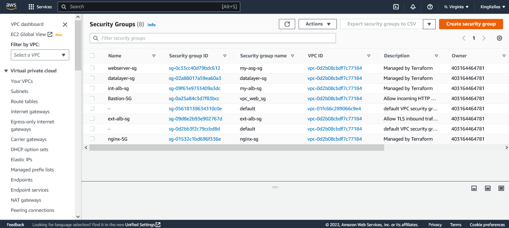
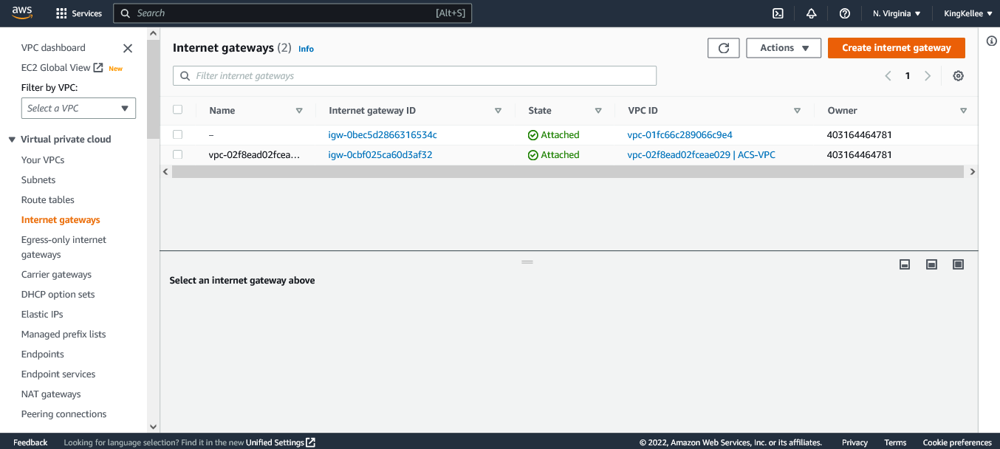
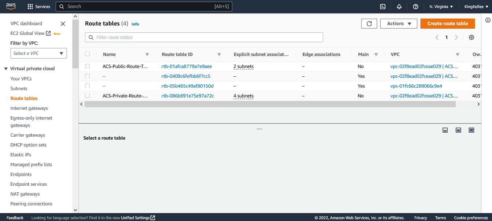
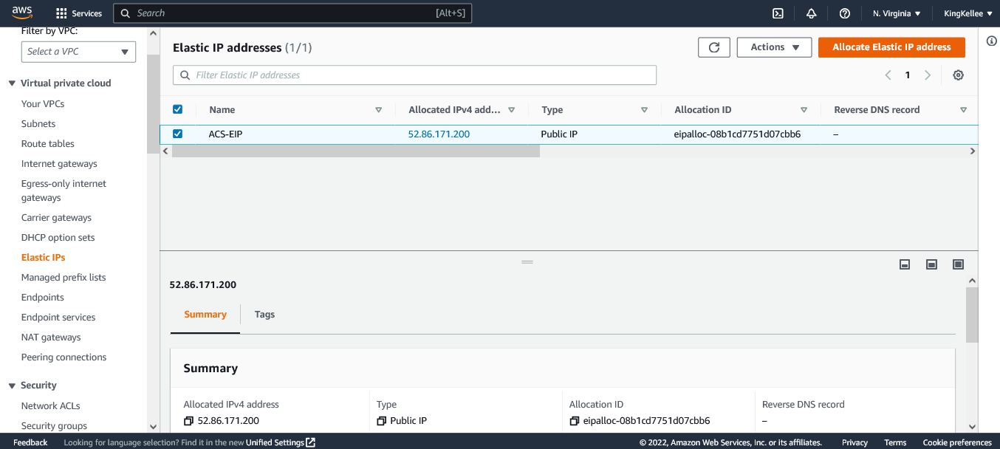
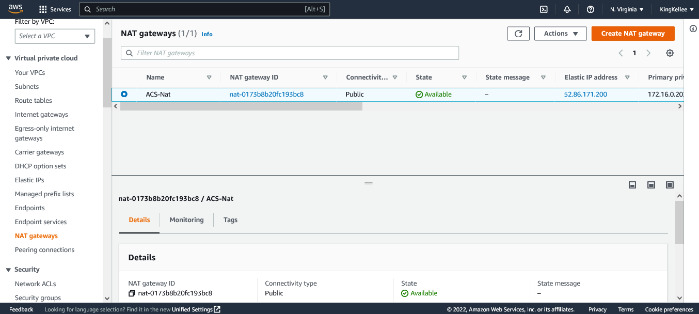
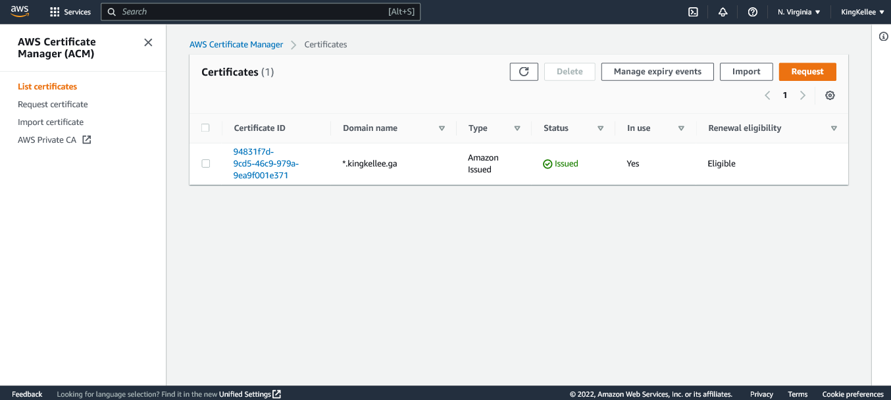
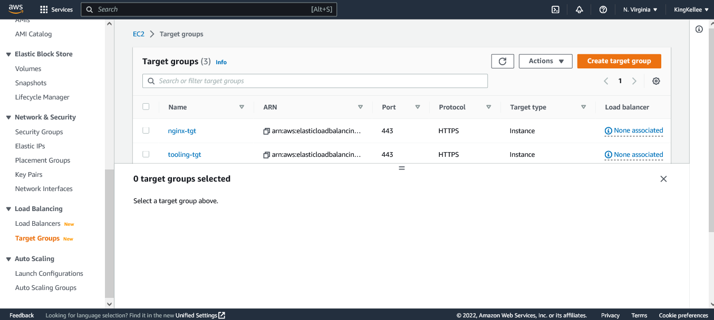
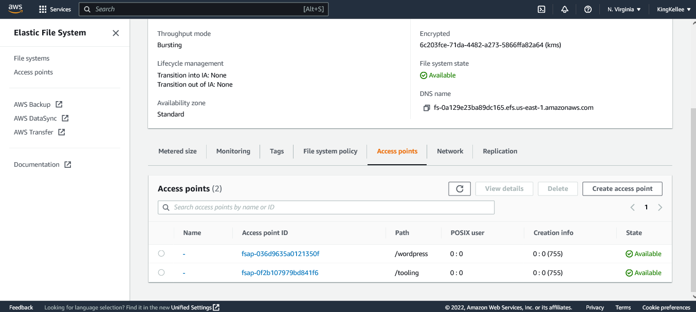
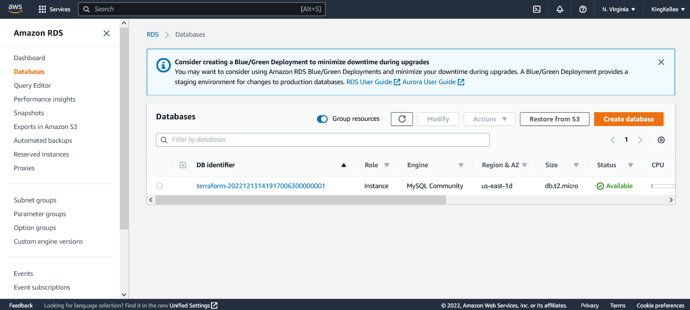

# Project 17 Automate Infrastructure With IAC using Terraform Part 2

## Project Architecture at a Glance

#


# Pre-requisite

- This is continuation of [Project 16](https://github.com/Kingkellee/dareyio-pbl/blob/master/project16.md)
- Understand certain concepts around Networking

  - [Watch this Video on Introdductio Networking](https://youtu.be/rL8RSFQG8do)
  - [Watch this Video TCP/IP and Subnet Masking](https://youtu.be/EkNq4TrHP_U)

  - [Dive Deeper into Networking](https://www.youtube.com/playlist?list=PLF360ED1082F6F2A5)
  - [An Introduction to Networking Terminology, Interfaces, and Protocols](https://www.digitalocean.com/community/tutorials/an-introduction-to-networking-terminology-interfaces-and-protocols)
  - [Netmasks and Subnets](https://www.digitalocean.com/community/tutorials/understanding-ip-addresses-subnets-and-cidr-notation-for-networking#netmasks-and-subnets)

## Basic Concepts

#

#### 1. INTERFACES

#

- A network interface is the network-specific software that communicates with the network-specific device driver and the IP layer in order to provide the IP layer with a consistent interface to all network adapters that might be present.
  The IP layer selects the appropriate network interface based on the destination address of the packet to be transmitted. Each network interface has a network address. The Network Interface layer is responsible for adding or removing any link layer protocol header required to deliver a message to its destination. The network adapter device driver controls the network adapter card. [Source](https://www.ibm.com/docs/en/aix/7.2?topic=protocol-tcpip-network-interfaces)

#### 2. PROTOCOLS

#

- A network protocol is an established set of rules that determine how data is transmitted between different devices in the same network. Essentially, it allows connected devices to communicate with each other, regardless of any differences in their internal processes, structure or design. Network protocols are the reason you can easily communicate with people all over the world, and thus play a critical role in modern digital communications. [Source](https://www.comptia.org/content/guides/what-is-a-network-protocol)

#### 3. IP ADDRESS

#

- An IP address is a long string of numbers assigned to every device connected to a network that uses Internet Protocol as the medium for communication; it’s the digital world’s equivalent of the mailing address associated with your home or workplace.
  The way Internet Protocol works is that information is transmitted over the network in discrete chunks called packets; each packet is mostly made up of whatever data the sender is trying to communicate, but also includes a header, consisting of metadata about that packet. [source](https://www.networkworld.com/article/3588315/what-is-an-ip-address-and-what-is-your-ip-address.html)

#### 4. SUBNETS

#

- A subnet, or subnetwork, is a segmented piece of a larger network. More specifically, subnets are a logical partition of an IP network into multiple, smaller network segments. Each subnet allows its connected devices to communicate with each other, while routers are used to communicate between subnets. The size of a subnet depends on the connectivity requirements and the network technology employed. A point-to-point subnet allows two devices to connect, while a data center subnet might be designed to connect many more devices. [Source](https://www.techtarget.com/searchnetworking/definition/subnet)

#### 5. CIDR NOTATION

#

- Classless inter-domain routing (CIDR) is a set of Internet Protocol (IP) standards that is used to create unique identifiers for networks and individual devices. The IP addresses allow particular information packets to be sent to specific computers.
  CIDR IP addresses consist of two groups of numbers, which are also referred to as groups of bits. The most important of these groups is the network address, and it is used to identify a network or a sub-network (subnet). The lesser of the bit groups is the host identifier. The host identifier is used to determine which host or device on the network should receive incoming information packets. [source](https://whatismyipaddress.com/cidr)

#### 6. IP ROUTING

#

- IP Routing is an umbrella term for the set of protocols that determine the path that data follows in order to travel across multiple networks from its source to its destination. Data is routed from its source to its destination through a series of routers, and across multiple networks. The IP Routing protocols enable routers to build up a forwarding table that correlates final destinations with next hop addresses.

These protocols include:

- BGP (Border Gateway Protocol)
- IS-IS (Intermediate System - Intermediate System)
- OSPF (Open Shortest Path First)
- RIP (Routing Information Protocol)

#### 7. INTERNET GATEWAYS

#

- An Internet gateway is a network "node" that connects two different networks that use different protocols (rules) for communicating. In the most basic terms, an Internet gateway is where data stops on its way to or from other networks. Thanks to gateways, we can communicate and send data back and forth with each other.
  Gateways can take several different forms from hardware to software - including routers and computers - and can perform a variety of tasks. These can range from passing traffic to the next 'hop' on its path to filtering traffic, proxies, or protocol translations. Because gateways are, by definition, at the edge of a network, they are often combined with firewalls, which keep out unwanted traffic or 'foreign' computers from a closed network. [Source](https://www.whatismypublicip.com/blog/what-is-an-internet-gateway/)

#### 8. NAT

#

- To access the Internet, one public IP address is needed, but we can use a private IP address in our private network. The idea of NAT is to allow multiple devices to access the Internet through a single public address. To achieve this, the translation of a private IP address to a public IP address is required. Network Address Translation (NAT) is a process in which one or more local IP address is translated into one or more Global IP address and vice versa in order to provide Internet access to the local hosts. Also, it does the translation of port numbers i.e. masks the port number of the host with another port number, in the packet that will be routed to the destination. It then makes the corresponding entries of IP address and port number in the NAT table. NAT generally operates on a router or firewall.[Source](https://www.geeksforgeeks.org/network-address-translation-nat/)

## NETWORKING

#

### Create 4 private subnets:

While creating private subnets keep in mind following principles

- Use variables or length() function to determine the number of AZs
- Use variables and cidrsubnet() function to allocate vpc_cidr for subnets
- Keep variables and resources in separate files for better code structure and readability
- Tags all the resources you have created so far. Explore how to use format() and count functions to automatically tag subnets with its respective number.
  

### Using Tags

- Default Tags can be defined in out `terraform.tfvars`

```
tags = {
  Enviroment      = "production"
  Owner-Email     = "dare@darey.io"
  Managed-By      = "Terraform"
  Billing-Account = "1234567890"
}
```

- We can then proceed to use the tag in our resources as shown below

```
tags = merge(
    var.tags,
    {
      Name = "Name of the resource"
    },
  )
```

- We then declare the Variables `tags` in our `variables.tf` file so that our resources can refrence it

```
variable "tags" {
  description = "A mapping of tags to assign to all resources."
  type        = map(string)
  default     = {}
}
```

- The nice thing about this is – anytime we need to make a change to the tags, we simply do that in terraform.tfvars.

### Creating Internet Gateways & format() function

#

- Create an Internet Gateway in a separate Terraform file internet_gateway.tf
  

- The `format() function` dynamically generate a unique name for this resource. The first part of the `%s` takes the interpolated value of aws_vpc.main.id while the second `%s` appends a literal string IG and finally an exclamation mark is added in the end.

### Creating NAT Gateways and Elastic IP (EIP) addresses

- Using a similar approach to create the NAT Gateways in a new file called `natgateway.tf.`
  
- We use the `depends_on` to indicate that the Internet Gateway resource must be available before this should be created [Read More..](https://www.terraform.io/docs/language/meta-arguments/depends_on.html)

### Creating AWS routes

#

- We create a new file called `route_tables.tf`, inside the file we create routes for both public and private subnets,and ensure they are properly tagged.
  

### Note the Netwroking Part of Our Infrastructure will Create the following resource if we run terraform plan

    ✅  Our main vpc
    ✅  2 Public subnets
    ✅  4 Private subnets
    ✅  1 Internet Gateway
    ✅  1 NAT Gateway
    ✅  1 EIP
    ✅  2 Route tables

## Compute and Access Control configuration

#

### AWS Identity and Access Management

#

#### IaM and Role

- We want to pass an IAM role to our EC2 instances to give them access to some specific resources, so we need to do the following in a new configuration file named `roles.tf`:

1. Create AssumeRole
   

   - Assume Role uses Security Token Service (STS) API that returns a set of temporary security credentials that you can use to access AWS resources that you might not normally have access to. These temporary credentials consist of an access key ID, a secret access key, and a security token. Typically, you use AssumeRole within your account or for cross-account access.

1. Create IAM policy for this role
   
   - This is where we need to define a required policy (i.e., permissions) according to our requirements. For example, allowing an IAM role to perform action describe applied to EC2 instances:
1. Attach the Policy to the IAM Role
   
   - This is where, we will be attaching the policy which we created above, to the role we created in the first step.
1. Create an Instance Profile and interpolate the IAM Role
   - 

### Create Security Groups

- Create a file and name it `security.tf`, it will create all the security groups in a single file, then we are going to refrence this security group within each resources that needs it.
- You can refrence the terraform documentation for [security group](https://registry.terraform.io/providers/hashicorp/aws/latest/docs/resources/security_group) and [security group rule](https://registry.terraform.io/providers/hashicorp/aws/latest/docs/resources/security_group)
  
- the `aws_security_group_rule` is used to refrence another security group in a security group.

### Create Certificate From Amazon Cerificate Manager

#

- Create a `cert.tf file` read through the terraform documentation for [AWS Certificate manager](https://registry.terraform.io/providers/hashicorp/aws/latest/docs/resources/acm_certificate)
  

### Create an External (Internet facing) Application Load Balancer (ALB)

#

- Create a file called `alb.tf`
- Create an ALB to balance the traffic between the Instances, see terraform documentation [ALB](https://registry.terraform.io/providers/hashicorp/aws/latest/docs/resources/lb):
  
- To inform our ALB to where route the traffic we need to create a Target Group to point to its targets see terraform documentation [ALB Target](https://registry.terraform.io/providers/hashicorp/aws/latest/docs/resources/lb_target_group):
  
- Then we will need to create a Listner for this target Group See [ALB Listener](https://registry.terraform.io/providers/hashicorp/aws/latest/docs/resources/lb_listener):
  
- Add the following outputs to `output.tf` to print them on screen

```
output "alb_dns_name" {
  value = aws_lb.ext-alb.dns_name
}

output "alb_target_group_arn" {
  value = aws_lb_target_group.nginx-tgt.arn
}
```

### Create an Internal (Internal) Application Load Balancer (ALB)

#

- For the Internal Load balancer, using the same concepts with the external load balancer, Add the code snippets inside the `alb.tf`
  
- We also need to inform our Internal ALB where to route the traffic. We create a Target Group to point to its targets:
  
- Lastly we create a Listner for this target Group
  

### Creating Austoaling Groups (ASG)

#

- To configure our ASG to be able to scale the EC2s out and in depending on the application traffic, We need to first create the launch template and the the AMI needed.
- Useful Terraform Documentation, go through this documentation and understand the arguement needed for each resources:
  - [SNS-topic](https://registry.terraform.io/providers/hashicorp/aws/latest/docs/resources/sns_topic)
  - [SNS-notification](https://registry.terraform.io/providers/hashicorp/aws/latest/docs/resources/autoscaling_notification
  - [Austoscaling](https://registry.terraform.io/providers/hashicorp/aws/latest/docs/resources/autoscaling_group)
  - [Launch-template](https://registry.terraform.io/providers/hashicorp/aws/latest/docs/resources/launch_template)
- Create a file and name it `asg-bastion-nginx.tf`
- Add the SNS topic configuration resource for creating notification for all the auto scaling groups
  

#### Create launch template for bastion `asg-bastion-nginx.tf`


#### Create Autoscalling Group for Bastion in `asg-bastion-nginx.tf`


#### Create launch template for NGINX in `asg-bastion-nginx.tf`


#### Create Autoscalling Group for NGINX in `asg-bastion-nginx.tf`


#### Create launch template for Wordpress in `asg-wordpress-tooling.tf`


#### Create Autoscalling Group for Wordpress in `asg-wordpress-tooling.tf`


#### Create launch template for Tooling in `asg-wordpress-tooling.tf`


#### Create Autoscalling Group for Tooling in `asg-wordpress-tooling.tf`


## Storage and Database

#

- Useful Terraform Documentation, go through this documentation and understand the arguement needed for each resources:
  [RDS](https://registry.terraform.io/providers/hashicorp/aws/latest/docs/resources/db_instance)
  [EFS](https://registry.terraform.io/providers/hashicorp/aws/latest/docs/resources/efs_file_system)
  [KMS](https://registry.terraform.io/providers/hashicorp/aws/latest/docs/resources/kms_key)

### Create Elastic File System (EFS)

#

- First create a KMS key. The AWS Key Management Service (KMS) makes it easy for you to create and manage cryptographic keys and control their use across a wide range of AWS services and in your applications.

- Then we create EFS and it mount targets


### Create MySQL RDS

- We create a new file name `rds.tf` and add the following code snippets
  

### Declaring Variables in `Variables.tf`

- Go through the entire code and variables defined in our resources and declare them in the variables.tf file.
  
- Declare the values for the variables defined in our `varibales.tf` in `terraform.tfvars` file.
  

## Deploying our Infrastructure

Run

```
terraform fmt
```

```
terraform validate
```

- before we paln and apply our code we need to take note of two things;
  - Using the concepts of modules in Project 18 we will refactor the long list of files in this project.
  - Secondly, our application wont work becuase in out shell script that was passed into the launch some endpoints like the RDs and EFS point is needed in which they have not been created yet. So in project 19 we will use our Ansible knowledge to fix this.

```
terraform plan
```

```
terraform apply --auto-approve
```

## Resources Created

1. VPC
   
1. SUBNETS
   
1. SECURITY GROUPS
   
1. INTERNET GATEWAY
   
1. ROUTE-TABLES
   
1. EIP
   
1. NAT GATEWAY
   
1. HOSTED ZONE
   
1. AWS CERTIFICATE
   
1. LOAD BALANCER
   
1. TARGET GROUP
   
1. LAUNCH TEMPLATES
   
1. INSTANCES
   
1. EFS-ACCESS POINTS
   
1. RDS
   

## PROJECT REPO

# [Github Repo for Project 17](https://github.com/Kingkellee/terraform-iac/tree/main/PBL)
