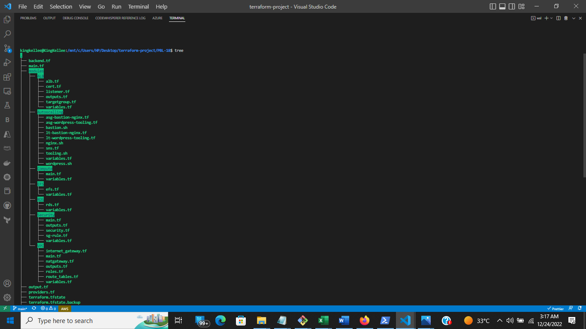
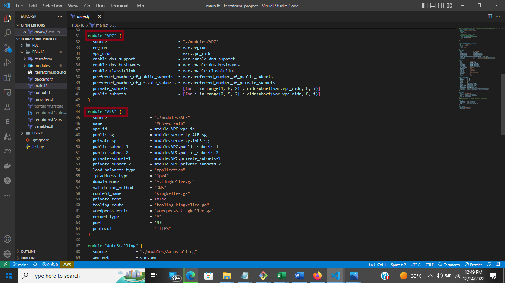

# PROJECT 18 : Automate Infrastructure With IaC using Terraform-Part 3

## Project Architecture at a Glance

#


# Pre-requisite

- This is continuation of [Project 16](https://github.com/Kingkellee/dareyio-pbl/blob/master/project16.md) and [Project 17](https://github.com/Kingkellee/dareyio-pbl/blob/master/project17.md)

## Refactor your project using Modules

- In this project we review the repository from [project 17](https://github.com/Kingkellee/terraform-iac/tree/main/PBL)), in the previous project notice that we had a single list of long file for creating all of our resources, but that is not the best way to go about it, having a long list of infrastructure makes our code base vey hard to read and understand therefore making future changes quite stressful.

- In this project we Break down the Terraform codes to have all resources in their respective modules. Combine resources of a similar type into directories within a ‘modules’ directory.

- Modules serve as containers that allow to logically group Terraform codes for similar resources in the same domain (e.g., Compute, Networking, AMI, etc.). One root module can call other child modules and insert their configurations when applying Terraform config. This concept makes your code structure neater, and it allows different team members to work on different parts of configuration at the same time.

- You can also create and publish your modules to Terraform Registry for others to use and use someone’s modules in your projects.

- Module is just a collection of `.tf` and/or `.tf.json` files in a directory.

- You can refer to existing child modules from your root module by specifying them as a source, like this:

```
module "network" {
  source = "./modules/network"
}
```

- Create a directory called modules in the root project directory
- Within the modules directory create directories named `VPC`, `Security`, `EFS`, `RDS`, `ALB`, `Autoscaling` and `Compute`.
- Within each of this directory created, copy files related to the named directory e.g For the VPC directory, the files needed to setup our `VPC` are `internet-gateway`, `Nat-gateway`, `Routes` etc.

#### The contents of each modules directory will be like the screenshot below:

#### VPC


#### SECURITY


#### ALB


#### Autoscalling


#### Compute


#### EFS


#### RDS


#### A tree view of all Modules and Child Directory



- Also create a `variables.tf` file in all the created directories, so the content of the directory will have a `variables.tf` file and other files related to the name of the directories.

- Note that the path to ‘network’ module is set as relative to your working directory. Or you can also directly access resource outputs from the modules, like this:

```
resource "aws_elb" "example" {
  # ...

  instances = module.servers.instance_ids
}
```




## Introducing Backend on S3

#

- So far, we have been using the default backend, which is the local backend – it requires no configuration, and the states file is stored locally. This mode can be suitable for learning purposes, but it is not a robust solution, so it is better to store it in some more reliable and durable storage.

- To solve this, we will need to configure a backend where the state file can be accessed remotely other DevOps team members using AWS – S3 bucket as a backend. There are plenty of different standard backends supported by Terraform that you can choose from.

- Here is how I went about to Re-initialize Terraform to use S3 backend:

  - Add the below code and replace the name of the S3 bucket you created in [Project-16](https://github.com/Kingkellee/dareyio-pbl/blob/master/project16.md) in your root `main.tf`.
    
  - Note that Terraform stores secret data inside the state files. Passwords, and secret keys processed by resources are always stored in there. Hence, you must consider to always enable encryption using `server_side_encryption_configuration`.
  - create a DynamoDB table to handle locks and perform consistency checks. In previous projects, locks were handled with a local file as shown in `terraform.tfstate.lock.info`.
  - With a cloud storage database like DynamoDB, anyone running Terraform against the same infrastructure can use a central location to control a situation where Terraform is running at the same time from multiple different people. So we create a file and name it `backend.tf`. Add the below code in your root `main.tf`
    

  - Terraform expects that both S3 bucket and DynamoDB resources are already created before we configure the backend. So, let us run terraform apply to provision resources.

  ```
  terraform plan
  ```

  

  ```
  terraform apply --auto-approve
  ```

  
  

## Resources Created

1. VPC
   
1. SUBNETS
   
1. SECURITY GROUPS
   
1. INTERNET GATEWAY
   
1. ROUTE-TABLES
   
1. EIP
   
1. NAT GATEWAY
   
1. HOSTED ZONE
   
1. AWS CERTIFICATE
   
1. LOAD BALANCER
   
1. TARGET GROUP
   
1. LAUNCH TEMPLATES
   
1. INSTANCES
   
1. EFS-ACCESS POINTS
   
1. RDS
   

   - Configure S3 Backend
     

   - Now its time to re-initialize the backend. Run terraform init and confirm you are happy to change the backend by typing yes
     

   - Verify the changes

##### tfstatefile is now inside the S3 bucket


##### DynamoDB table which we create has an entry which includes state file status


##### Navigate to the DynamoDB table inside AWS and leave the page open in your browser. Run terraform plan and while that is running, refresh the browser and see how the lock is being handled

 - After terraform plan completes, refresh DynamoDB table.
 - Add Terraform Output
Before you run terraform apply let us add an output so that the S3 bucket Amazon Resource Names ARN and DynamoDB table name can be displayed. Create a new file and name it output.tf and add below code.


- Let us run `terraform apply`
  Terraform will automatically read the latest state from the S3 bucket to determine the current state of the infrastructure. Even if another engineer has applied changes, the state file will always be up to date.
  Now, head over to the `S3 console` again, refresh the page, and click the grey `Show` button next to `Versions.` You should now see several versions of your terraform.tfstate file in the S3 bucket:
  

- Destroy Infrastructure
  run

```
terraform destroy --auto-approve
```


## PROJECT REPO

# [Github Repo for Project 18](https://github.com/Kingkellee/terraform-iac/tree/main/PBL-18)
