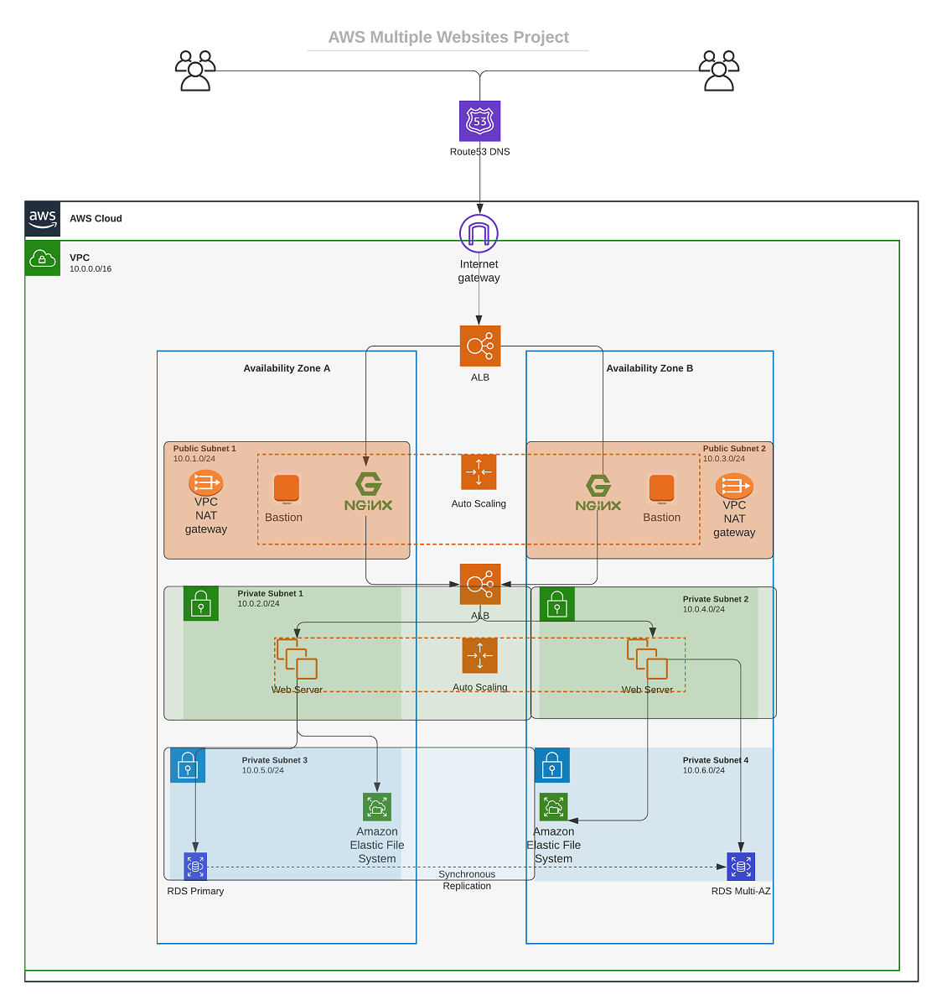

# PROJECT 19: Automate Infrastructure With IaC using Terraform.

## Project Architecture at a Glance

#



## Project Objective

In this project we will be using [Terraform Cloud](https://www.terraform.io/cloud) to provision our infrastructure.
Terraform is a managed service that provides you with Terraform CLI to provision infrastructure, either on demand or in response to various events.

- Recall in [Project 17](https://github.com/Kingkellee/dareyio-pbl/blob/master/project17.md) and [Project 18](https://github.com/Kingkellee/dareyio-pbl/blob/master/project18.md) and our application did not work when we tried to access the webservers endpoint, this is becuase in out shell script that was passed into the launch some endpoints like the RDs and EFS point is needed in which they have not been created yet. We will be using Ansible to fix that in this project.
- Also recalll we used a random AMI from AWS to provison our Autoscalling Group in [Project 17](https://github.com/Kingkellee/dareyio-pbl/blob/master/project17.md) but in this project we will make use of [Packer](https://developer.hashicorp.com/packer/docs/intro) to build Images needed to Orchestrate our Autoscalling Group.

## Brief Introduction of the Tools we will be Using

### 1. [Terraform Cloud](https://www.terraform.io/cloud)

Terraform Cloud is HashiCorp’s managed service offering. It eliminates the need for unnecessary tooling and documentation for practitioners, teams, and organizations to use Terraform in production.

Terrafporm Clouds provides you with Terraform CLI to provision infrastructure in a remote environment that is optimized for the Terraform workflow.

### 2. [Packer](https://developer.hashicorp.com/packer/docs/intro)

Packer is an open source tool for creating identical machine images for multiple platforms from a single source configuration. Packer is lightweight, runs on every major operating system, and is highly performant, creating machine images for multiple platforms in parallel. Packer does not replace configuration management like Chef or Puppet. In fact, when building images, Packer is able to use tools like Chef or Puppet to install software onto the image.

### 3. [Ansible](https://docs.ansible.com/ansible/latest/installation_guide/intro_installation.html)

Ansible is an agentless automation tool that you install on a single host (referred to as the control node). From the control node, Ansible can manage an entire fleet of machines and other devices (referred to as managed nodes) remotely with SSH, Powershell remoting, and numerous other transports, all from a simple command-line interface with no databases or daemons required.

## Getting Started-Setting Up Infrastructures using Terraform Cloud

1. Create a Terraform Cloud account
   Follow [this link](https://app.terraform.io/signup/account), create a new account, verify your email and you are ready to start
1. Create an organization
   
1. Create a Workspace
   - Click on Start from Scratch
     
   - Create a new workflow, select `Version Control Workflow`
     
   - Connect to a Version Control Provider
     
   - Select a Repository
     
   - Create a Workspace
     
1. Configure variables

   - Set two environment variables: `AWS_ACCESS_KEY_ID` and `AWS_SECRET_ACCESS_KEY`
     
     These credentials will be used to privision your AWS infrastructure by Terraform Cloud.

   - After we have set these 2 environment variables – our Terraform Cloud is all set to apply the codes from GitHub/Gitlab depending on the VSP used and create all necessary AWS resources.

## Creating Bastion, Nginx, Tooling and Wordpress AMIs

#

1. Install packer on your Local Machine [See Documentation](https://developer.hashicorp.com/packer/tutorials/docker-get-started/get-started-install-cli)

- Configure Packer template to build AMIs for each of our Web Servers [How to Build Images with Packer](https://developer.hashicorp.com/packer/tutorials/docker-get-started/docker-get-started-build-image)
  - Our Packer Codes can be found in this [GitLab Repo](https://gitlab.com/Kingkellee/packer-ami)
  - Run the following Packer commands for each <file-name>.pkr.hcl files:
  ```
      packer fmt <file-name>.pkr.hcl
      packer validate <file-name>.pkr.hcl
      packer build <file-name>.pkr.hcl
  ```
  
  
  
  
  - On Complettion Copy the `AMI ID` from AWS and assign to respective AMI value in our `terraform.auto.tfvars`
    
  - In our [Terraform code](https://gitlab.com/Kingkellee/packer-pbl-19), dettach by commenting out Listeners and its Attachement of Nginx, Tooling and Wordpress Servers
  - Make changes and push to our repo

## Run terraform plan and terraform apply from web console

- Switch to "Runs" tab, Select `New Run`
  
- Select Plan type click on `Plan and Apply(standard)` button. If planning has been successfull, you can proceed and confirm Apply – press "Confirm and apply", provide a comment and "Confirm plan"
  
- Check the logs and verify that everything has run correctly. Note that Terraform Cloud has generated a unique state version that you can open and see the codes applied and the changes made since the last run.
  

## Ansible Dynamic Inventory & Configuring Webservers

By default, ansible deals with the static inventory but in the production environment, the application runs on the auto-scaling groups so, the IPs of the servers keep changing so in that time dynamic inventory comes into the picture. Ansible dynamic inventory connects to the cloud provider and it will get the available virtual machines IP and then it will run the playbook on them..[Read More](https://medium.com/geekculture/a-complete-overview-of-ansible-dynamic-inventory-a9ded104df4c)

- SSH into the Bastion instance, check to see `python` and `boto3` are installed

- To ensure the Ansible file can get all the required information from our AWS account such as our instance IP addresses, tags for each instances, run

```
aws configure
```

enter all required credentials. Then run:

```
ansible-inventory -i aws_ec2.yaml --graph
```


- clone [Ansible Repository](https://gitlab.com/Kingkellee/ansible-pbl-19) which contains the scripts which contains the script to configure the infrastructure as required.

- Ensure that we have ssh-agent enabled on our bastion instance, so that we can easily SSH into Nginx and Webservers.

- Update the ansible script with values such as:
  - `RDS endpoints` for wordpress and tooling
  - Database name, password and username for wordpress and tooling
    
    
  - Access point ID for wordpress and tooling
    
    
  - Internal load balancer DNS for nginx reverse proxy
    
  - Repo to clone tooling DB
    
- Run ansible playbook to configure the infrastructure.

```
ansible-playbook -i inventory/aws_ec2.yml playbooks/site.yml
```


- Re attach our Listeners and Target Group by uncommenting the changes we made to our [Terraform code](https://gitlab.com/Kingkellee/packer-pbl-19) and push the updated changes
  

## Verify Our Infrastructure Was Confifured Properly

#

### NGINX

- Confirmed Nginx Running

```
sudo systemctl status nginx
```


- Confirmed Reverse Proxy Nginx Configuration
  
- Confirmed Nginx Target passes Health Check
  

### TOOLING

- Confirmed Appache webserver was Installed

```
sudo systemctl status httpd
```


- Confirmed /healthstatus was created
  
- Confirmed Our Tooling Endpoint is Reachable
  
- Confirmed Health Tooling Target
  
- Confirmed Tooling Endpoint via Domain Name
  

### WORDPRESS

- Confirmed Appache webserver was Installed

```
sudo systemctl status httpd
```


- Confirmed /healthstatus was created
  
- Confirmed Our Wordpress Endpoint is Reachable
  
- Confirmed Health Wordpress Target
  
- Confirmed Wordpress Endpoint via Domain Name
  
- Install Wordpress
  

## Destroying Resources

- In `workspace settings`, select `Destruction and Deletion`
  
- Select `Queue destroy plan`
- Enter workspace name and click on Queue Destroy Plan
  
  

## PROJECT REPO

# [Github Repo for Project 19](https://github.com/Kingkellee/PBL-project-19)
