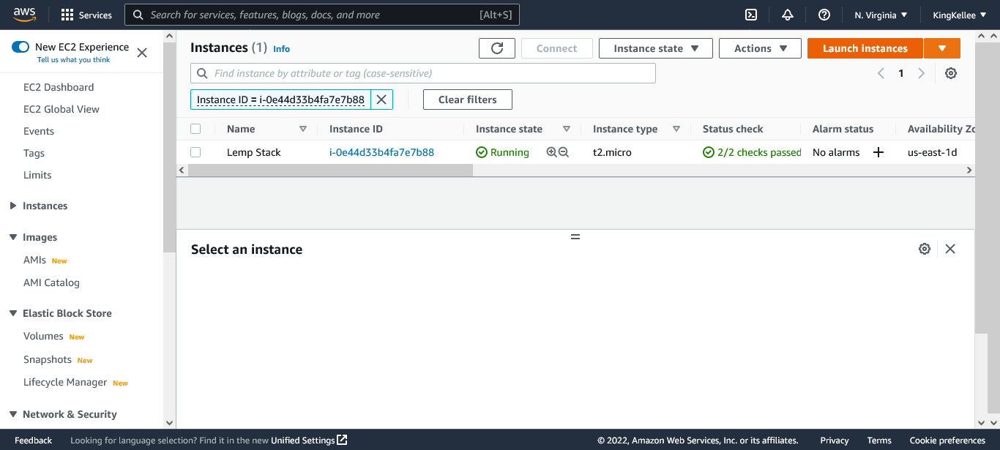
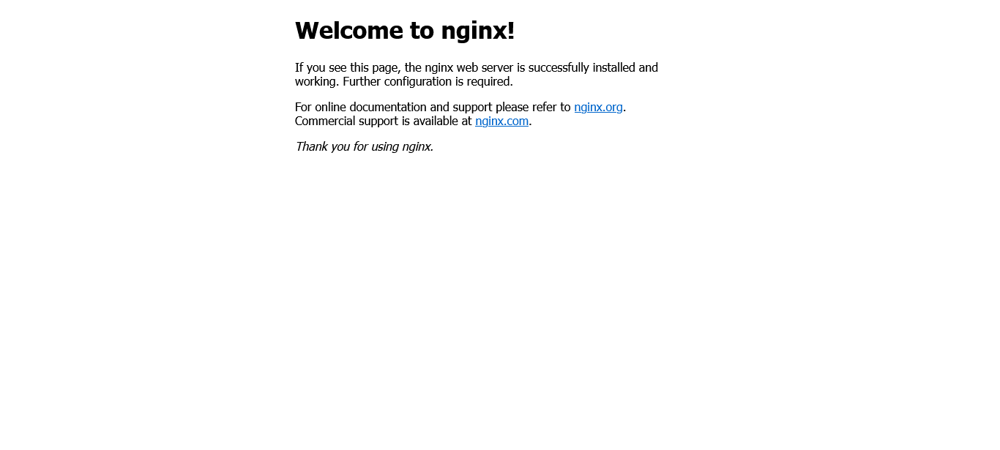
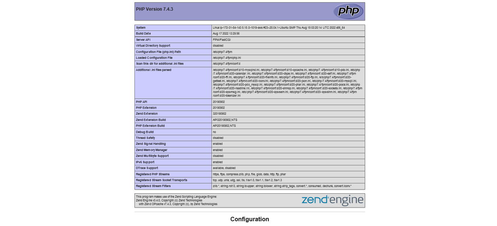

# LEMP STACK DOCUMENTATION

    LEMP Stands For:

    L- Linux Operating System
    E- Nginx Server
    M- MySQL Database
    P- PHP

### Advantages Of LEMP:

    1. One of the benefits of using LEMP is its      widespread community support.
    2. PHP and MySQL in the backend together are very powerful also with large community support and several hosting providers support.
    3. LEMP is open-source.
    4. Another benefit of LEMP is that Nginx is faster and is capable of handling a good amount of load.

### Disadvantages of LEMP:

    1. If configurations are considered Nginx does not allow additional configurations which is a downside unlike Apache as it is more flexible in this case.
    2. Not flexible enough to support dynamic modules and loading.

## Getting Started with LEMP STACK

### Prerequisite

- Signup to AWS and Launch an EC2 Instance with Ubutun 20.04 AMI Image
  
- Set Security group to allow inbound Http Access from port 80
- Connect to EC2 instance
  ```
  # if permission error
  chmod 0400 <private-key>.pem
  ```
  then
  ```
  ssh -i "<private-key>.pem" ubuntu@<public-IPv4-dns>
  ```

### Installing the NginX web Server

- Install Nginx

```
sudo apt update
# then
sudo apt install nginx
```

- Verify Nginx was successfuly installed

```
sudo systemctl status nginx
```

- to accesss our server locally

```
curl http://localhost:80
```



### Installing MYSQL

```
sudo apt install mysql-server
# login to mysql
sudo mysql
```

- Run this script to remove some insecure default settings and lock down access to your database system

```
ALTER USER 'root'@'localhost' IDENTIFIED WITH mysql_native_password BY 'PassWord.1';
```

- to exit the Mysql Shell

```
mysql > exit
```

- start mysql interactive script

```
sudo mysql_secure_installation
```

- Test mysql Login

```
sudo mysql -p
```

### Installing PHP

- Install php-fpm to pass PHP requests from Nginx to the process manager for processing
- Install php-mysql a module that allows php to communicate with mysql database

```
sudo apt install php-fpm php-mysql
```

### Configuring NGINX to Use PHP Processor

1. Create root web directory
   ```
   sudo mkdir /var/www/projectLEMP
   ```
1. Assing ownership to current system user
   ```
   sudo chown -R $USER:$USER /var/www/projectLEMP
   # $USER environment variable is used to refrence current system user
   ```
1. Using your preffered CLI Editor create a new configuration file in Nginx sites-available directoy

   ```
   sudo nano /etc/nginx/sites-available/projectLEMP
   ```

   paste the following configuration

   ```
   #/etc/nginx/sites-available/projectLEMP

   server {
       listen 80;
       server_name projectLEMP www.projectLEMP;
       root /var/www/projectLEMP;

       index index.html index.htm index.php info.php;

       location / {
           try_files $uri $uri/ =404;
       }

       location ~ \.php$ {
           include snippets/fastcgi-php.conf;
           fastcgi_pass unix:/var/run/php/php7.4-fpm.sock;
       }

       location ~ /\.ht {
           deny all;
       }

   }
   ```

1. Activate your configuration by linking to the config file from Nginx’s sites-enabled directory:
   ```
   sudo ln -s /etc/nginx/sites-available/projectLEMP /etc/nginx/sites-enabled/
   ```
1. Test configuration file for syntax error
   ```
   sundo nginx -t
   ```
1. disable default Nginx Host currently configured to listen on port 80
   ```
   sudo unlink /etc/nginx/sites-enabled/default
   ```
1. reload nginx to apply changes
   ```
   sudo systemctl reload nginx
   ```
1. create an index.html file in the web root
   ```
   sudo echo 'Hello LEMP from hostname' $(curl -s http://169.254.169.254/latest/meta-data/public-hostname) 'with public IP' $(curl -s http://169.254.169.254/latest/meta-data/public-ipv4) > /var/www/projectLEMP/index.html
   ```


### Testing PHP with Nginx

1. create a test PHP file in your document root

   ```
   sudo nano /var/www/projectLEMP/info.php
   ```

   paste the following code

   ```php
   <?php
   phpinfo();
   ```



### Retrieving Data from MYSQL Database with PHP

1. connect to mysql database
   ```
   sudo mysql -p
   ```
2. Create Database
   ```mysql
   mysql> CREATE DATABASE `example_database`;
   ```
3. create new user and grant privelleges

```
mysql>  CREATE USER 'example_user'@'%' IDENTIFIED WITH mysql_native_password BY 'password';

mysql> GRANT ALL ON example_database.* TO 'example_user'@'%';
```

4. Create test table

```
mysql > CREATE TABLE example_database.todo_list ( item_id INT AUTO_INCREMENT, content VARCHAR(255), PRIMARY KEY(item_id) );
```

5. Insert Data into table

```
mysql> INSERT INTO example_database.todo_list (content) VALUES ("My first important item");
```

6. create PHP Script to access MYSQL Database

```
nano /var/www/projectLEMP/todo_list.php
```

copy content

```
<?php
$user = "example_user";
$password = "password";
$database = "example_database";
$table = "todo_list";

try {
  $db = new PDO("mysql:host=localhost;dbname=$database", $user, $password);
  echo "<h2>TODO</h2><ol>";
  foreach($db->query("SELECT content FROM $table") as $row) {
    echo "<li>" . $row['content'] . "</li>";
  }
  echo "</ol>";
} catch (PDOException $e) {
    print "Error!: " . $e->getMessage() . "<br/>";
    die();
}
```

Access page on
http://<Public_domain_or_IP>/todo_list.php


