# PROJECT 20: Migration to the Сloud with containerization. Part 1 - Docker & Docker Compose

## Project Objective

#

In this project, I migrated a [Tooling Web Application]() a PHP Based Application from a VM-based solution into a containerized one.

## Containerizing the MYSQL Database layer

#

### Step 1: Pull MySQL Docker Image from Docker Hub Registry

```
docker pull mysql/mysql-server:latest
```

- List the images to check that you have downloaded them successfully:
  ```
  docker image ls
  ```

### Step 2: Deploy the MySQL Container to your Docker Engine

```
docker run --name <container_name> -e MYSQL_ROOT_PASSWORD=<my-secret-pw> -d mysql/mysql-server:latest
```

- `container_name` - name of your choice
- `-d` option instructs Docker to run the container as a service in the background
- `my-secret-pw` - your chosen password
- `latest` version tag - This tag may differ according to the image you downloaded

- To check if the mysql-server is running run

```
docker ps -a
```

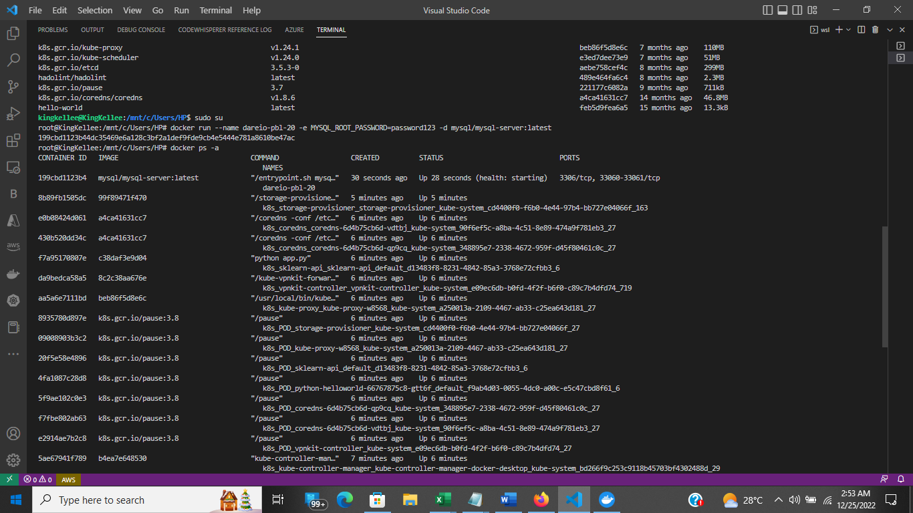

### Step 3 Connecting to the MySQL Docker Container

#### Approach 1 - Connecting directly to the container running the MySQL server:

#

- Use either of this commands

```
 docker exec -it mysql bash
```

or

```
docker exec -it mysql mysql -uroot -p
```

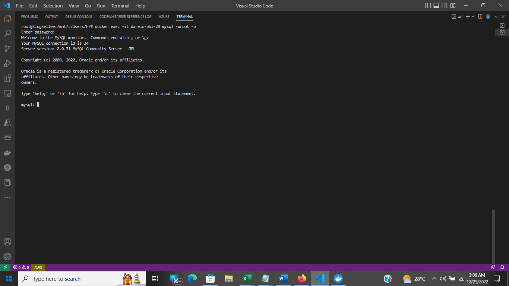

- Flags used

  1. `exec` used to execute a command from bash itself
  1. `-it` makes the execution interactive and allocate a pseudo-TTY
  1. `bash` this is a unix shell and its used as an entry-point to interact with our container
  1. `mysql` The second mysql in the command **"docker exec -it 1. mysql `mysql` -uroot -p"** serves as the entry point to interact with mysql container just like bash or sh
  1. `-u` mysql username
  1. `-p` mysql password

#### Approach 2 - Connecting through a network

- Stop and remove the previous mysql docker container.

```
docker ps -a
```

```
docker stop <container-name> or <container-id>
```

```
docker rm <container-name> or <container-id>
```

- Verify that the container is deleted

```
docker ps -a
```

#### Step 1- First, create a network:

```
docker network create --subnet=172.18.0.0/24 tooling_app_network
```

#### Step 2. create an environment variable to store the root password:

```
 export MYSQL_PW=<mysql-root-password>
```

#### Step 3. Verify the environment variable is created

```
echo $MYSQL_PW
```

#### Step 4. Pull the image and run the container, all in one command

```
docker run --network tooling_app_network -h mysqlserverhost --name=mysql-server -e MYSQL_ROOT_PASSWORD=$MYSQL_PW  -d mysql/mysql-server:latest
```

- Flags used

  1. `-d` runs the container in detached mode
  1. `--network` connects a container to a network
  1. `-h` specifies a hostname

- Verify the container is running:

```
 docker ps -a
```

#### Step 5. Create a User

- Create a file and name it `create_user.sql` and add the below code

```
CREATE USER '<username>'@'%' IDENTIFIED BY '<password>'; GRANT ALL PRIVILEGES ON * . * TO '<username>'@'%';
```

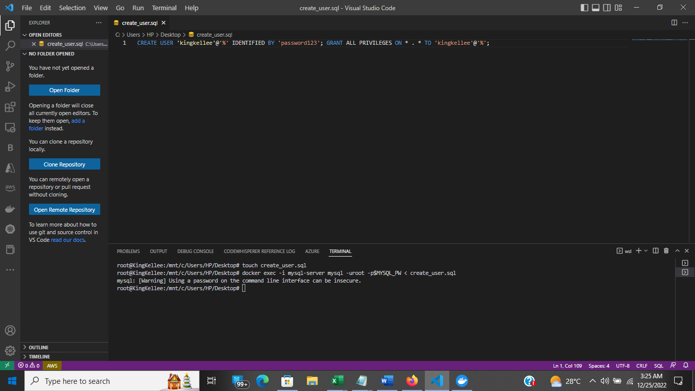

- Run the script: Ensure you are in the directory create_user.sql file is located or declare a path

```
docker exec -i mysql-server mysql -uroot -p$MYSQL_PW < create_user.sql
```

### Step 4 - Connecting to the MySQL server from a second container running the MySQL client utility

- Run the MySQL Client Container:

```
 docker run --network tooling_app_network --name mysql-client -it --rm mysql mysql -h mysqlserverhost -u  -p
```

- Flags used:

  1. `--name` gives the container a name
  1. `-it` runs in interactive mode and Allocate a pseudo-TTY
  1. `--rm` automatically removes the container when it exits
  1. `--network` connects a container to a network
  1. `-h` a MySQL flag specifying the MySQL server Container hostname
  1. `-u` username for-user-created-from-the-SQL-script-create_user.sql
  1. `-p` password specified for the user created from the SQL script

### Step 5. Prepare database schema

- Clone the Tooling-app repository

```
git clone https://github.com/kingkellee/tooling
```

- Export the location of the SQL file located in `tooling/html/tooling_db_schema.sql`

```
export tooling_db_schema=tooling_db_schema.sql
```

- Verify that the path is exported

```
echo $tooling_db_schema
```

- Use the SQL script to create the database and prepare the schema.
  - The `docker exec` command is used to execute a command in a running container.

```
docker exec -i mysql-server mysql -uroot -p$MYSQL_PW < $tooling_db_schema
```

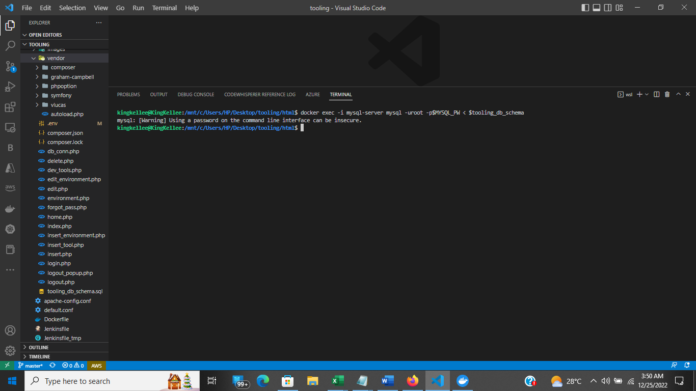

- Update the `.env` file with connection details to the database

  - The `.env` file is located in `tooling/html/.env`

```
sudo vi .env

MYSQL_IP=mysqlserverhost
MYSQL_USER=username
MYSQL_PASS=client-secrete-password
MYSQL_DBNAME=toolingdb
```

- Flags used:

  1. `MYSQL_IP` mysql ip address "leave as mysqlserverhost"
  1. `MYSQL_USER` mysql username for user export as environment variable
  1. `MYSQL_PASS` mysql password for the user exported as environment varaible
  1. `MYSQL_DBNAME` mysql databse name "toolingdb"

### Step 5. Run the Tooling App

- Create a Dockerfile in the root directory of tooling app See [Documentation](https://docs.docker.com/develop/develop-images/dockerfile_best-practices/) or watch this [Video](https://www.youtube.com/watch?v=hnxI-K10auY)

- Ensure you are inside the `tooling` directory that has the `Dockerfile` and build your container :

```
docker build -t tooling:0.0.1 .
```

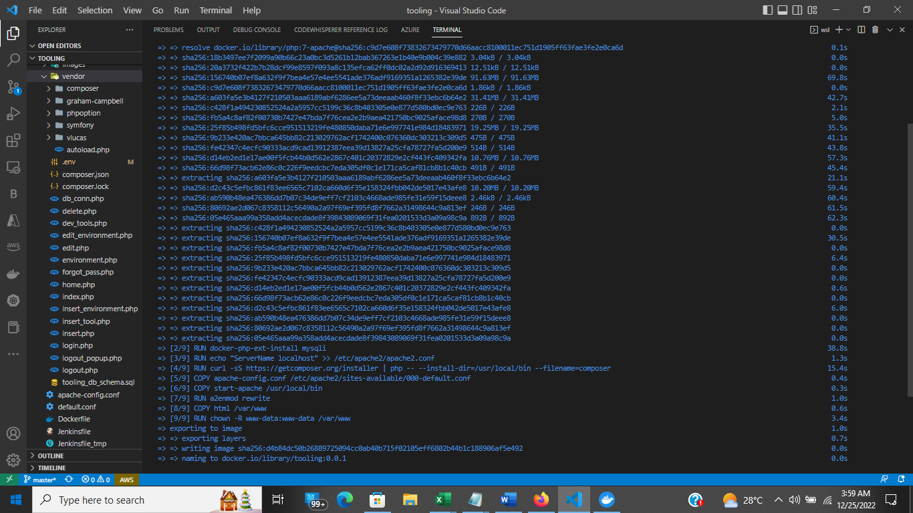

- Flags Used
  `-t` - used to tag the image 0.0.1

  - `.` at the end is important as that tells Docker to locate the Dockerfile in the current directory you are running the command.

- Run the container:

```
docker run --network tooling_app_network -p 8085:80 -it tooling:0.0.1
```

- Check tooling can be accessed on `http://localhost:8085`
  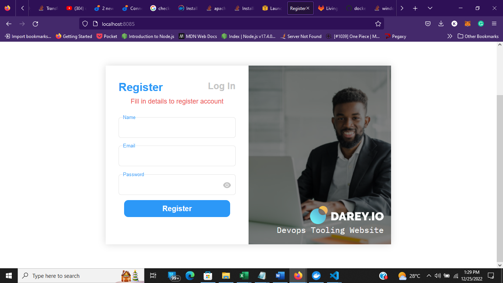
  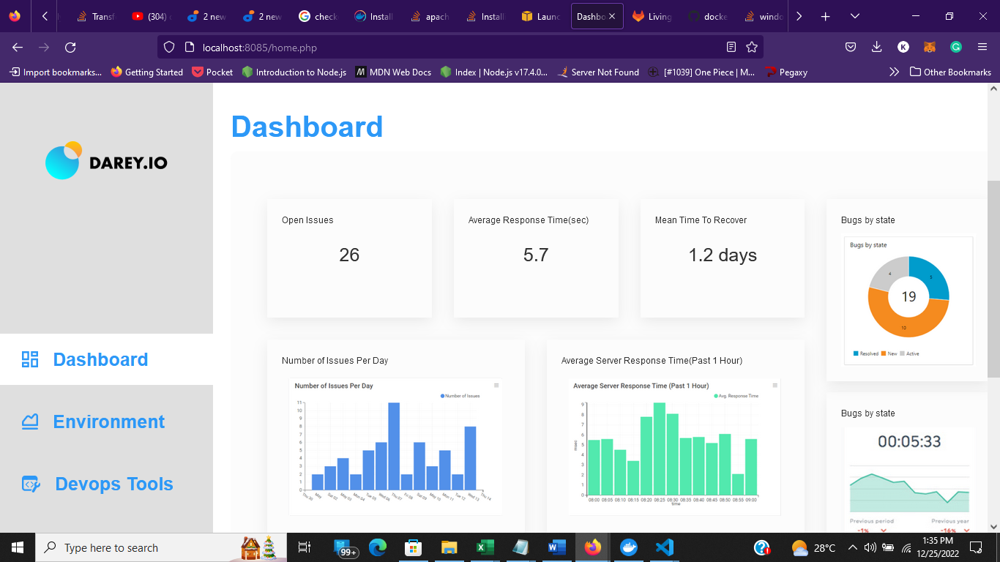

- Flags Used
  - `--network` flag so that both the Tooling app and the database can easily connect on the same virtual network we created earlier.
  - `-p` flag is used to map the container port with the host port.

## PRACTISE TASK

### Task.1 - Implement a POC to migrate the PHP-Todo app into a containerized application.

#### Part 1.

- Clone the git repository from here

```
git clone https://github.com/Kingkellee/php-todo-pbl-20.git
```

- Write a Dockerfile for the TODO app
  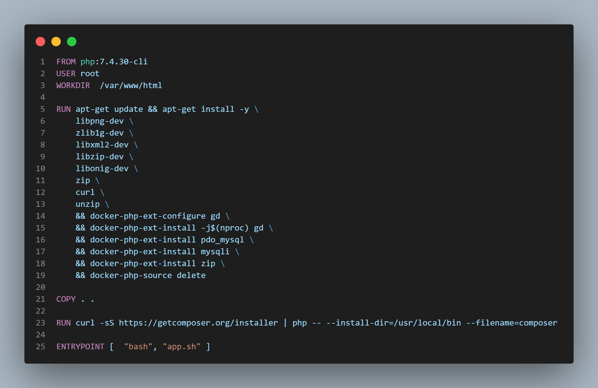
- Run both database and app on your laptop Docker Engine

```
docker build -t php-todo:php-todo .
```

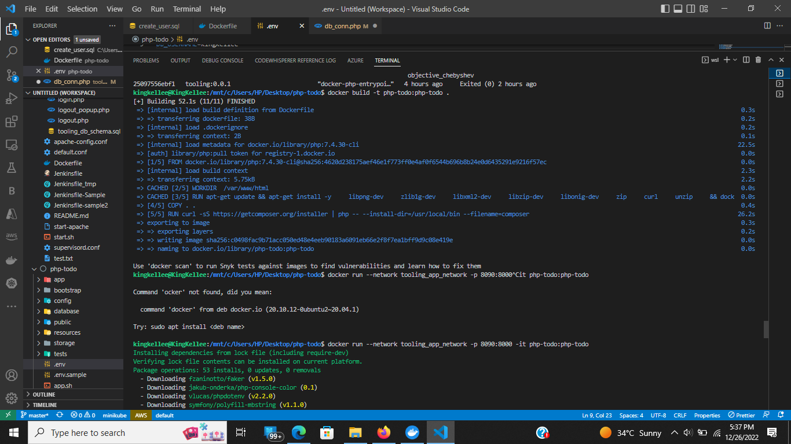

```
docker run --network tooling_app_network -p 8090:8000 -it t php-todo:php-todo
```

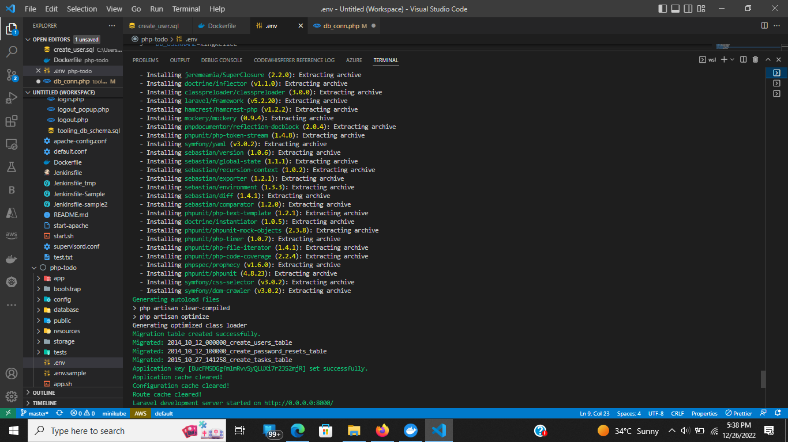
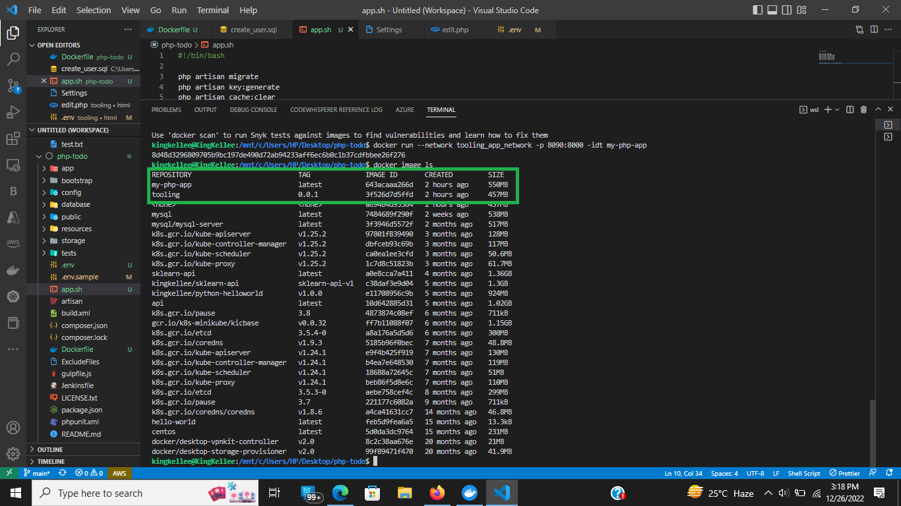

- Access the application from the browser
  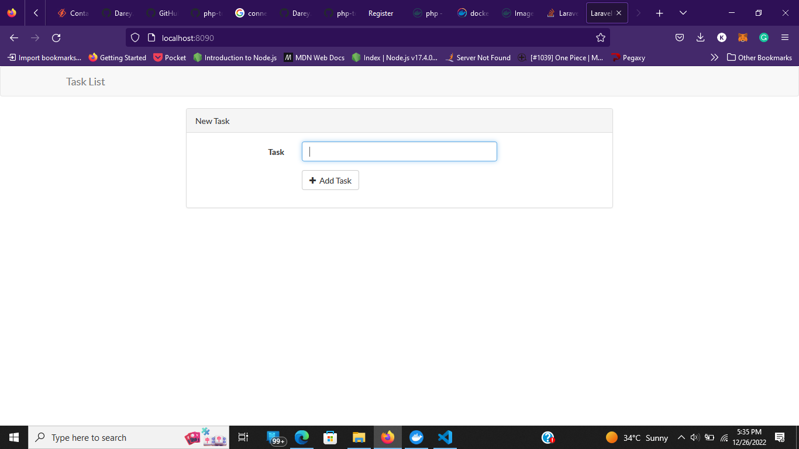
  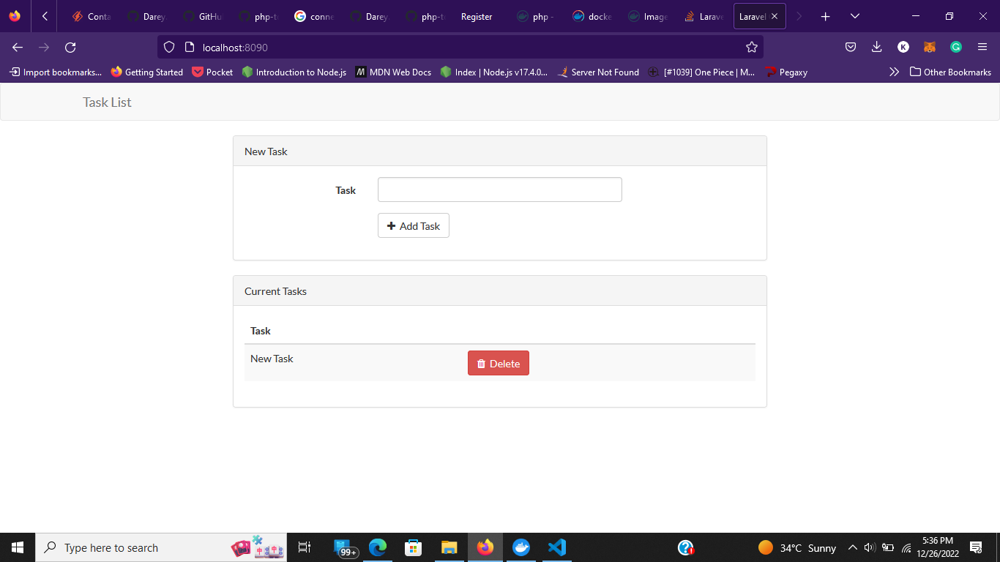

#### Part 2

- Create an account in Docker Hub
- Create a new Docker Hub repository
- Push the docker images from your PC to the repository
  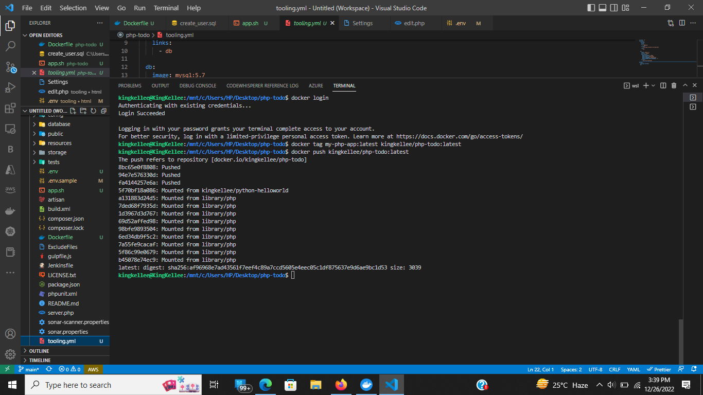
  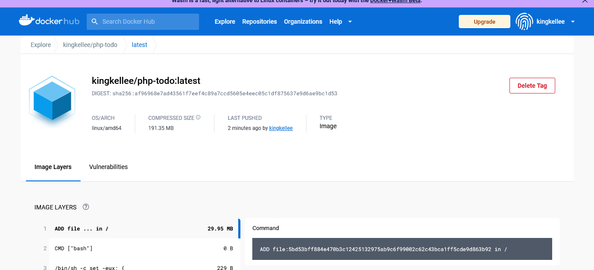

#### Part 3

- Write a Jenkinsfile that will simulate a Docker Build and a Docker Push to the registry
- Connect your repo to Jenkins
- Create a multi-branch pipeline
- Simulate a CI pipeline from a feature and master branch using previously created Jenkinsfile
- Ensure that the tagged images from your Jenkinsfile have a prefix that suggests which branch the image was pushed from. For example, feature-0.0.1.
- Verify that the images pushed from the CI can be found at the registry.

## Deployment with Docker Compose

- Install [Docker Compose ](https://docs.docker.com/compose/install/)
- Create a file, `tooling.yml`
- Write the Docker Compose definitions with YAML syntax. The YAML file is used for defining services, networks, and volumes as shown below:

```
    version: "3.9"
    services:
    tooling_frontend:
      build: .
      ports:
        - "5000:80"
      volumes:
        - tooling_frontend:/var/www/html
      links:
        - db
    db:
      image: mysql:5.7
      restart: always
      environment:
        MYSQL_DATABASE: <The database name required by Tooling app >
        MYSQL_USER: <The user required by Tooling app >
        MYSQL_PASSWORD: <The password required by Tooling app >
        MYSQL_RANDOM_ROOT_PASSWORD: '1'
      volumes:
        - db:/var/lib/mysql
    volumes:
      tooling_frontend:
      db:
```

- Run the command to start the containers

```
docker-compose -f tooling.yml up -d
```

- Verify the containers are running

```
docker-compose ls
```

## PRACTICE TASK 2

1. Complete Continous Integration With A Test Stage

   - Document your understanding of all the fields specified in the Docker Compose file tooling.yaml
   - Update your Jenkinsfile with a test stage before pushing the image to the registry.
   - What you will be testing here is to ensure that the tooling site http endpoint is able to return status code 200. Any other code will be determined a stage failure.
   - Implement a similar pipeline for the PHP-todo app.
     Ensure that both pipelines have a clean-up stage where all the images are deleted on the Jenkins server.
