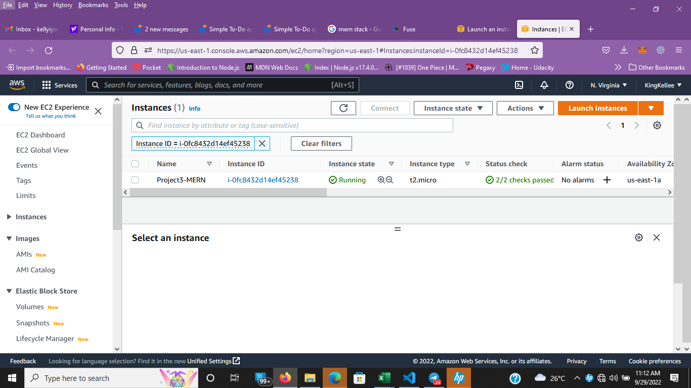
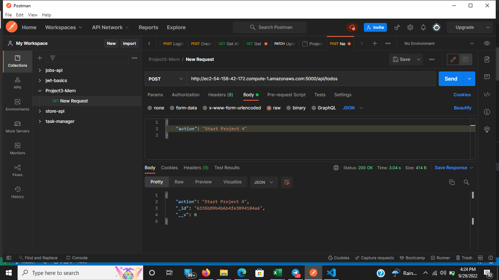
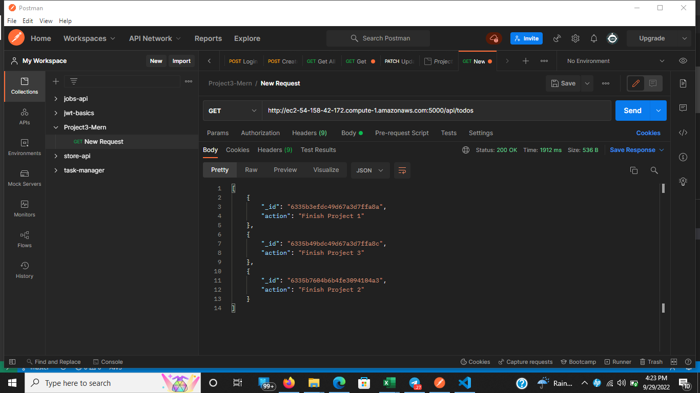
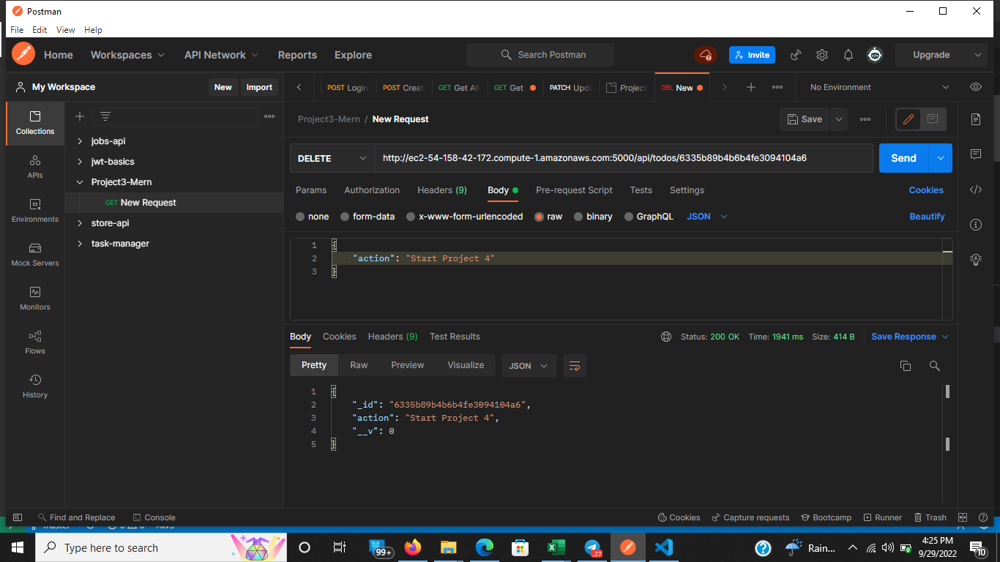
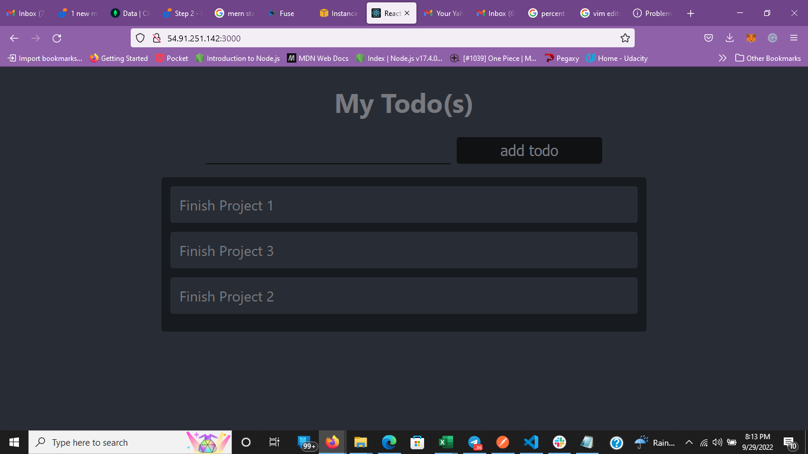

# MERN STACK DOCUMENTATION

## Simple To-do Application on MERN web Stack

MERN Web stack consists of following components:

- MongoDB: A document-based, No-SQL database used to store application data in a form of documents.

- ExpressJS: A server side Web Application framework for Node.js.

- ReactJS: A frontend framework developed by Facebook. It is based on JavaScript, used to build User Interface (UI) components.

- Node.js: A JavaScript runtime environment. It is used to run JavaScript on a machine rather than in a browser.

### Prerequisite

- Signup to AWS and Launch an EC2 Instance with Ubutun 20.04 AMI Image
  
- Set Security group to allow inbound Http Access from port 80, 5000 and 3000
- Connect to EC2 instance
  ```
  # if permission error
  chmod 0400 <private-key>.pem
  ```
  then
  ```
  ssh -i "<private-key>.pem" ubuntu@<public-IPv4-dns>
  ```

### Backend Configuration

- Run Updates and Upgrade Ubuntu

```
 sudo apt update
```

```
sudo apt upgrade
```

- Install NodeJs and npm

```
curl -fsSL https://deb.nodesource.com/setup_18.x | sudo -E bash -
```

```
sudo apt-get install -y nodejs
```

- Verify Node and Npm

```
node -v
```

```
npm -v
```

- Initiliaze Node Project

```
mkdir todo
```

```
npm init
```

- Install Express

```
npm install express dotenv
```

```
# create an index.js file
touch index.js
```

```
nano index.js
```

```
  # Copy and Paste code into index.js

  const express = require('express');
require('dotenv').config();

const app = express();

const port = process.env.PORT || 5000;

app.use((req, res, next) => {
res.header("Access-Control-Allow-Origin", "\*");
res.header("Access-Control-Allow-Headers", "Origin, X-Requested-With, Content-Type, Accept");
next();
});

app.use((req, res, next) => {
res.send('Welcome to Express');
});

app.listen(port, () => {
console.log(`Server running on port ${port}`)
});

```

```
# run to start server
node index.js
```

- Create Routes

```
mkdir routes
```

```
cd routes
```

```
touch api.js
```

```
# Open api.js with favorite editor and Copy and paste code below

const express = require ('express');
const router = express.Router();
const Todo = require('../models/todo');

router.get('/todos', (req, res, next) => {

//this will return all the data, exposing only the id and action field to the client
Todo.find({}, 'action')
.then(data => res.json(data))
.catch(next)
});

router.post('/todos', (req, res, next) => {
if(req.body.action){
Todo.create(req.body)
.then(data => res.json(data))
.catch(next)
}else {
res.json({
error: "The input field is empty"
})
}
});

router.delete('/todos/:id', (req, res, next) => {
Todo.findOneAndDelete({"_id": req.params.id})
.then(data => res.json(data))
.catch(next)
})

module.exports = router;
```

### Defining Models

- Change directory to the project todo directory
- Install Mongoose

```
npm install mongoose
```

- create a models folder

```
mkdir models && cd models && touch todo.js
```

- Open todo.js with favorite code editor, copy and paste code below

```
const mongoose = require('mongoose');
const Schema = mongoose.Schema;

//create schema for todo
const TodoSchema = new Schema({
action: {
type: String,
required: [true, 'The todo text field is required']
}
})

//create model for todo
const Todo = mongoose.model('todo', TodoSchema);

module.exports = Todo;
```

### Connecting to MongoDb

Signup to [MongoDB](https://www.mongodb.com/) and see [the documentation](https://www.mongodb.com/docs/drivers/node/current/fundamentals/connection/connect/#std-label-node-connect-to-mongodb) on connecting to a Mongodb database

- Create an environmet file in todo directory

```
touch .env
```

```
# Add connection string to accesss the database
DB = 'mongodb+srv://<username>:<password>@<network-address>/<dbname>?retryWrites=true&w=majority'
```

- Update index.js with the following code

```
const express = require('express');
const bodyParser = require('body-parser');
const mongoose = require('mongoose');
const routes = require('./routes/api');
const path = require('path');
require('dotenv').config();

const app = express();

const port = process.env.PORT || 5000;

//connect to the database
mongoose.connect(process.env.DB, { useNewUrlParser: true, useUnifiedTopology: true })
.then(() => console.log(`Database connected successfully`))
.catch(err => console.log(err));

//since mongoose promise is depreciated, we overide it with node's promise
mongoose.Promise = global.Promise;

app.use((req, res, next) => {
res.header("Access-Control-Allow-Origin", "\*");
res.header("Access-Control-Allow-Headers", "Origin, X-Requested-With, Content-Type, Accept");
next();
});

app.use(bodyParser.json());

app.use('/api', routes);

app.use((err, req, res, next) => {
console.log(err);
next();
});

app.listen(port, () => {
console.log(`Server running on port ${port}`)
});
```

### Testing API with Postman

- start server

```
node index.js
```

- Open postman and create Post Request
  

- Test get request
  

- Test Delete Request
  

### Create FrontEnd

- In the project root directory, run

```
 npx create-react-app client
```

- Install Concurrently and nodemon

```
npm install concurrently --save-dev
```

```
npm install nodemon --save-dev
```

- open your package.json file in the root folder of the app project, and paste the following code:

```
"scripts": {
"start": "node index.js",
"start-watch": "nodemon index.js",
"dev": "concurrently \"npm run start-watch\" \"cd client && npm start\""
},
```

- Enter into the client folder, then locate the package.json file and add the following key-value pair inside it.

```
{
  // ...
  "proxy": "http://publicIPv4address:5000"
}
```

### Create React Components

- Enter into the client folder, move to the src directory

```
mkdir components
```

```
cd components
```

- Inside ‘components’ directory create three files Input.js, ListTodo.js and Todo.js.

```
touch Input.js ListTodo.js Todo.js
```

- Open Input.js file and paste the following:

```
import React, { Component } from 'react';
import axios from 'axios';

class Input extends Component {
  state = {
    action: '',
  };

  addTodo = () => {
    const task = { action: this.state.action };

    if (task.action && task.action.length > 0) {
      axios
        .post('/api/todos', task)
        .then((res) => {
          if (res.data) {
            this.props.getTodos();
            this.setState({ action: '' });
          }
        })
        .catch((err) => console.log(err));
    } else {
      console.log('input field required');
    }
  };

  handleChange = (e) => {
    this.setState({
      action: e.target.value,
    });
  };

  render() {
    let { action } = this.state;
    return (
      <div>
        <input type="text" onChange={this.handleChange} value={action} />
        <button onClick={this.addTodo}>add todo</button>
      </div>
    );
  }
}

export default Input;
```

- To make use of axios, which is a Promise-based HTTP client for the browser and Node.js, navigate to your client directory from the terminal:

```
cd client
```

```
npm install axios
```

- open your ListTodo.js file and paste the following code:

```
import React from 'react';

const ListTodo = ({ todos, deleteTodo }) => {
  return (
    <ul>
      {todos && todos.length > 0 ? (
        todos.map((todo) => {
          return (
            <li key={todo._id} onClick={() => deleteTodo(todo._id)}>
              {todo.action}
            </li>
          );
        })
      ) : (
        <li>No todo(s) left</li>
      )}
    </ul>
  );
};

export default ListTodo;
```

- Then, in Todo.js file you write the following code:

```
import React, { Component } from 'react';
import axios from 'axios';
import Input from './Input';
import ListTodo from './ListTodo';

class Todo extends Component {
  state = {
    todos: [],
  };

  componentDidMount() {
    this.getTodos();
  }

  getTodos = () => {
    axios
      .get('/api/todos')
      .then((res) => {
        if (res.data) {
          this.setState({
            todos: res.data,
          });
        }
      })
      .catch((err) => console.log(err));
  };

  deleteTodo = (id) => {
    axios
      .delete(`/api/todos/${id}`)
      .then((res) => {
        if (res.data) {
          this.getTodos();
        }
      })
      .catch((err) => console.log(err));
  };

  render() {
    let { todos } = this.state;

    return (
      <div>
        <h1>My Todo(s)</h1>
        <Input getTodos={this.getTodos} />
        <ListTodo todos={todos} deleteTodo={this.deleteTodo} />
      </div>
    );
  }
}

export default Todo;
```

- Goback to the src directory and make changes to the App.js file, paste the code below into it

```
import React from 'react';
import Todo from './components/Todo';
import './App.css';

const App = () => {
  return (
    <div className="App">
      <Todo />
    </div>
  );
};

export default App;
```

- paste the following code into App.css

```
.App {
  text-align: center;
  font-size: calc(10px + 2vmin);
  width: 60%;
  margin-left: auto;
  margin-right: auto;
}

input {
  height: 40px;
  width: 50%;
  border: none;
  border-bottom: 2px #101113 solid;
  background: none;
  font-size: 1.5rem;
  color: #787a80;
}

input:focus {
  outline: none;
}

button {
  width: 25%;
  height: 45px;
  border: none;
  margin-left: 10px;
  font-size: 25px;
  background: #101113;
  border-radius: 5px;
  color: #787a80;
  cursor: pointer;
}

button:focus {
  outline: none;
}

ul {
  list-style: none;
  text-align: left;
  padding: 15px;
  background: #171a1f;
  border-radius: 5px;
}

li {
  padding: 15px;
  font-size: 1.5rem;
  margin-bottom: 15px;
  background: #282c34;
  border-radius: 5px;
  overflow-wrap: break-word;
  cursor: pointer;
}

@media only screen and (min-width: 300px) {
  .App {
    width: 80%;
  }

  input {
    width: 100%
  }

  button {
    width: 100%;
    margin-top: 15px;
    margin-left: 0;
  }
}

@media only screen and (min-width: 640px) {
  .App {
    width: 60%;
  }

  input {
    width: 50%;
  }

  button {
    width: 30%;
    margin-left: 10px;
    margin-top: 0;
  }
}
```

- Also in index.css add the following codes:

```
body {
  margin: 0;
  padding: 0;
  font-family: -apple-system, BlinkMacSystemFont, "Segoe UI", "Roboto", "Oxygen", "Ubuntu", "Cantarell", "Fira Sans", "Droid Sans", "Helvetica Neue", sans-serif;
  -webkit-font-smoothing: antialiased;
  -moz-osx-font-smoothing: grayscale;
  box-sizing: border-box;
  background-color: #282c34;
  color: #787a80;
}

code {
  font-family: source-code-pro, Menlo, Monaco, Consolas, "Courier New", monospace;
}
```

- Go to the Todo directory

```
cd ../..
```

- In the Todo directory run server:

```
npm run dev
```

- our To-Do app should be ready and fully functional you can access it using http://{public-ipv4-address}:3000


