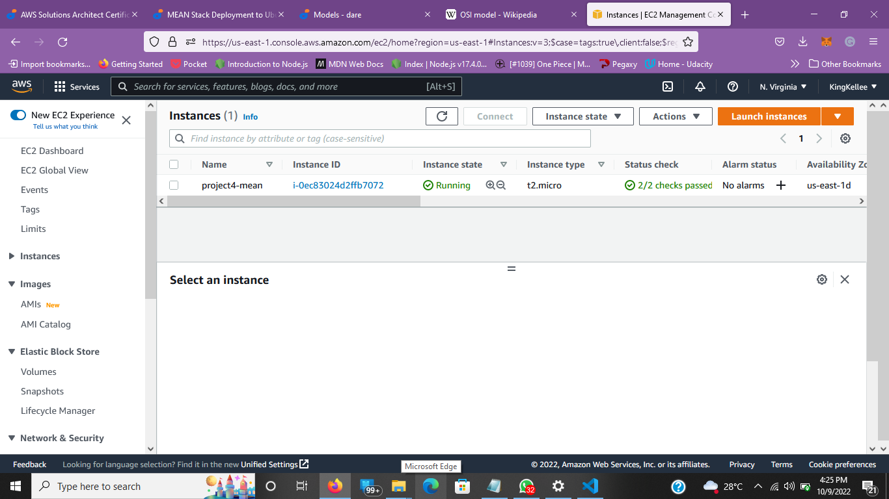
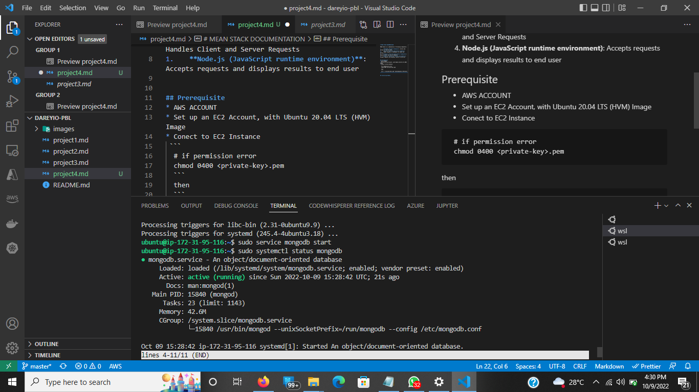
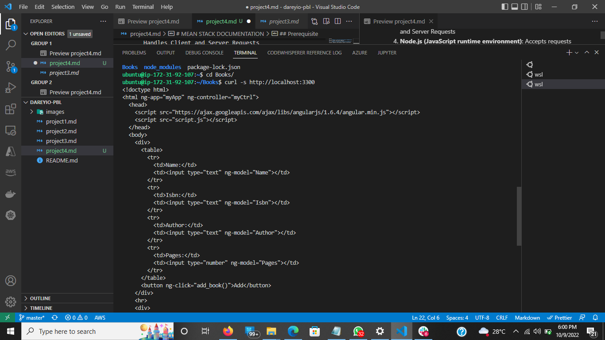
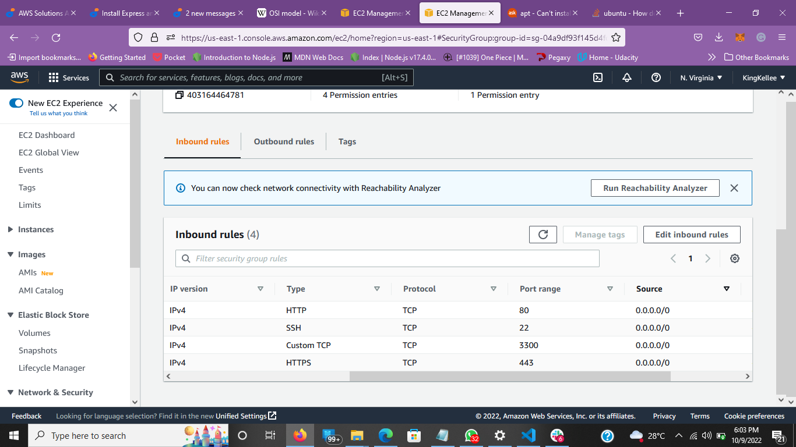
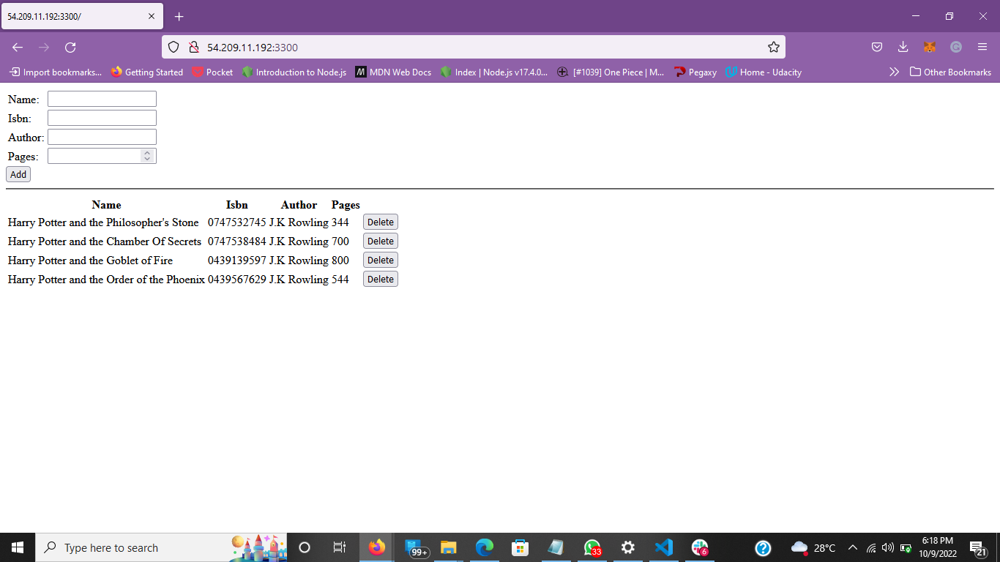

# MEAN STACK DOCUMENTATION

MEAN Stack is a combination of following components:

1.  **MongoDB (Document database)**: Stores and allows to retrieve data.
1.  **Express (Back-end application framework)**: Makes requests to Database for Reads and Writes.
1.  **Angular (Front-end application framework)**: Handles Client and Server Requests
1.  **Node.js (JavaScript runtime environment)**: Accepts requests and displays results to end user

## Prerequisite

- AWS ACCOUNT
- Set up an EC2 Account, with Ubuntu 20.04 LTS (HVM) Image
- Conect to EC2 Instance

```
 # if permission error
 chmod 0400 <private-key>.pem
```

then

```
ssh -i "<private-key>.pem" ubuntu@<public-IPv4-dns>
```



## Installing NodeJs

- Install updates and upgrade Ubuntu

```
sudo apt update
```

```
sudo apt upgrade
```

- Add certificates

```
sudo apt -y install curl dirmngr apt-transport-https lsb-release ca-certificates

curl -sL https://deb.nodesource.com/setup_12.x | sudo -E bash -
```

- Install NodeJs

```
sudo apt install -y nodejs
```

## Install MongoDB

```
sudo apt-key adv --keyserver hkp://keyserver.ubuntu.com:80 --recv 0C49F3730359A14518585931BC711F9BA15703C6
```

```
echo "deb [ arch=amd64 ] https://repo.mongodb.org/apt/ubuntu trusty/mongodb-org/3.4 multiverse" | sudo tee /etc/apt/sources.list.d/mongodb-org-3.4.list
```

- Install MongoDB

```
sudo apt install -y mongodb
```

- Start Server

```
sudo service mongodb start
```



- Verify the server is working

```
sudo systemctl status mongodb
```

- Install npm – Node package manager.

```
sudo apt install aptitude
```

```
sudo aptitude install npm
```

Using aptitude is to help install broken dependencies and resolve conflicts in version

- Install Body-parser to process JSON files passed in request

```
sudo npm install body-parser
```

- Create and Navigate into Books directory and iniatilize project

```
mkdir Books && cd Books
```

```
npm init -y
```

- Create Server

```
touch server.js
```

```
nano server.js
```

```
# Copy and paste configuratuon into server.js

var express = require('express');
var bodyParser = require('body-parser');
var app = express();
app.use(express.static(__dirname + '/public'));
app.use(bodyParser.json());
require('./apps/routes')(app);
app.set('port', 3300);
app.listen(app.get('port'), function() {
    console.log('Server up: http://localhost:' + app.get('port'));
});

```

## Install Express, Mongoose and Set up Routes to the Server

```
sudo npm install express mongoose
```

- in the Book directory create and navigate into apps directory

```
mkdir apps && cd apps
```

- create Routes

```
touch routes.js
```

```
nano routes.js
```

```
# copy and paste code below

var Book = require('./models/book');
module.exports = function(app) {
  app.get('/book', function(req, res) {
    Book.find({}, function(err, result) {
      if ( err ) throw err;
      res.json(result);
    });
  });
  app.post('/book', function(req, res) {
    var book = new Book( {
      name:req.body.name,
      isbn:req.body.isbn,
      author:req.body.author,
      pages:req.body.pages
    });
    book.save(function(err, result) {
      if ( err ) throw err;
      res.json( {
        message:"Successfully added book",
        book:result
      });
    });
  });
  app.delete("/book/:isbn", function(req, res) {
    Book.findOneAndRemove(req.query, function(err, result) {
      if ( err ) throw err;
      res.json( {
        message: "Successfully deleted the book",
        book: result
      });
    });
  });
  var path = require('path');
  app.get('*', function(req, res) {
    res.sendfile(path.join(__dirname + '/public', 'index.html'));
  });
};
```

- Inside the app directory create a model directory and navigate into the directory

```
mkdir models && cd models
```

- Create model callled book.js

```
touch book.js
```

```
nano book.js
```

```
# Copy and paste the navigation below

var mongoose = require('mongoose');
var dbHost = 'mongodb://localhost:27017/test';
mongoose.connect(dbHost);
mongoose.connection;
mongoose.set('debug', true);
var bookSchema = mongoose.Schema( {
  name: String,
  isbn: {type: String, index: true},
  author: String,
  pages: Number
});
var Book = mongoose.model('Book', bookSchema);
module.exports = mongoose.model('Book', bookSchema);

```

## Access the Routes with Angular JS

```
cd ../..
```

- Create a public folder and navigate into the directory

```
mkdir public && cd public
```

- create a script.js file

```
touch script.js
```

```
nano script.js
```

- Copy and Paste the controller configuration into script.js

```
var app = angular.module('myApp', []);
app.controller('myCtrl', function($scope, $http) {
  $http( {
    method: 'GET',
    url: '/book'
  }).then(function successCallback(response) {
    $scope.books = response.data;
  }, function errorCallback(response) {
    console.log('Error: ' + response);
  });
  $scope.del_book = function(book) {
    $http( {
      method: 'DELETE',
      url: '/book/:isbn',
      params: {'isbn': book.isbn}
    }).then(function successCallback(response) {
      console.log(response);
    }, function errorCallback(response) {
      console.log('Error: ' + response);
    });
  };
  $scope.add_book = function() {
    var body = '{ "name": "' + $scope.Name +
    '", "isbn": "' + $scope.Isbn +
    '", "author": "' + $scope.Author +
    '", "pages": "' + $scope.Pages + '" }';
    $http({
      method: 'POST',
      url: '/book',
      data: body
    }).then(function successCallback(response) {
      console.log(response);
    }, function errorCallback(response) {
      console.log('Error: ' + response);
    });
  };
});
```

- create an index.html page

```
touch index.html
```

```
nano index.html
```

```
# Copy and paste code below into index.html
<!doctype html>
<html ng-app="myApp" ng-controller="myCtrl">
  <head>
    <script src="https://ajax.googleapis.com/ajax/libs/angularjs/1.6.4/angular.min.js"></script>
    <script src="script.js"></script>
  </head>
  <body>
    <div>
      <table>
        <tr>
          <td>Name:</td>
          <td><input type="text" ng-model="Name"></td>
        </tr>
        <tr>
          <td>Isbn:</td>
          <td><input type="text" ng-model="Isbn"></td>
        </tr>
        <tr>
          <td>Author:</td>
          <td><input type="text" ng-model="Author"></td>
        </tr>
        <tr>
          <td>Pages:</td>
          <td><input type="number" ng-model="Pages"></td>
        </tr>
      </table>
      <button ng-click="add_book()">Add</button>
    </div>
    <hr>
    <div>
      <table>
        <tr>
          <th>Name</th>
          <th>Isbn</th>
          <th>Author</th>
          <th>Pages</th>

        </tr>
        <tr ng-repeat="book in books">
          <td>{{book.name}}</td>
          <td>{{book.isbn}}</td>
          <td>{{book.author}}</td>
          <td>{{book.pages}}</td>

          <td><input type="button" value="Delete" data-ng-click="del_book(book)"></td>
        </tr>
      </table>
    </div>
  </body>
</html>
```

- Change Back into the book Directory and Start Server

```
cd ..
```

```
node server.js
```

- Test Server

```
curl -s http://localhost:3300
```



- To access the server from the browser , Open TCP Port 3300 on AWS EC2 Instance security group

the secuirty group would look like this


- Access the site over the browser http:<public-ipv4>:3300


