# Client-Server Architecture with MySQL

To demonstrate a **basic client-server using MySQL Relational Database Management System**

- Create, configure and Launch 2 Ubuntu 20.04 EC2 Instance in AWS

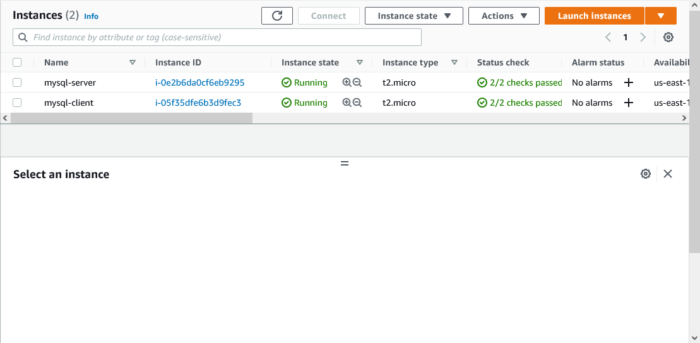

- connect to mysql-server instance

```
ssh -i "<private-key>.pem" ubuntu@<public-IPv4-dns>
```

```
 # if permission error
 chmod 0400 <private-key>.pem
```

## Configuring MYSQL-SERVER

\*Install MYSQL Server Software

```
sudo apt update
```

```
sudo apt install mysql-server -y
```

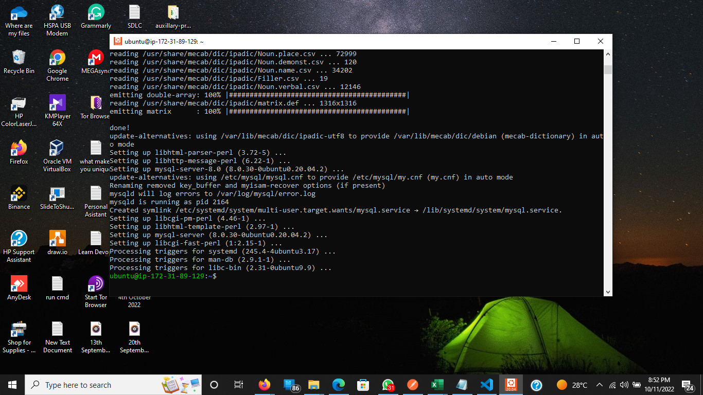

- Login to MYSQL

```
sudo mysql
```

- Run this script to remove some insecure default settings and lock down access to your database system

```
ALTER USER 'root'@'localhost' IDENTIFIED WITH mysql_native_password BY 'PassWord';
```

- to exit the Mysql Shell

```
mysql > exit
```

- start mysql interactive script

```
sudo mysql_secure_installation
```

- Test mysql Login

```
sudo mysql -p
```

### Creating Database

- connect to the MySQL console using the root account:

```
sudo mysql -p
```

- Create a new user named using mysql_native_password as default authentication method.

```
mysql>  CREATE USER 'example_user'@'%' IDENTIFIED WITH mysql_native_password BY 'password';
```

- Create a test database

```
mysql> CREATE DATABASE `example_database`;
```

- Grant user permission over the example_database

```
mysql> GRANT ALL ON example_database.* TO 'example_user'@'%';
```

- exit the MySQL shell with:

```
mysql> exit
```

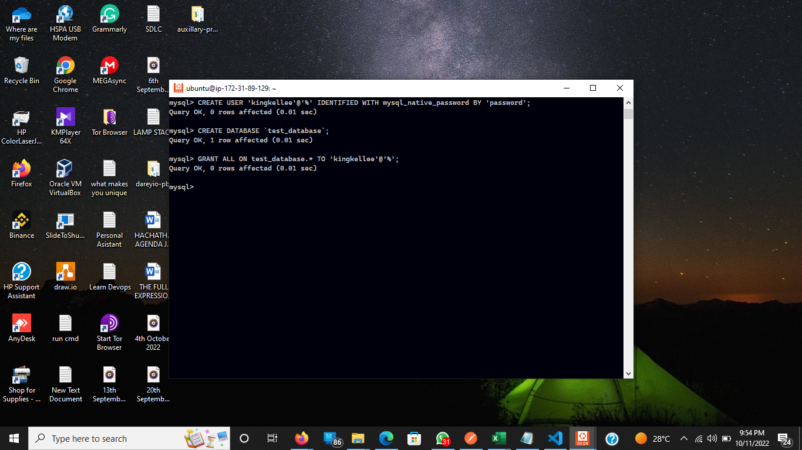

### Configure EC2 Server to Communicate using Local IP Address

- For extra security, do not allow all IP addresses to reach your ‘mysql server’ – allow access only to the specific local IP address of your ‘mysql client’.

- On mysql server

```
ip addr show
```

- Copy private ip-address for mysql server (this can also be gotten from ec2 instance private-ipv4-address)

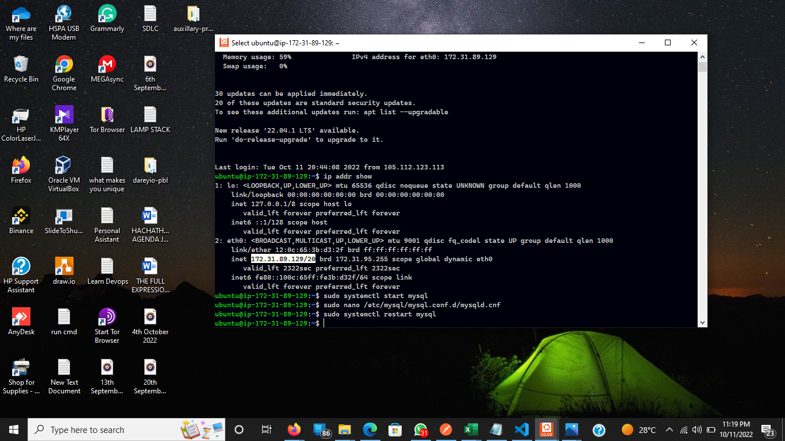
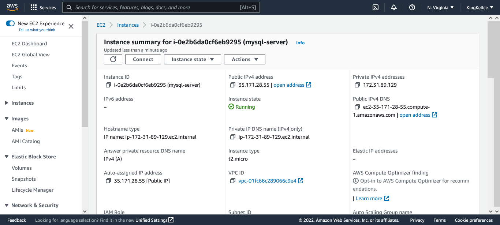

- In the EC2 Instance Security Group create a new entry in ‘Inbound rules’ in ‘mysql server’ Security Groups.

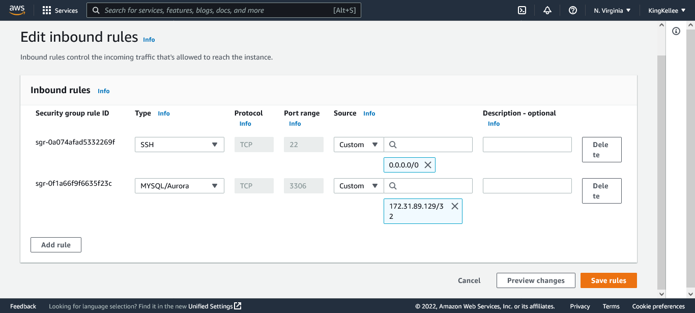

- configure MySQL server to allow connections from remote hosts.

```
sudo nano /etc/mysql/mysql.conf.d/mysqld.cnf
```

- Replace Bind address ip from ‘127.0.0.1’ to ‘0.0.0.0’ like this:
  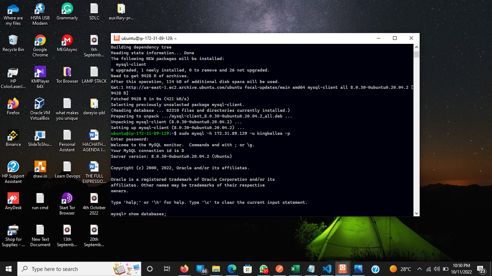

- restart mysql services

```
sudo mysql systemctl restart mysql
```

### Configure MYSQL Client and Remotely connect to MYSQL Server

- connect to mysql-client instance

```
ssh -i "<private-key>.pem" ubuntu@<public-IPv4-dns>
```

```
 # if permission error
 chmod 0400 <private-key>.pem
```

- Run updates

```
sudo apt update
```

- Install mysql client

```
sudo apt install mysql-client
```

- Connect remotely to mysql server Database Engine

```
sudo mysql -h <private-ipv4-address-mysqlserver> -u username -p
```

- Check that you have successfully connected to a remote MySQL server and can perform SQL queries:

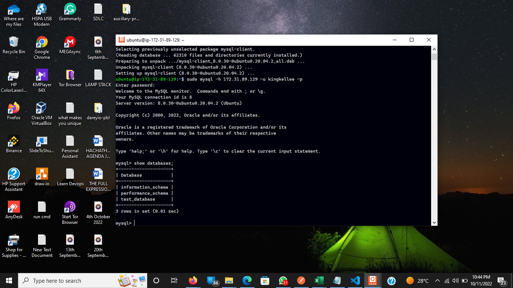

### Test SQL Queries

- create a test table named todo_list.

```
CREATE TABLE example_database.todo_list (
mysql>     item_id INT AUTO_INCREMENT,
mysql>     content VARCHAR(255),
mysql>     PRIMARY KEY(item_id)
mysql> );
```

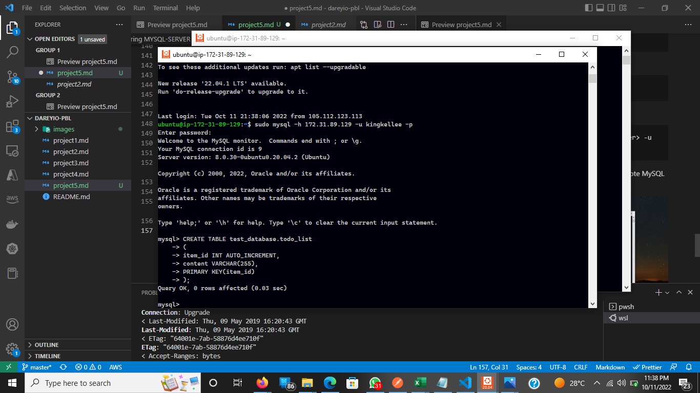

- Insert a few rows of content in the test table.

```
mysql> INSERT INTO example_database.todo_list (content) VALUES ("My first important item");
```

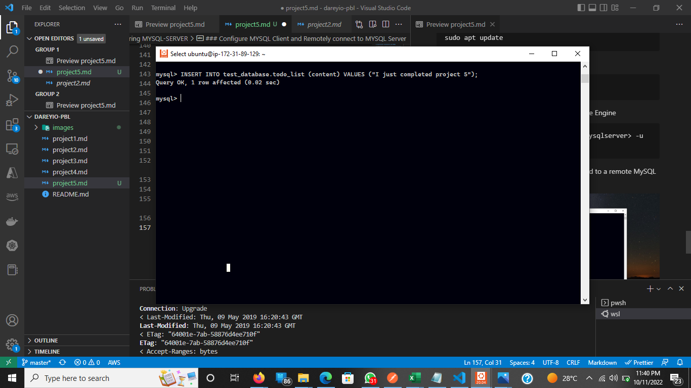

- confirm that the data was successfully saved to your table, run:

```
mysql>  SELECT * FROM example_database.todo_list;
```

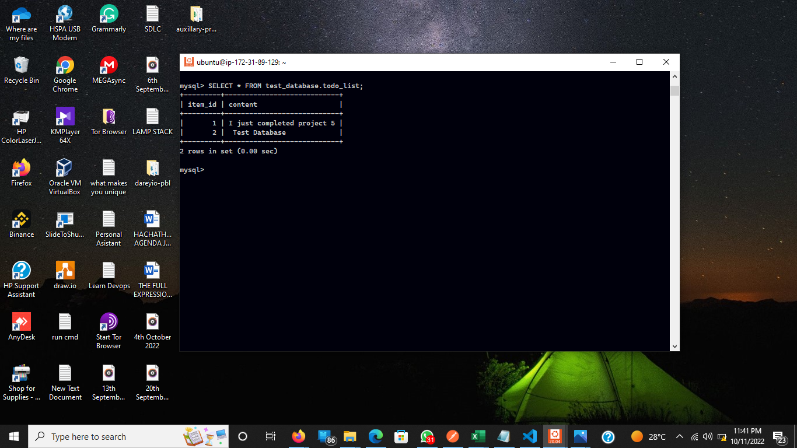

- exit Mysql

```
mysql> exit
```
