# Documentation of a Web Solution with Wordpress

## Prepare Web Server

- Launch 2 Instance of RedHat AMI EC2 Server.

1. Name The Firstance Instance _web-server_
   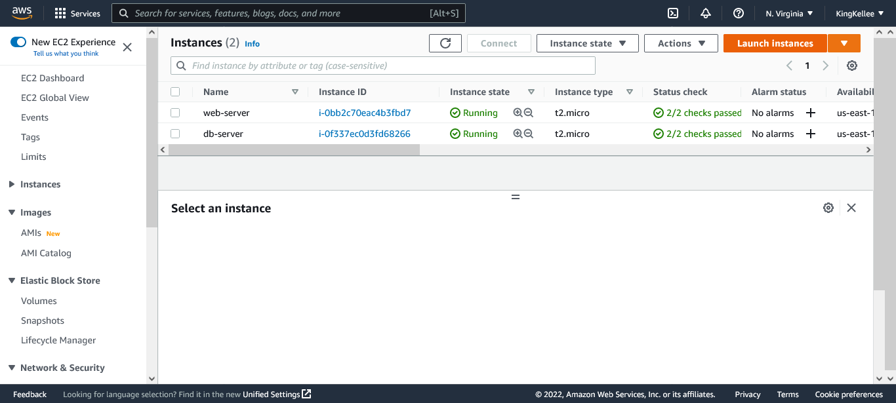

- Add 3 EBS Volume to EC2 Instance, each 0f 10GB
  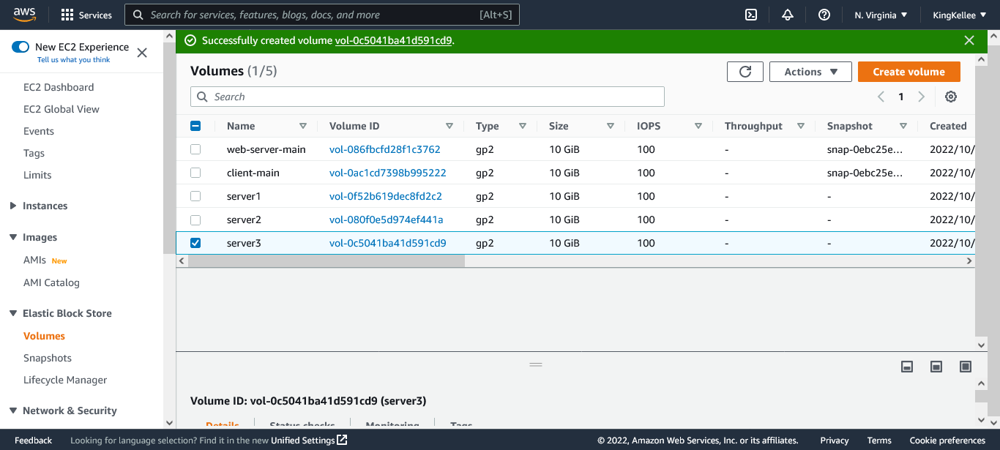
- Attach all 3 Volumes to the Web Server EC2 Instance
  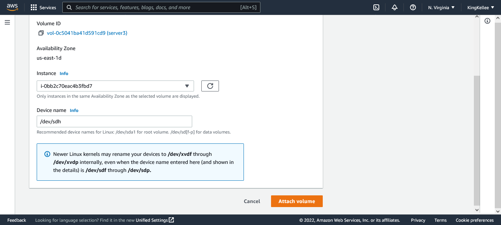

- Open a Linux Terminal or SSH Client, and sign
  into the webserver

```
ssh -i "<private-key>.pem" ec2-user@<public-IPv4-dns>
```

- Inspect the block devices attached to the server

```
lsblk
```

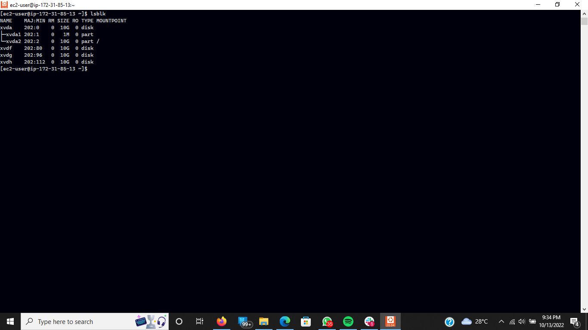

- To see all mounts and free space on the server

```
df -h
```

- Create a single partition in each of the three disk

```
sudo gdisk /dev/xvdf
sudo gdisk /dev/xvdg
sudo gdisk /dev/xvdh
```

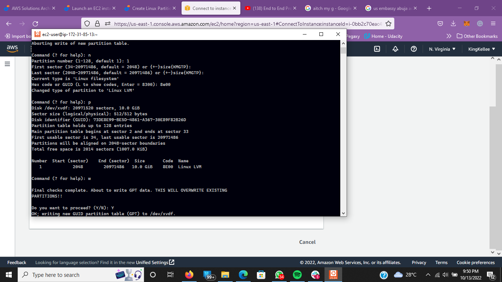

- Use lsblk to view the newly configured partition on each of the 3 disks.

- Install LVM2 Package and check for availabile partitions

```
sudo yum install lvm2 -y && sudo lvmdiskscan
```

- Mark each of the 3 disks as physical volumes (PVs) to be used by LVM

```
sudo pvcreate /dev/xvdf1
sudo pvcreate /dev/xvdg1
sudo pvcreate /dev/xvdh1
```

- To verify the Physical volume has been created successfully

```
sudo pvs
```

- Add the 3 Physical Volumes to a Volume Group (VG). Name the VG webdata-vg

```
sudo vgcreate webdata-vg /dev/xvdh1 /dev/xvdg1 /dev/xvdf1
```

- To Verify that the VG has been created successfully

```
sudo vgs
```

- Create 2 logical volumes. Use half of the PV size for apps-lv, and the remaining space of the PV size for logs-lv

```
sudo lvcreate -n apps-lv -L 14G webdata-vg
sudo lvcreate -n logs-lv -L 14G webdata-vg
```

- To verify the Logical Volume has been created successfully

```
sudo lvs
```

- Verify the whole process is successfuly created

```
sudo vgdisplay -v #view complete setup - VG, PV, and LV
```

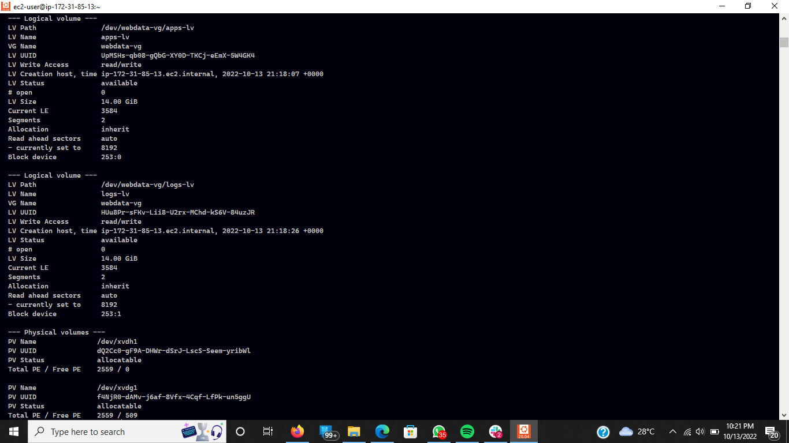

```
sudo lsblk
```

- Format the logical volumes with ext4 filesystem

```
sudo mkfs -t ext4 /dev/webdata-vg/apps-lv
sudo mkfs -t ext4 /dev/webdata-vg/logs-lv
```

- Create a directory to store our website data

```
sudo mkdir -p /var/www/html
```

- Create a directory to store our Backup log data

```
sudo mkdir -p /home/recovery/logs
```

- Mount `/var/www/html` (OUR WEBSITE DATA directory) on apps-lv logical volume

```
sudo mount /dev/webdata-vg/apps-lv /var/www/html/
```

- **Backup all the files in the log directory /var/log into `/home/recovery/logs`**

```
sudo rsync -av /var/log/. /home/recovery/logs/
```

- Mount `/var/log` on logs-lv logical volume.

```
sudo mount /dev/webdata-vg/logs-lv /var/log
```

- Restore log files back into /var/log directory

```
sudo rsync -av /home/recovery/logs/. /var/log
```

### update the `/etc/fstab` file

- Copy the UUID of the device

```
sudo blkid
```

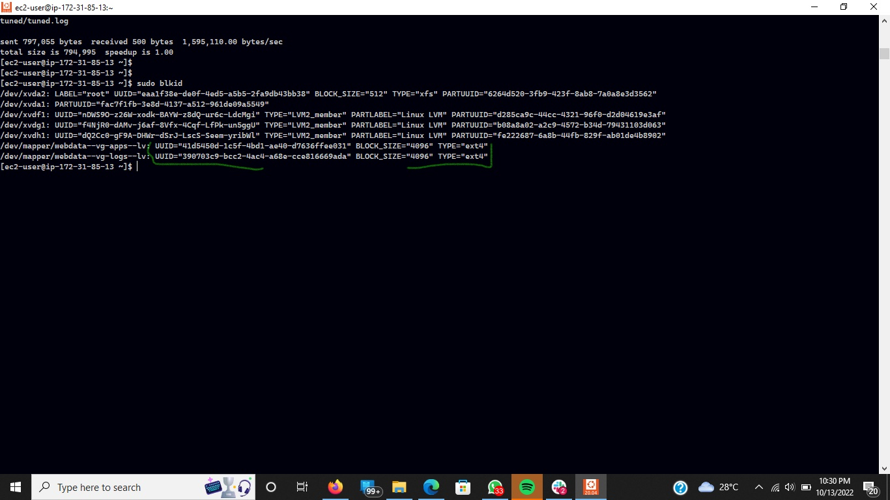

- Open and update `/etc/fstab`

```
sudo vi /etc/fstab
```

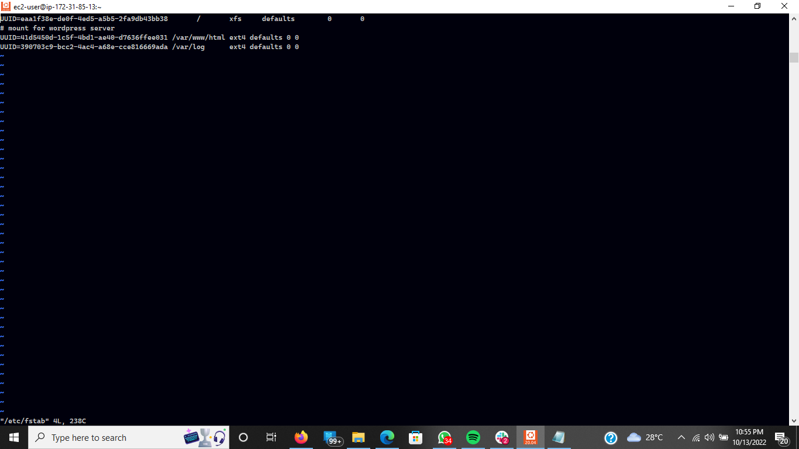

- Test the configuration and reload the daemon

```
sudo mount -a
```

```
sudo systemctl daemon-reload
```

- Verify the Setup

```
df -h
```

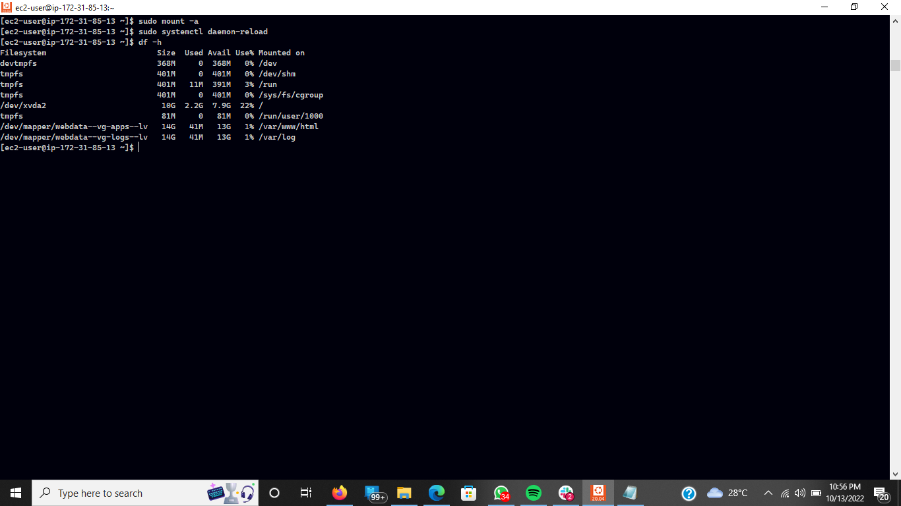

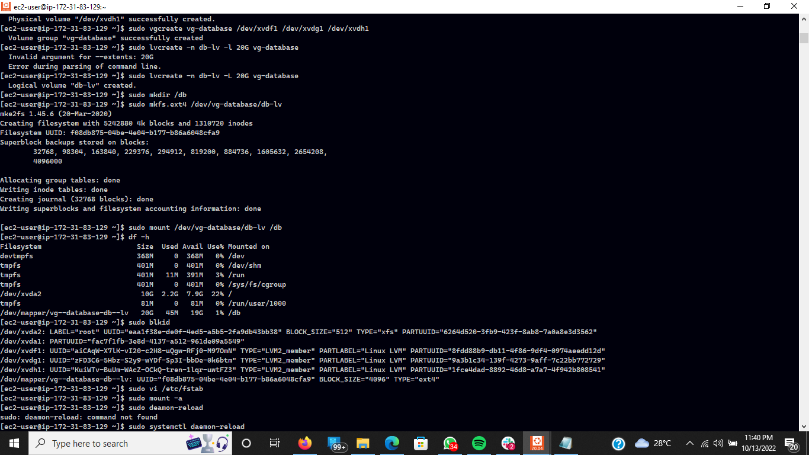

## Configure WordPress on Web Server

- Run Linux Update

```
sudo yum -y update
```

- Install wget, Apache and it’s dependencies

```
sudo yum -y install wget httpd php php-mysqlnd php-fpm php-json
```

- Start Apache

```
sudo systemctl enable httpd
sudo systemctl start httpd
```

- To install PHP and it’s depemdencies

```
sudo yum install https://dl.fedoraproject.org/pub/epel/epel-release-latest-8.noarch.rpm
```

```
sudo yum install yum-utils http://rpms.remirepo.net/enterprise/remi-release-8.rpm
```

```
sudo yum module list php
```

```
sudo yum module reset php
```

```
sudo yum module enable php:remi-7.4
```

```
sudo yum install php php-opcache php-gd php-curl php-mysqlnd
```

```
sudo systemctl start php-fpm
```

```
sudo systemctl enable php-fpm
```

```
sudo setsebool -P httpd_execmem 1
```

- Restart Apache

```
sudo systemctl restart httpd
```

### Try to access from your browser the link to your WordPress `http://<Web-Server-Public-IP-Address>/`

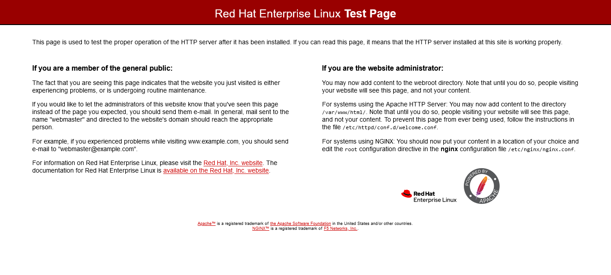

## Prepare Database Server

- Repeat the Same Process for the Second Red Hat Linux Instance, db-server

* Inspect the block devices attached to the server

```
lsblk
```

- To see all mounts and free space on the server

```
df -h
```

- Create a single partition in each of the three disk

```
sudo gdisk /dev/xvdf /dev/xvdg /dev/xvdh
```

- Use lsblk to view the newly configured partition on each of the 3 disks.

- Install LVM2 Package and check for availabile partitions

```
sudo yum install lvm2 -y && sudo lvmdiskscan
```

- Mark each of the 3 disks as physical volumes (PVs) to be used by LVM

```
sudo pvcreate /dev/xvdf1
sudo pvcreate /dev/xvdg1
sudo pvcreate /dev/xvdh1
```

- To verify the Physical volume has been created successfully

```
sudo pvs
```

- Add the 3 Physical Volumes to a Volume Group (VG). Name the VG database-vg

```
sudo vgcreate database-vg /dev/xvdh1 /dev/xvdg1 /dev/xvdf1
```

- To Verify that the VG has been created successfully

```
sudo vgs
```

- Create 1 logical volume.

```
sudo lvcreate -n db-lv -L 28G database-vg
```

- To verify the Logical Volume has been created successfully

```
sudo lvs
```

- Verify the whole process is successfuly created

```
sudo vgdisplay -v #view complete setup - VG, PV, and LV
```

```
sudo lsblk
```

- Format the logical volumes with ext4 filesystem

```
sudo mkfs -t ext4 /dev/database-vg/db-lv
```

- Create a directory to store our website data

```
sudo mkdir /db
```

- Mount `/db` on db-lv logical volume

```
sudo mount /dev/database-vg/db-lv /db
```

### update the `/etc/fstab` file

- Copy the UUID of the device

```
sudo blkid
```

- Open and update `/etc/fstab`

```
sudo vi /etc/fstab
```

- Test the configuration and reload the daemon

```
sudo mount -a
```

```
sudo systemctl daemon-reload
```

- Verify the Setup

```
df -h
```

## Configure Database Server

- Install MYSQL Server Software

```
sudo yum update
```

```
sudo yum install mysql-server -y
```

- Start mysql service

```
sudo systemctl start mysqld
```

- To enable MYSQL service

```
sudo systemctl enable mysqld
```

- Confirm MYSQL is active

```
sudo systemctl status mysqld
```

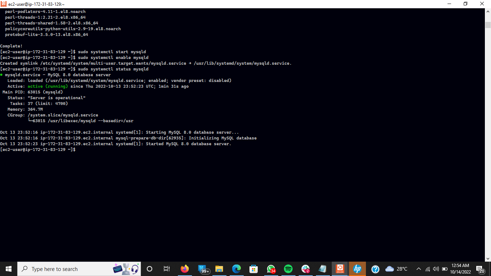

- Login to MYSQL

```
sudo mysql -u root -p
```

- Run this script to remove some insecure default settings and lock down access to your database system

```
mysql > ALTER USER 'root'@'localhost' IDENTIFIED WITH mysql_native_password BY 'password';
```

- to exit the Mysql Shell

```
mysql > exit
```

- start mysql interactive script

```
sudo mysql_secure_installation
```

- Login to MYSQL

```
sudo mysql -u root -p
```

- Create Database User

```
mysql > CREATE USER 'wordpress'@'%' IDENTIFIED WITH mysql_native_password BY 'password'
```

- Grant User Permission

```
mysql > GRANT ALL PRIVILEGES ON _._ TO 'wordpress'@'%' WITH GRANT OPTION;
```

- Flush Priviledge

```
mysql > flush privileges;

```

- Test user is created

```
mysql > select user, host from mysql.user;
```

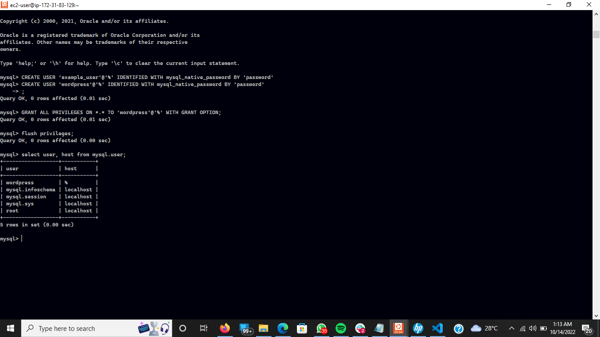

- Edit configuration

```
sudo vi /etc/my.cnf

```

- Copy and Paste into `/etc/my.cnf`

```

[mysqld]
bind-address=0.0.0.0

```

- Restart Mysqld

```
sudo systemctl restart mysqld
```

## Configure Database to Work with Wordpress

- In Your WebServer

- Download wordpress and copy wordpress to `var/www/html`

```
mkdir wordpress && cd wordpress
```

- Install Wordpress

```
sudo wget http://wordpress.org/latest.tar.gz
```

- Uninstall Wordpress

```
sudo tar xzvf latest.tar.gz
```

```
sudo rm -rf latest.tar.gz
```

```
cp wordpress/wp-config-sample.php wordpress/wp-config.php
```

```
sudo cp -R wordpress/. /var/www/html/

```

- Move into `/var/www/html/`

```
cd /var/www/html/
```

```
sudo yum install mysql-server -y
```

- Start mysql service

```
sudo systemctl start mysqld
```

- To enable MYSQL service

```
sudo systemctl enable mysqld
```

- Confirm MYSQL is active

```
sudo systemctl status mysqld
```

- Configure wp-config.php

```
sudo vi wp-config.php
```

- Edit database configuration settings
  db host is the private ip address of your database-server
  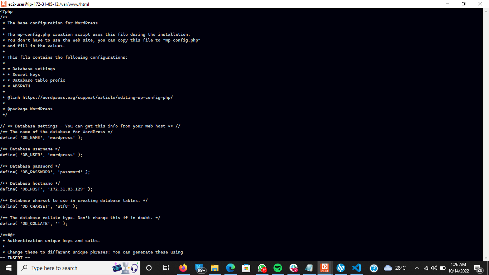

- restart httpd services

```
sudo systemctl restart httpd
```

- Disable the default appache page

```
sudo mv /etc/httpd/conf.d/welcome.conf /etc/httpd/conf.d/welcome.conf_backup
```

- open MySQL port 3306 on Database Server. For extra security, allow access to the DB server ONLY from your Web Server’s IP address.
- in the Inbound Rule configuration specify source as webserver-private-ip/32
  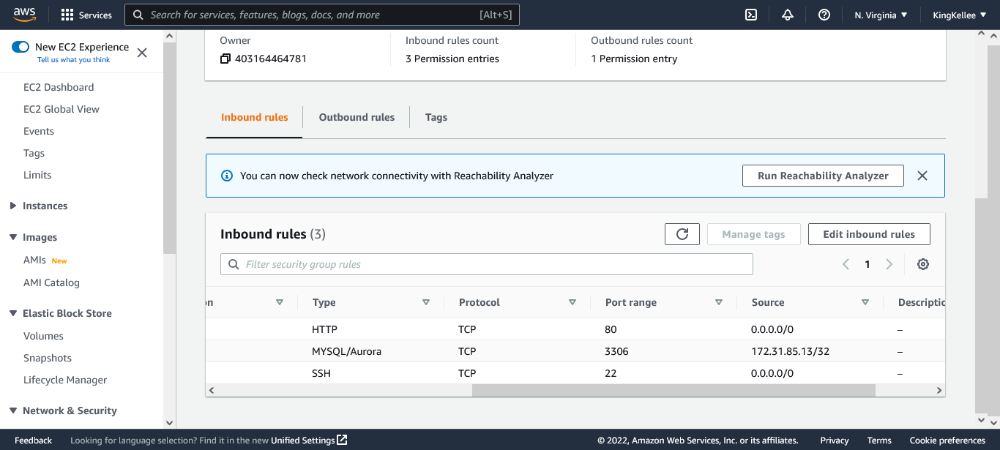

- Check Webserver can Connect to the Database

```
sudo mysql -h database-server-ip-address -u wordpress -p
```

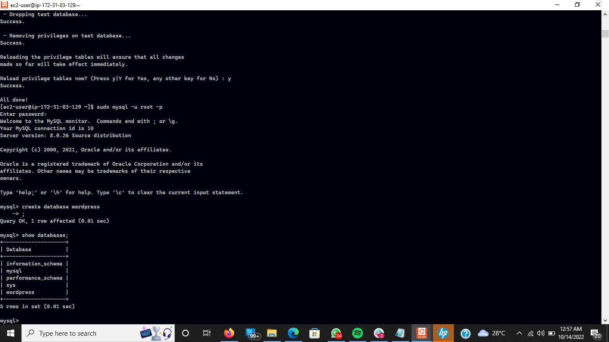

## Configure SELinux Policies

```
sudo chown -R apache:apache /var/www/html/
```

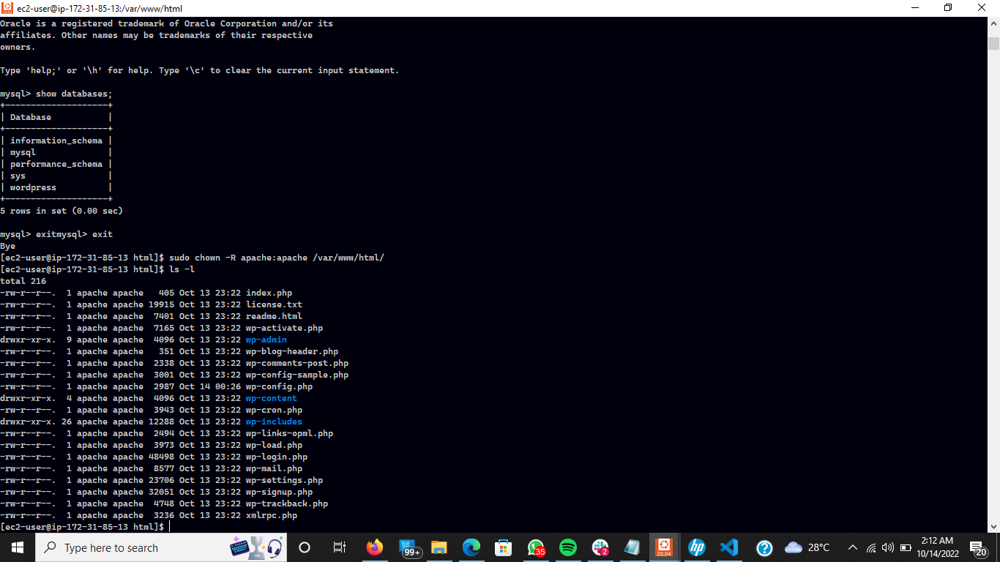

```
sudo chcon -t httpd_sys_rw_content_t /var/www/html/ -R
```

```
sudo setsebool -P httpd_can_network_connect=1
```

```
sudo setsebool -P httpd_can_network_conect_db 1
```

### Try to access from your browser the link to your WordPress `http://<Web-Server-Public-IP-Address>/wordpress/`

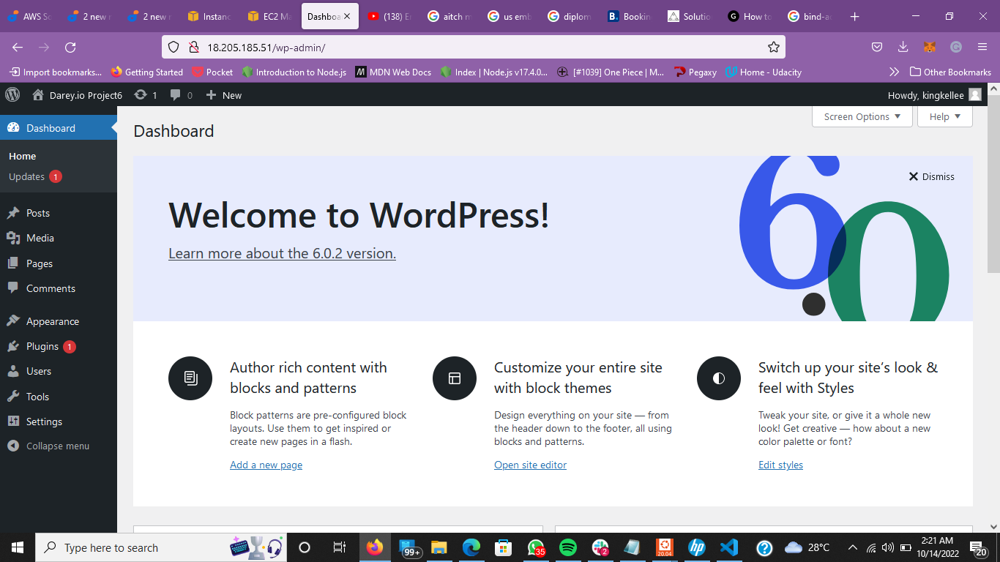
