# DEVOPS TOOLING WEBSITE DOCUMENTATION

> This documentation describes the process a DevOps Engineer would Implement a website solution which makes access to DevOps tools within the cooperate infratsructure easily accessible.

In This project, I immplememnted a solution that consists of the following components:

1. Infrastructure: AWS
1. Webserver Linux: Red Hat Enterprise Linux 8
1. Database Server: Ubuntu 20.04 + MySQL
1. Storage Server: Red Hat Enterprise Linux 8 + NFS Server
1. Programming Language: PHP
1. Code Repository: GitHub

### 3-Tier Web Application Architecture with a Single Database and an NFS Server as a Shared File Storage

> A 3-tier application architecture is a modular client-server architecture that consists of a presentation tier, an application tier and a data tier. The data tier stores information, the application tier handles logic and the presentation tier is a graphical user interface (GUI) that communicates with the other two tiers. The three tiers are logical, not physical, and may or may not run on the same physical server.


## Prerequisite

1. See [the documentation on How to Prepare your WebServer from Project 6](https://github.com/Kingkellee/dareyio-pbl/blob/master/project6.md)
2. Spin Up EC2 Instance:

- 4 Red Hat Enterprise Linux 8 Operating System
- 1 of the RHEL will be used to Configure the NFS Server, the other 3 will be used to Configure the Webserver
- 1 Ubuntu 20.04 for our Database Server

## Prepare NFS Server

- Rename one of the RHEL EC2 instance as NFS
- SSH into NFS Server

```
ssh -i "<private-key>.pem" ec2-user@<public-IPv4-dns>
```

- Configure LVM on the NFS Server using [LVM experience Project 6](https://github.com/Kingkellee/dareyio-pbl/blob/master/project6.md)
- Use **_xfs_** instead of **_ext4_**
- Create 3 Logical Volumes, **lv-opt**, **lv-apps** and **lv-logs**
- Create mount points on /mnt directory for the logical volumes as follow:
  - Mount **lv-apps** on **/mnt/apps** – To be used by webservers
  - Mount **lv-logs** on **/mnt/logs** – To be used by webserver logs
  - Mount **lv-opt** on **/mnt/opt** – To be used by Jenkins server
- Install NFS Serer and Configure it to start on reboot

```
sudo yum update -y
```

```
sudo yum install nfs-utils -y
```

```
sudo systemctl start nfs-server.service
```

```
sudo systemctl enable nfs-server.service
```

```
sudo systemctl status nfs-server.service
```

## Export the mounts for the Web Servers

- Set up permissions top access our Web Servers to read, write and execute files on NFS

```
sudo chown -R nobody: /mnt/apps
```

```
sudo chown -R nobody: /mnt/logs
```

```
sudo chown -R nobody: /mnt/opt
```

```
sudo chmod -R 777 /mnt/apps
```

```
sudo chmod -R 777 /mnt/logs
```

```
sudo chmod -R 777 /mnt/opt
```

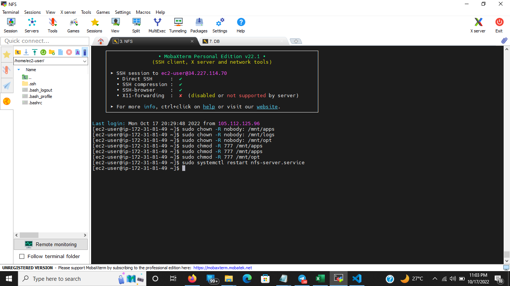

- Restart NFS Server Service

```
sudo systemctl restart nfs-server.service
```

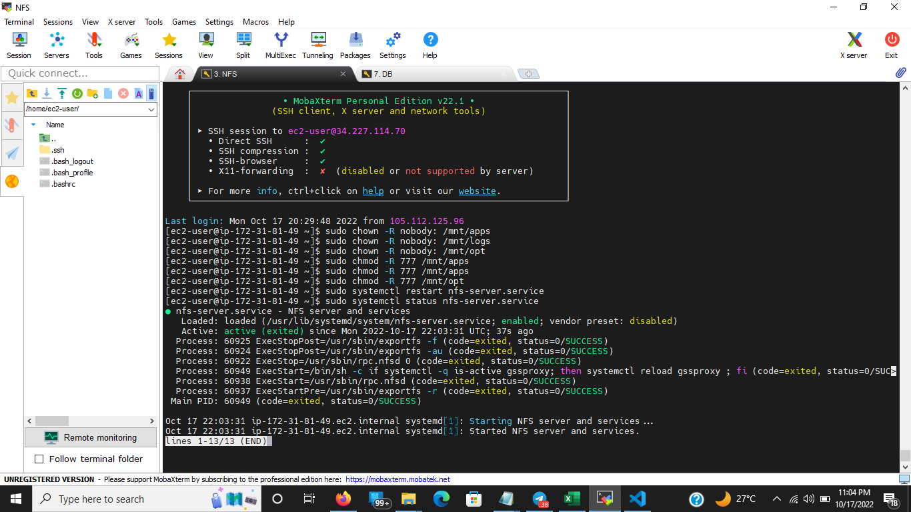

- Open AWS Console, select the NFS Server EC2 Instance, click the Networking Tab, Click on the Subnet ID and select the IPV4 CIDR Address
- Configure access to NFS for Clients within the same subnets

```
sudo vi /etc/exports
```

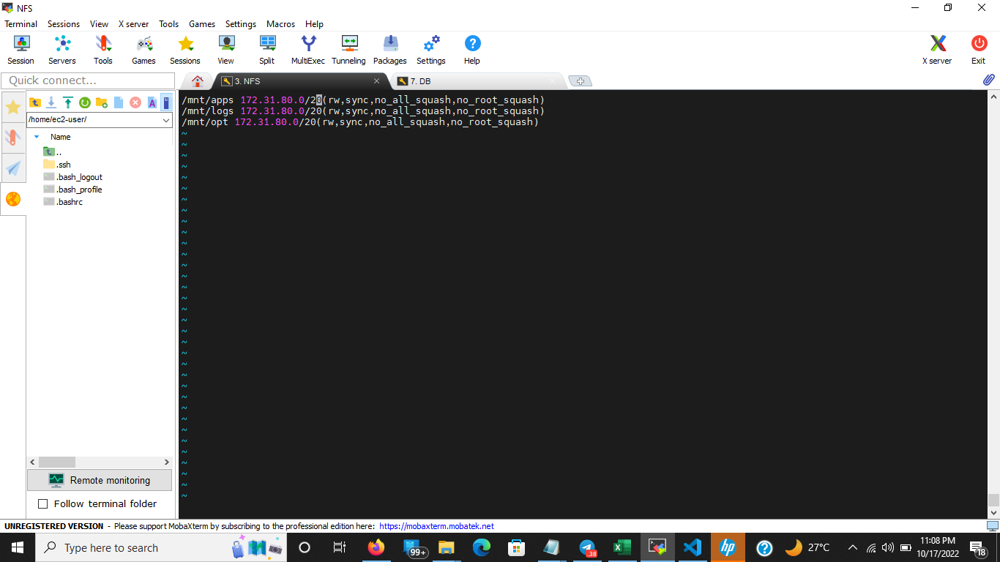

- Check which port is used by NFS and open it using Security Groups

```
rpcinfo -p | grep nfs
```

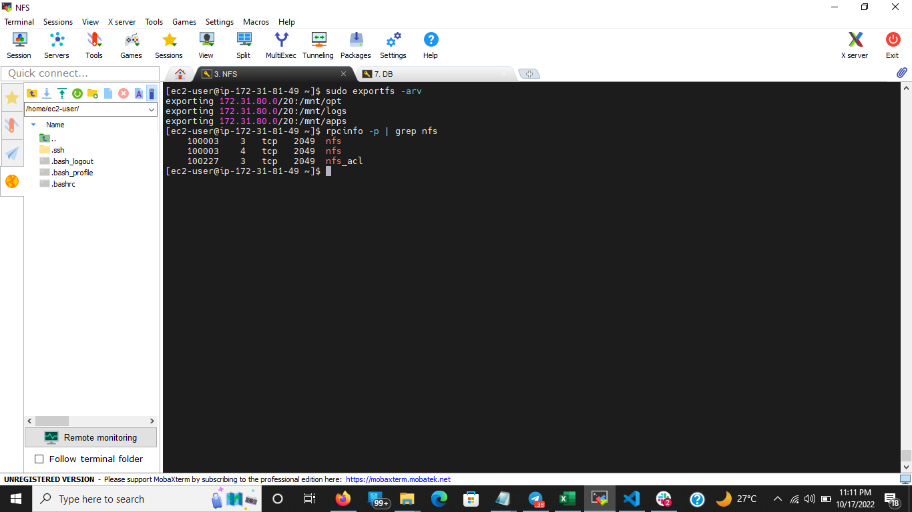

- Edit inbound rule and Open the following ports **TCP 111** **UDP 111** **UDP 2049**
  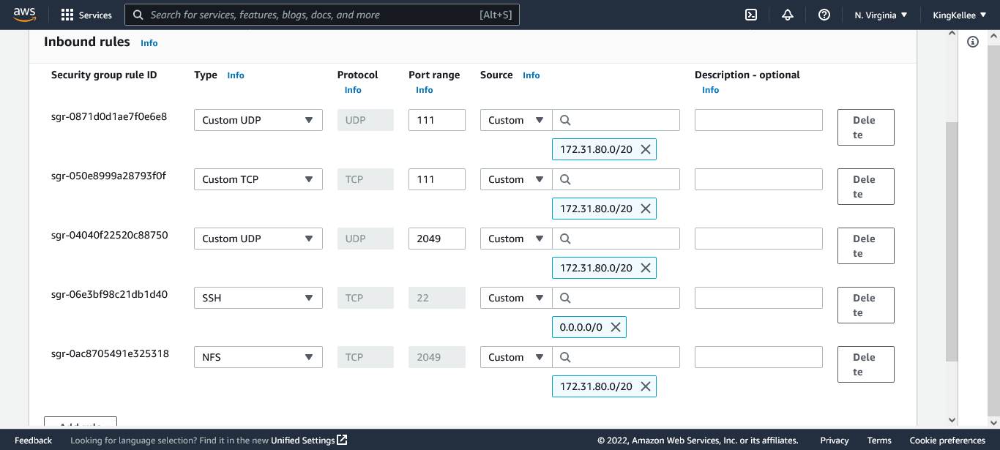

## Configure Database Server

- Spin up the Ubuntu server Created on the Prerequisite, and SSH into the Server

```
ssh -i "<private-key>.pem" ubuntu@<public-IPv4-dns>
```

- Install MYSQL Server

```
sudo apt update -y
```

```
sudo apt install mysql-server
```

- Start mysql service

```
sudo systemctl start mysqld
```

- To enable MYSQL service

```
sudo systemctl enable mysqld
```

- Confirm MYSQL is active

```
sudo systemctl status mysqld
```

- Login to MYSQL

```
sudo mysql -u root -p
```

- Run this script to remove some insecure default settings and lock down access to your database system

```
mysql > ALTER USER 'root'@'localhost' IDENTIFIED WITH mysql_native_password BY 'password';
```

- to exit the Mysql Shell

```
mysql > exit
```

- start mysql interactive script

```
sudo mysql_secure_installation
```

- Login to MYSQL

```
sudo mysql -u root -p
```

- Create Database User

```
mysql > CREATE USER 'webaccess'@'<webservers subnet cidr>' IDENTIFIED WITH mysql_native_password BY 'password'
```

- Grant User Permission

```
mysql > GRANT ALL PRIVILEGES ON tooling.* TO 'wordpress'@'<webservers subnet cidr>' WITH GRANT OPTION;
```

- Flush Priviledge

```
mysql > flush privileges;

```

- Test user is created

```
mysql > select user, host from mysql.user;
```

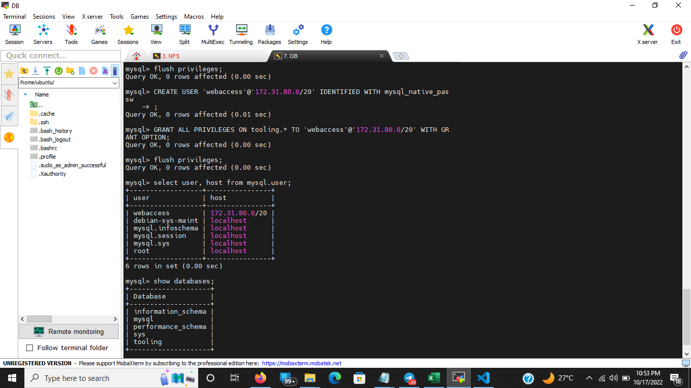

- Edit configuration

```
sudo vi /etc/mysql/mysql.cnf.d/mysqld

```

- Copy and Paste into `/etc/mysql/mysql.cnf.d/mysqld.cnf`

```
# edit the bind-address

bind-address=0.0.0.0
mysqlx-bind-address=0.0.0.0

```

- Restart Mysqld

```
sudo systemctl restart mysql
```

## Configure the Web Servers (This Step must Be Done on All Web Server)

- Connect to the web Server Instance

```
ssh -i "<private-key>.pem" ec2-user@<public-IPv4-dns>
```

- Configure NFS Client

```
sudo yum install nfs-utils nfs4-acl-tools -y
```

- Mount `/var/www/` and target the NFS server’s export for apps

```
sudo mkdir /var/www
```

```
sudo mount -t nfs -o rw,nosuid <NFS-Server-Private-IP-Address>:/mnt/apps /var/www
```

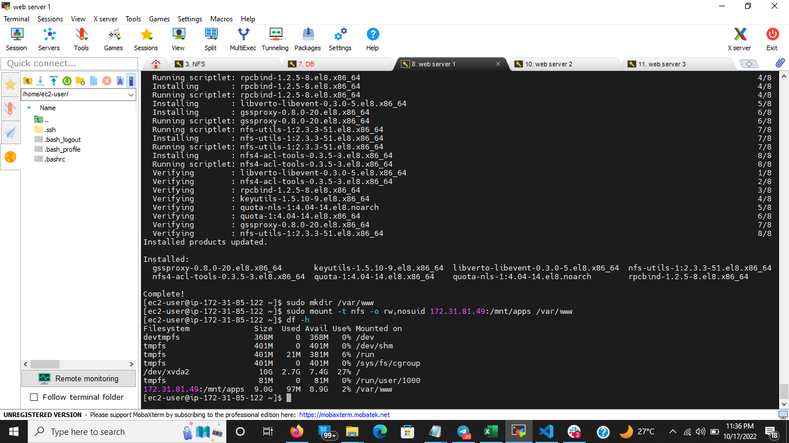

- Verify that NFS was mounted successfully

```
df -h
```

- Persist the Changes on webservers on reboot

```
sudo vi /etc/fstab
```

```
# add the following line
<NFS-Server-Private-IP-Address>:/mnt/apps /var/www nfs defaults 0 0
```

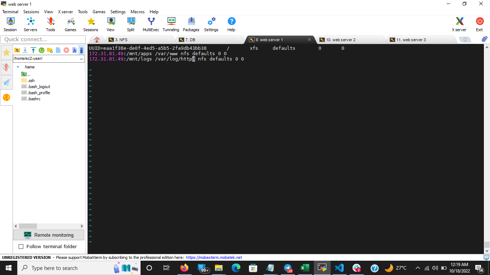

- Install Remi’s repository, Apache and PHP

```
sudo yum install httpd -y
```

```
sudo dnf install https://dl.fedoraproject.org/pub/epel/epel-release-latest-8.noarch.rpm
```

```
sudo dnf install dnf-utils http://rpms.remirepo.net/enterprise/remi-release-8.rpm
```

```
sudo dnf module reset php
```

```
sudo dnf module enable php:remi-7.4
```

```
sudo dnf install php php-opcache php-gd php-curl php-mysqlnd
```

```
sudo systemctl start php-fpm
```

```
sudo systemctl enable php-fpm
```

```
setsebool -P httpd_execmem 1
```

- Verify that Apache files and directories are available on the Web Server in /var/www and also on the NFS server in /mnt/apps.

```
cd /var/www
```

```
touch test.txt
```

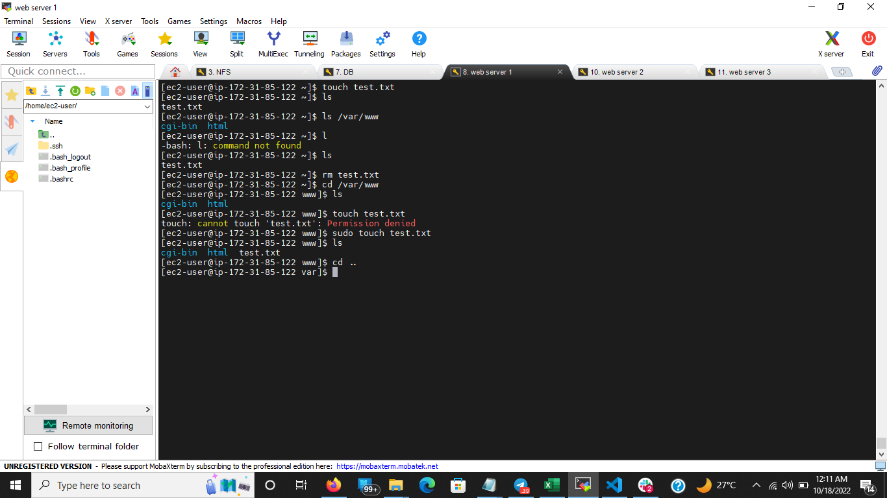

```
# on the NFS Server
ls /mnt/apps
```

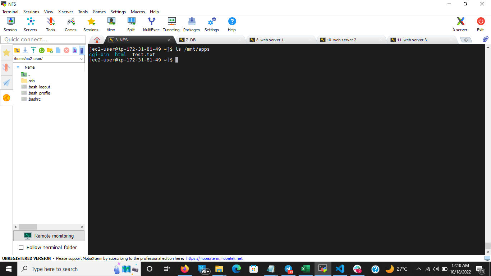

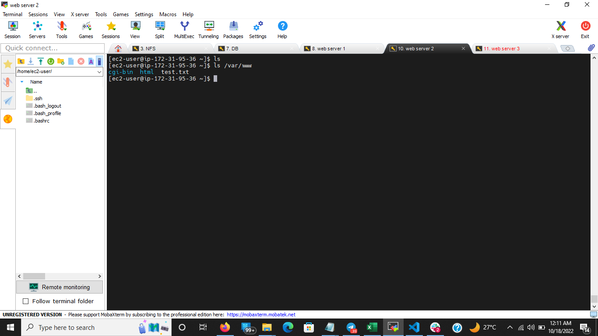

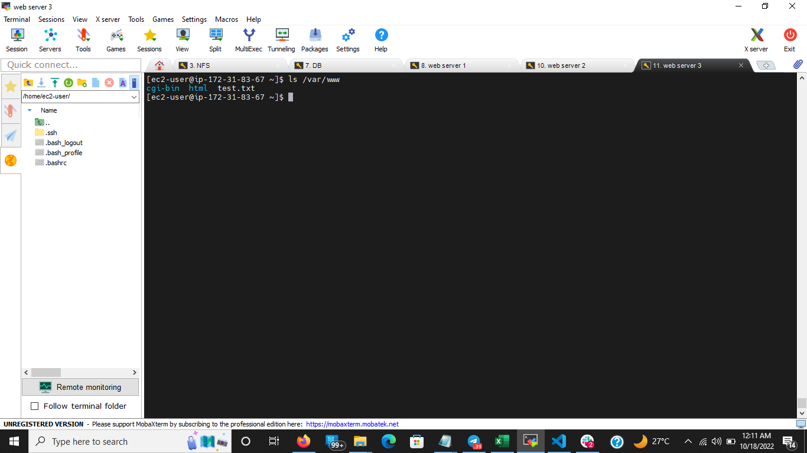

- Fork the  to your Github account

```
sudo yum install git
```

```
git clone https://github.com/<github-username>/tooling.git
```

- Deploy the tooling website code to the Webserver

```
cd tooling
```

```
sudo cp -R html/. /var/www/html
```

- Check if `/var/www/html` and `html/` contains the same files

```
ls /var/www/html
```

```
ls html
```

- Open TCP port 80 on web servers
- disable SELinux

```
cd ..
sudo setenforce 0
```

- set SELINUX=disabled

```
sudo vi /etc/sysconfig/selinux
.
.
....
SELINUX=disabled
```

- Restart httpd

```
sudo systemctl restart httpd
```

```
sudo systemctl status httpd
```

- Update the website’s configuration to connect to the database

```
sudo vi /var/www/html/functions.php
```

    database host: <database-private-ip>
    database username: webaccess
    database password: password

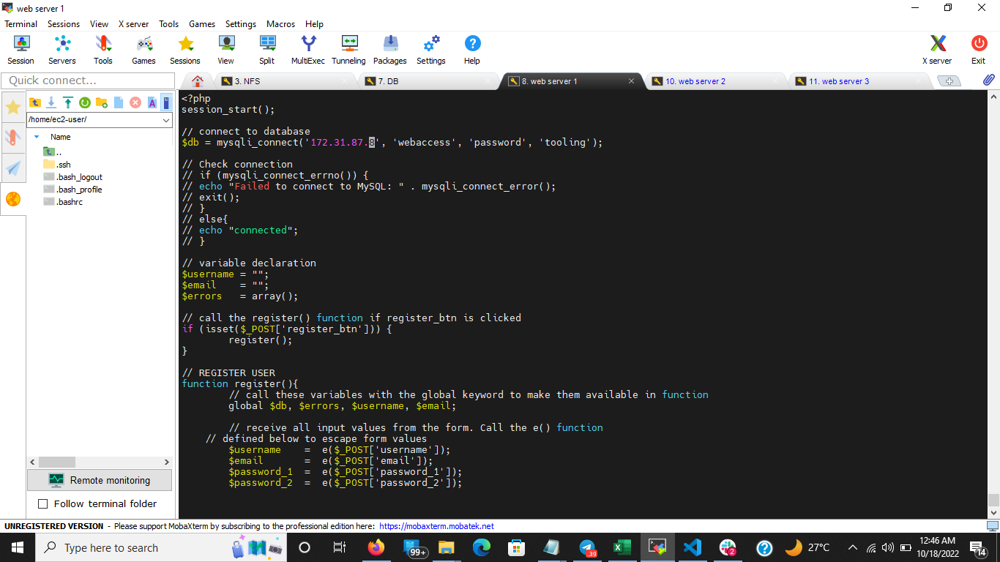

- Install Mysql Client on the Webserver

```
sudo yum install mysql -y
```

- On the database Security Group allow inbound access from MYSQL/Aurora at port 3306 from webserver IPV4 CIDR Address

- Apply `tooling-db.sql' script to the database

```
mysql -h <databse-private-ip> -u <db-username> -p < tooling-db.sql

# enter your password when prompted for password
```

- Confirm Database

```
mysql > show databases;
```

- Change Database

```
mysql > select user, host from mysql.user
```

```
mysql > use tooling;
```

```
mysql > show tables;
```

```
mysql > select * from users
```

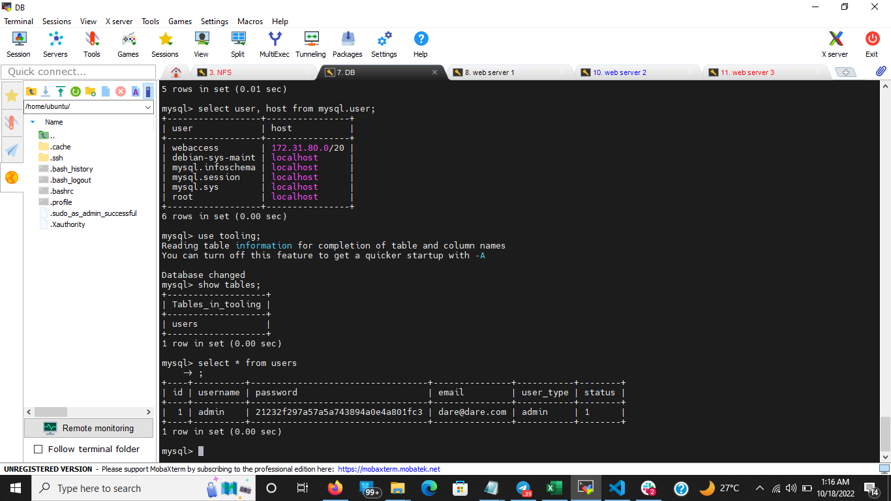

- Open the website in your browser using `http://<Web-Server-Public-IP-Address-or-Public-DNS-Name>/index.php `
  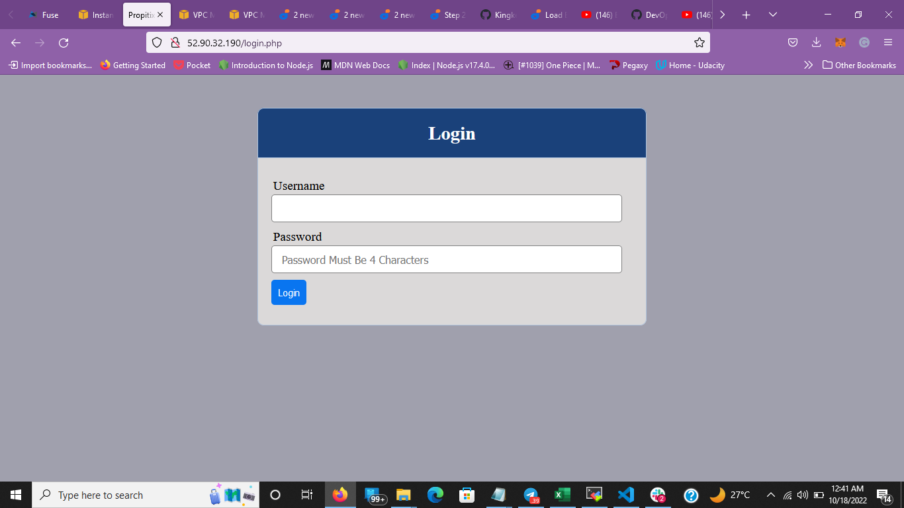

- Login into the website using the admin user
  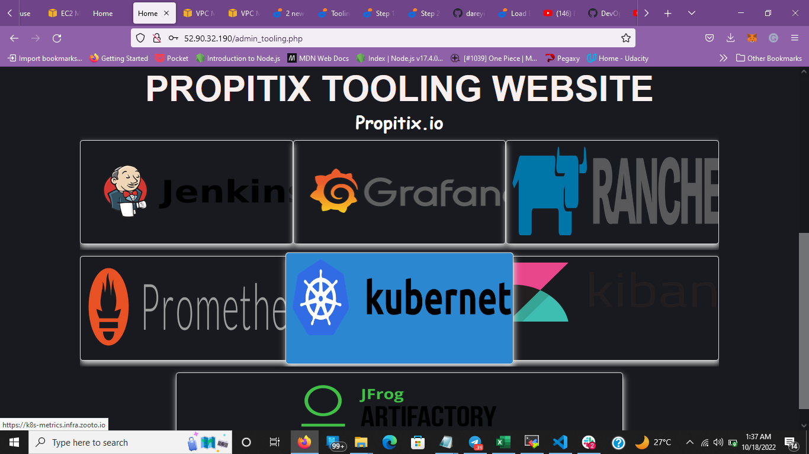
