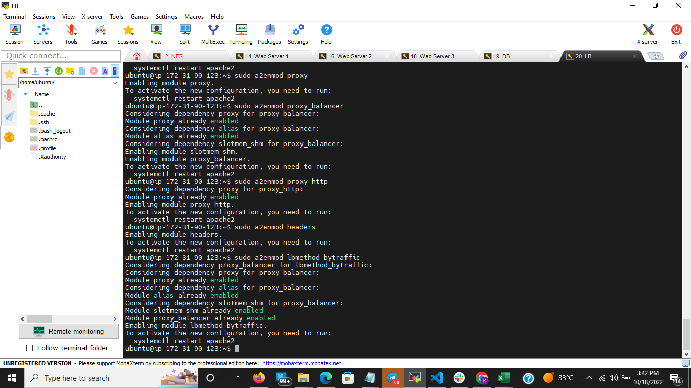
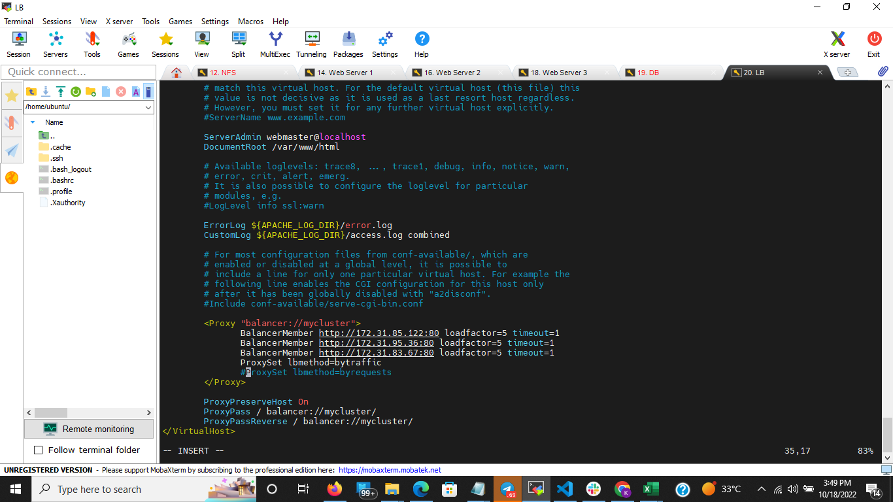
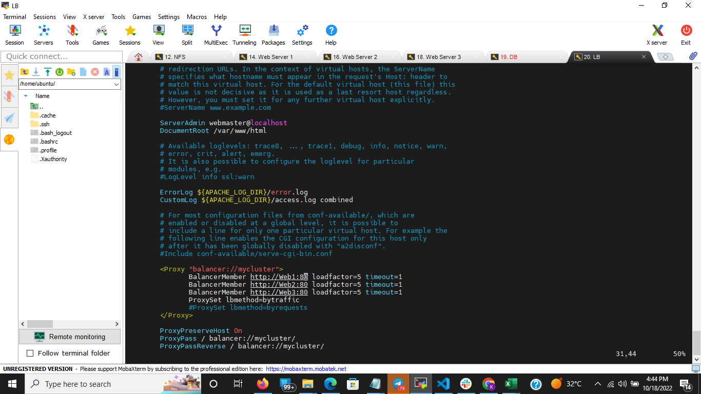
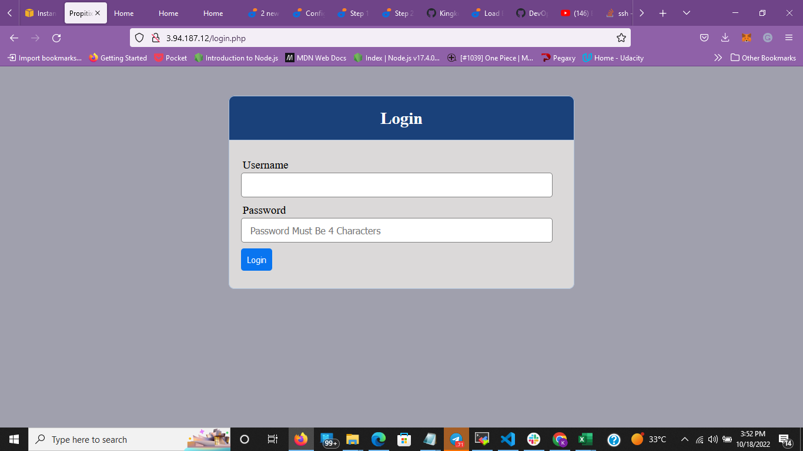
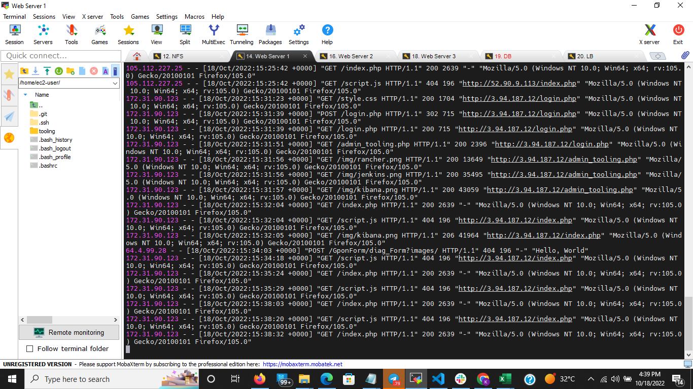
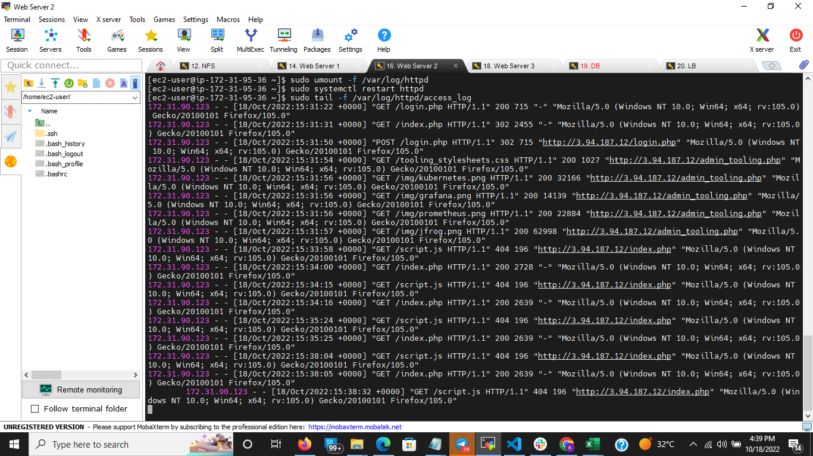
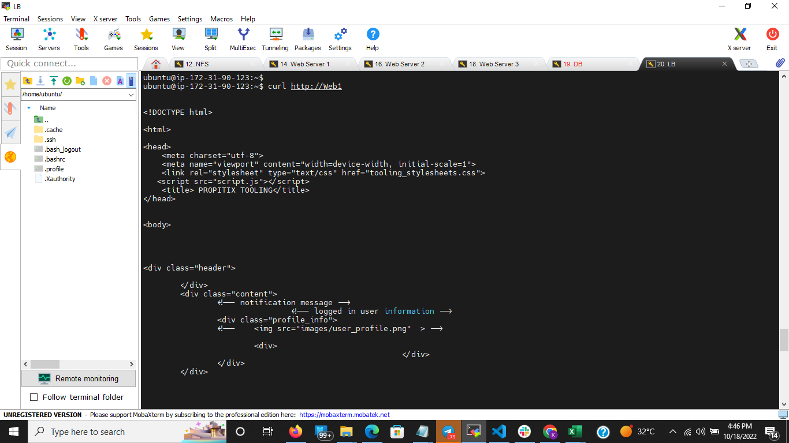

# DOCUMENTATION ON Load Balancer Solution With Apache

## Project Objective

In this Project, I configured a Load balancer to distribute traffic between our Web Server.

## Prerequisites

1. Configure Web Servers, MYSQL DB Server and NFS Server, See [Project 7 Documentation](https://github.com/Kingkellee/dareyio-pbl/blob/master/project7.md) Getting Strated

## Configure Apache as a Load Balancer

- Create an Ubuntu Server 20.04 EC2 instance, name it `Project-8-apache-lb`
- SSH into EC2 Instance
- Edit Inbound rule and Open TCP port 80 on `Project-8-apache-lb` Security Group

## Install Apache Load Balancer

- Install Apache

```
sudo apt update -y
```

```
sudo apt install apache2 -y
```

```
sudo apt-get install libxml2-dev
```

- Enable the Following modules

```
sudo a2enmod rewrite
```

```
sudo a2enmod proxy
```

```
sudo a2enmod proxy_balancer
```

```
sudo a2enmod proxy_http
```

```
sudo a2enmod headers
```

```
sudo a2enmod lbmethod_bytraffic
```

- Restart Apache Service

```
sudo systemctl status apache2
```



## Configure Load Balancer to point traffic coming from our Web Servers:

```
sudo vi /etc/apache2/sites-available/000-default.conf
```

```
#Add this configuration into /etc/apache2/sites-available/000-default.conf <VirtualHost *:80>
</VirtualHost>

<Proxy "balancer://mycluster">
               BalancerMember http://<WebServer1-Private-IP-Address>:80 loadfactor=5 timeout=1
               BalancerMember http://<WebServer2-Private-IP-Address>:80 loadfactor=5 timeout=1
               ProxySet lbmethod=bytraffic
               # ProxySet lbmethod=byrequests
        </Proxy>

        ProxyPreserveHost On
        ProxyPass / balancer://mycluster/
        ProxyPassReverse / balancer://mycluster/
```

- Restart Apache Server

```
sudo systemctl restart apache2
```



- Unmount `/var/log/httpd/` from webserver

```
sudo systemctl stop httpd
```

```
sudo umount -f /var/log/httpd
```

```
sudo systemctl restart httpd
```

## Configure Local DNS Names

- Open `/etc/hosts`

```
sudo vi /etc/hosts
```

- Add 3 records into this file with Local IP address and arbitrary name for the Web Servers

```
<WebServer1-Private-IP-Address> Web1
<WebServer2-Private-IP-Address> Web2
<WebServer2-Private-IP-Address> Web3
```

- Update the Loan Balancer config file with the Arbitrary name

```
sudo vi /etc/apache2/sites-available/000-default.conf
```

```
BalancerMember http://Web1:80 loadfactor=5 timeout=1
BalancerMember http://Web2:80 loadfactor=5 timeout=1
BalancerMember http://Web3:80 loadfactor=5 timeout=1
```



- Verify that our configuration works, GOTO `http://<Load-Balancer-Public-IP-Address-or-Public-DNS-Name>/index.php`
  

- run this command on the ssh console for our webservers

```
sudo tail -f /var/log/httpd/access_log
```

Web 1 Traffic

Web 2 Traffic

Web 3 Traffic


- curl Web Servers from Load Balancer locally

```
curl http://Web1
```

```
curl http://Web2
```

```
curl http://Web3
```


