# Continous Integration Pipeline For Tooling Website (JENKINS)

## Project Objective

1. In this project I automated the Continuous Integeration of Tooling website from [Project7](https://github.com/Kingkellee/dareyio-pbl/blob/master/project7.md) and [Project8](https://github.com/Kingkellee/dareyio-pbl/blob/master/project8.md)
   utilizing Jenkins CI capabilities to track changes in our source code and automaticallly update our Tooling website

## Configure Jenkins Server

- Create an AWS EC2 Ubuntu Server 20.04 LTS and name it `Jenkins`
- SSH into the Jenkin Server

- Install JDK

```
sudo apt update -y
```

```
sudo apt install default-jdk-headless
```

- Install Jenkins

```
wget -q -O - https://pkg.jenkins.io/debian-stable/jenkins.io.key | sudo apt-key add -
```

```
sudo sh -c 'echo deb https://pkg.jenkins.io/debian-stable binary/ > /etc/apt/sources.list.d/jenkins.list'
```

```
sudo apt update -y
```

```
sudo apt-get install jenkins
```

- To check if Jenkins is up and running

```
sudo systemctl status jenkins
```

- Edit Inbound rule and Open port 8080 for Jenkins Server
  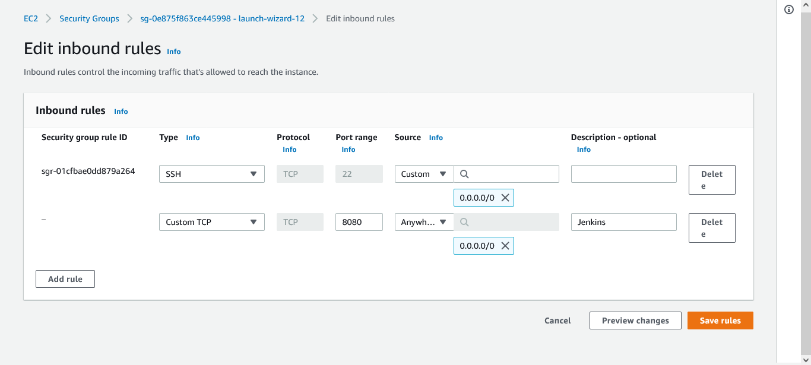

## Initial Jekins Setup

- Access Jenkins using `http://<Jenkins-Server-Public-IP-Address-or-Public-DNS-Name>:8080`
- 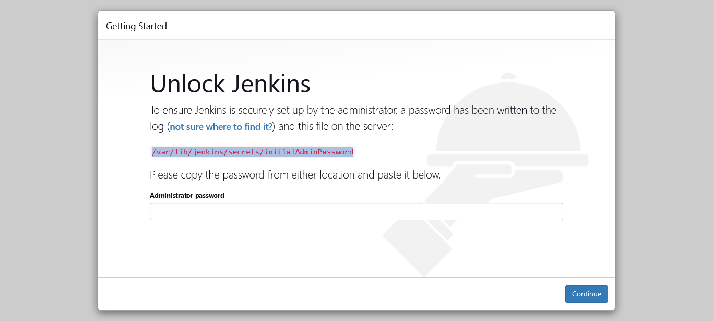

- To retrieve Administrator password

```
sudo cat /var/lib/jenkins/secrets/initialAdminPassword
```

- On the Jenkins Install Page, choose `Install suggested plungins`
  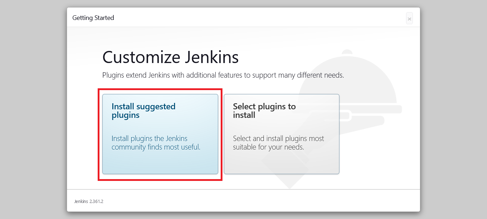

- Create an admin user once installation is completed
  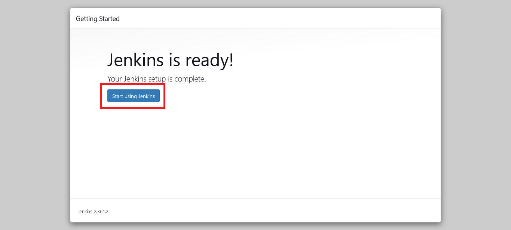

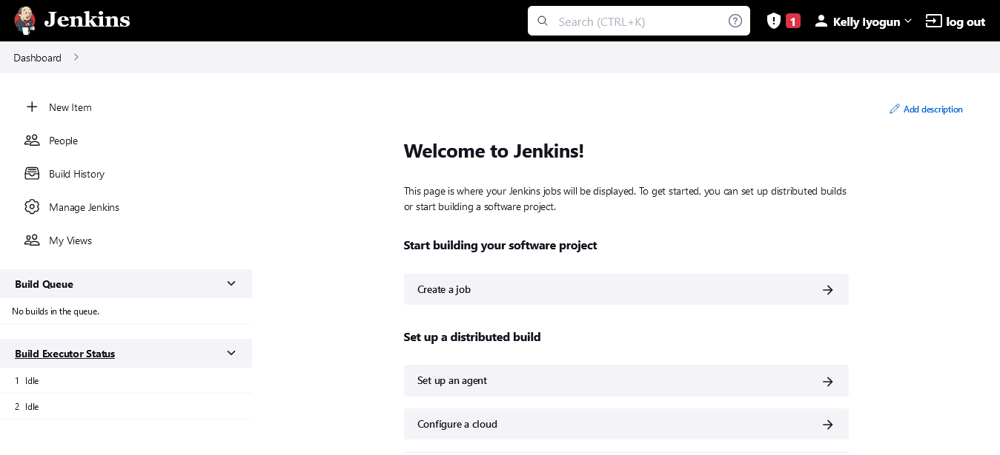

## Configure Jenkins to retrieve source code fom Github Webhooks

- Enable webhooks from Github repository settings
  - Click on Settings from the Git Repo
  - Click on Webhook
  - Click on Add Webhook
  - Enter payload url: `http://<jenkins-public-ipv4-dns>:8080/github-webhook`
  - Select `application/json` for the content type
  - For which event you will like to trigger this webhook, Select `Just the push event`
  - Click on Add the webhook

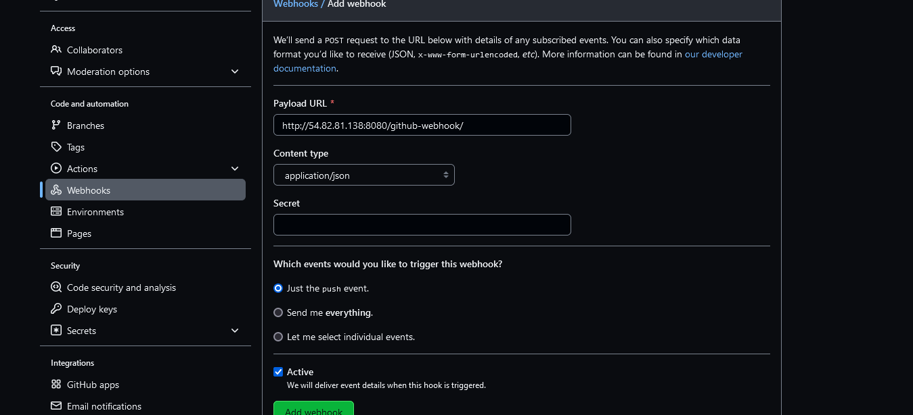

- Goto Jenkins web console and click `New Item` and Create a `Freestyle Project`
  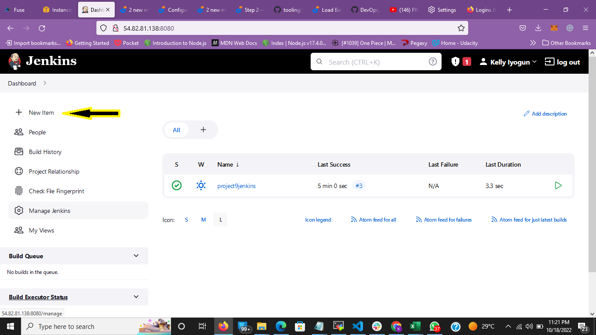
  Select Freestyle Project
  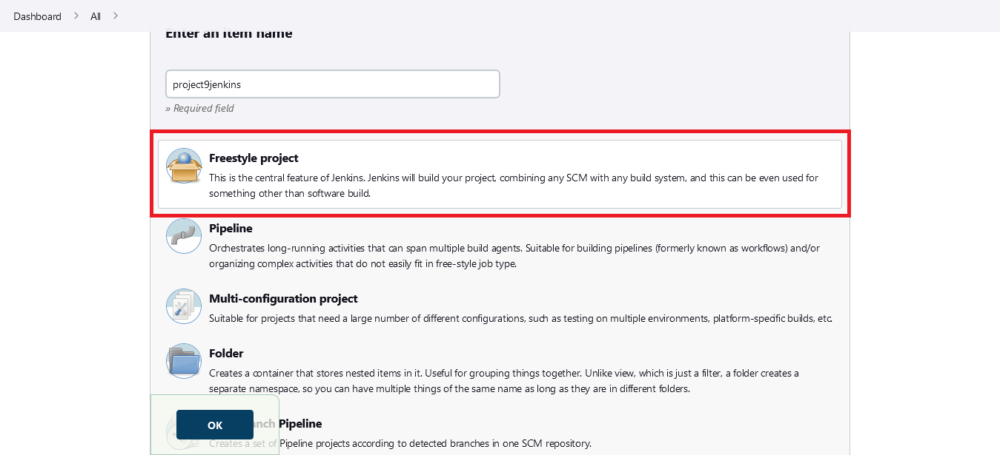
- In configuration of your Jenkins freestyle project choose Git repository
- In Repository URL, input the forked tooling github repo `https://github.com/<GitUsername>/tooling.git`
- Enter your Github Credentials
- Click Save
  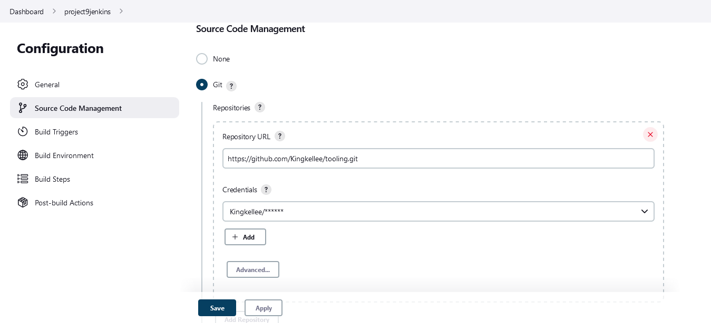
- Click on Build Now Button
- on the Build Histroy, a green tick shows the build was successful
  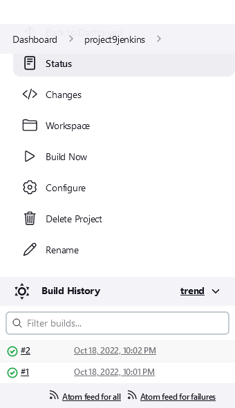
- Click on the Build Number and check Console Output to see if it has run successfully
  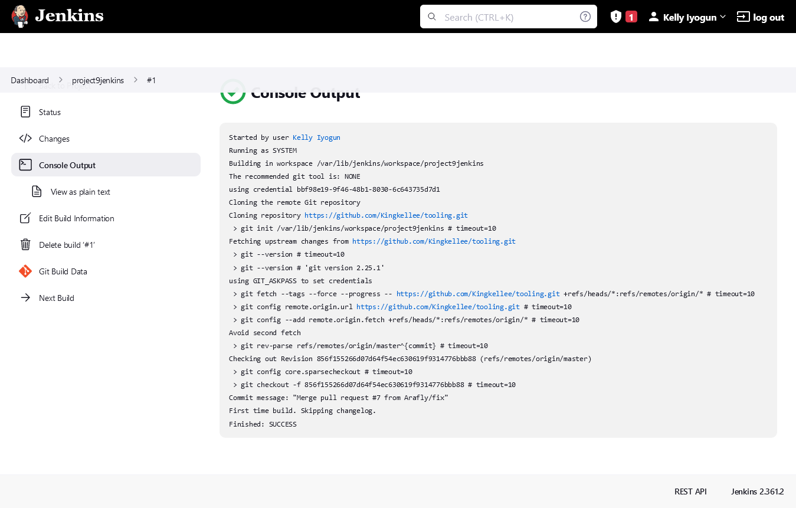

### To configure the Build to be triggered on push commits

- Click `Configure` on your Project
  - `Select Github hook trigger for for GITScm polling`

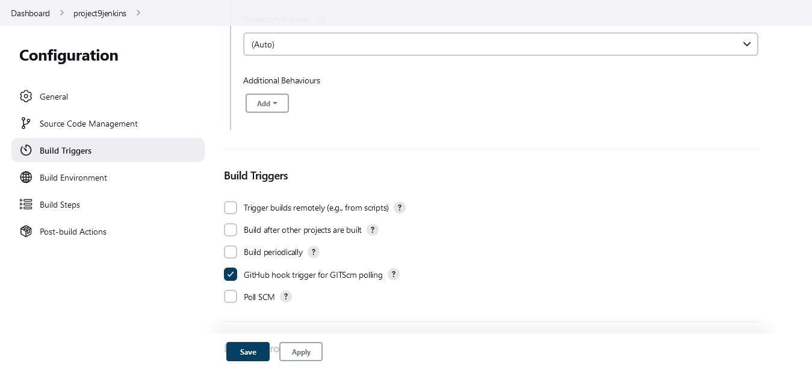

- Configure Post-build Actions to archive all the files
  - Click on `Add Post Build Action`
  - Select `Archive the Artifats `
  - on files to archive, input `**`
  - Click Save

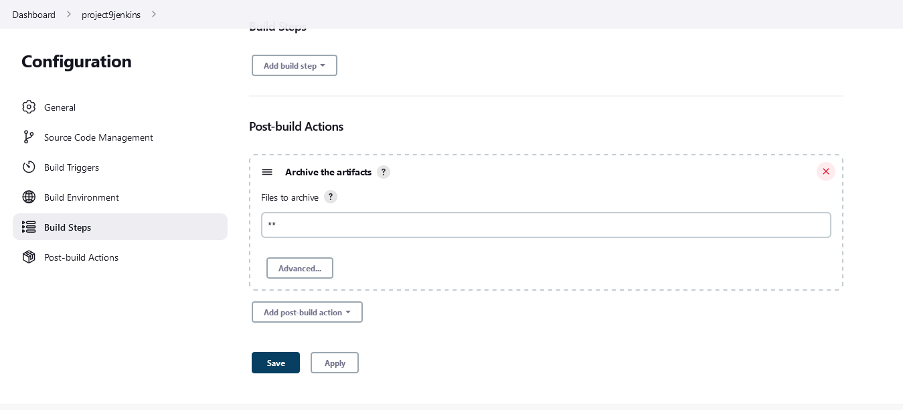

- Change permissions on NFS mount point

```
sudo chown  -R nobody:nobody /mnt
```

```
sudo chmod -R 777 /mnt
```

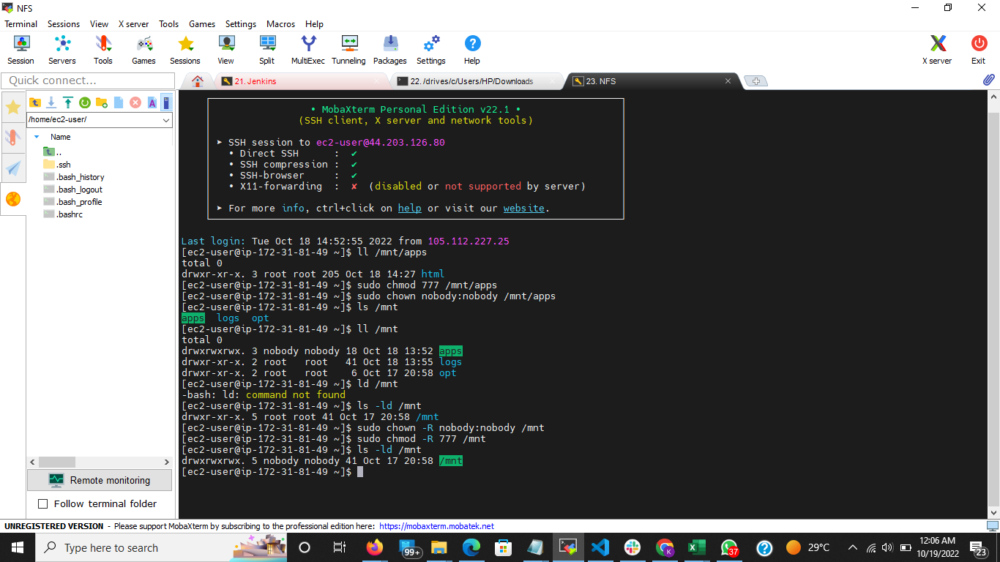

- Commit a new change on your Github repo and check for a successful Build
  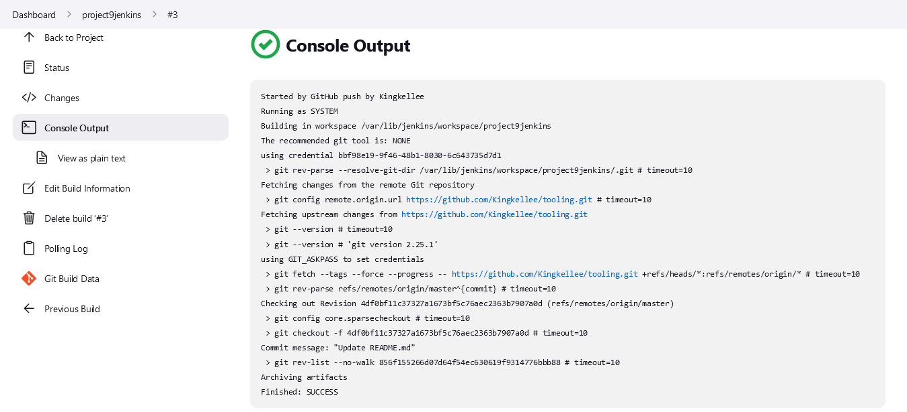

- Artifacts are stored on Jenkins server locally in;

```
ls /var/lib/jenkins/jobs/<jenkins_prject_name>/builds/<build_number>/archive/
```

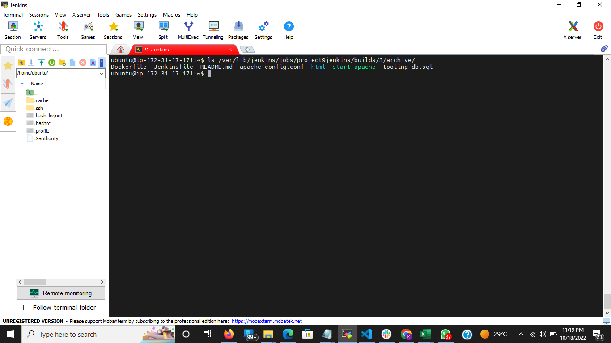

## Configure Jenkins to Copy Files to NFS Server via SSH

- Install `Publish Over SSH` Plugin - Goto the main dashboard

  - Select `Manage Jenkins` - Choose `Manage Plugins` from the menu items - On `Available` tab search for `Publish Over SSH` plugin and click on `install without restart`
    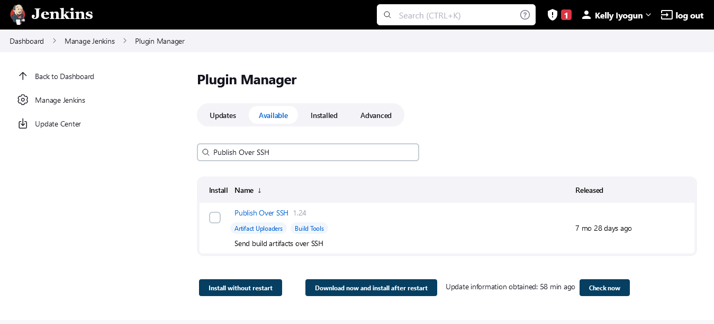

- Configure the job/project to copy artifacts over to NFS server. - On the `Main Dashboard`, Select `Manage Jenkins` - Click on `Configure System` - Scroll to `Publish Over SSH` Plugin Configuration Section 1. Provide a private key
  `# copy the content of your pem file cat <private-key>.pem` 1. Provide an Arbtiary Name 1. Host Name: `<PRIVATE-IP-ADDRESS>` of NFS server 1. Username: `ec2-user` because the EC2 instance is Red Hat Linux 1. Remote directory: `/mnt/apps` 1. Test the configuration and make sure the connection returns `Success`. 1. Save the Configuration
  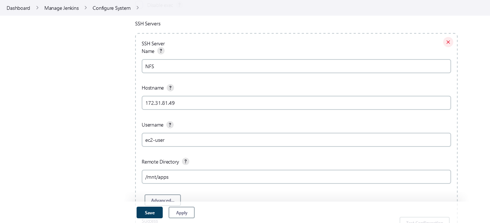

- Add another `Post Build Action` - Click on `Add Post Build Action` - Select `Send build artifacts over SSH` - on Source files to archive, input `**` - Click Save
  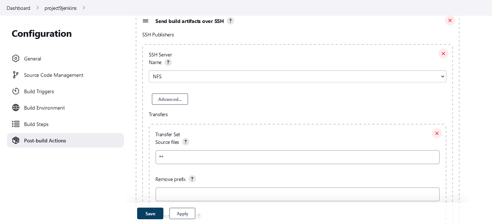
- Commit another Changes to Git Hub Repo
- Webhook should trigger a new job and in the `Console Output` you should see:

```
SSH: Transferred 25 file(s)
Finished: SUCCESS
```

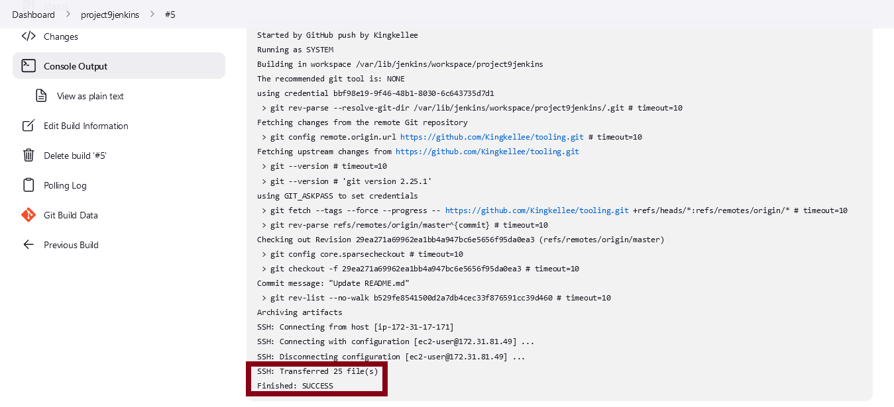

- To check if files were Archived over SSH to `/mnt/apps`
  - Connect via SSH to your NFS server
  - Check README.MD file
  - You should see your Change

```
cat /mnt/apps/README.md
```

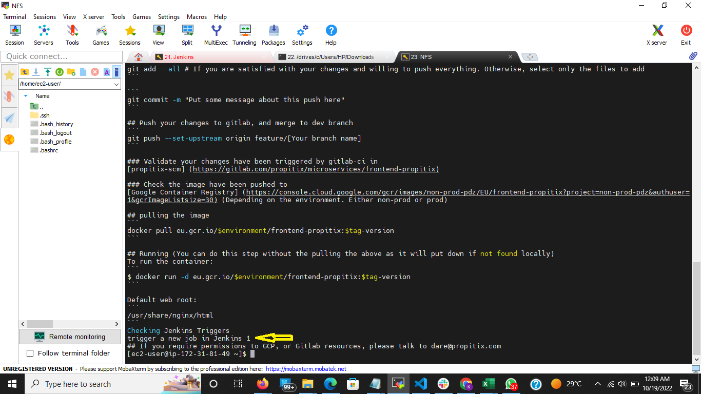
